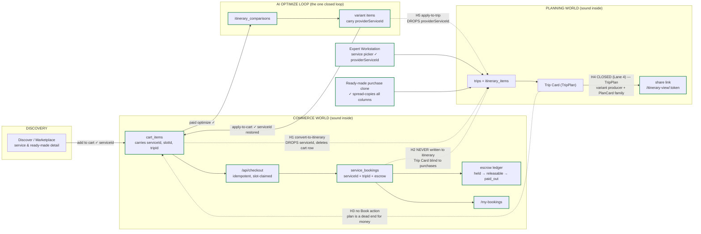
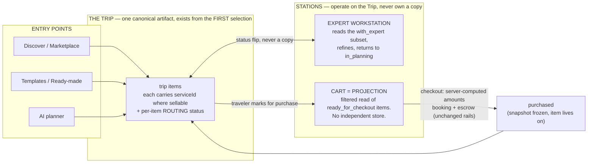
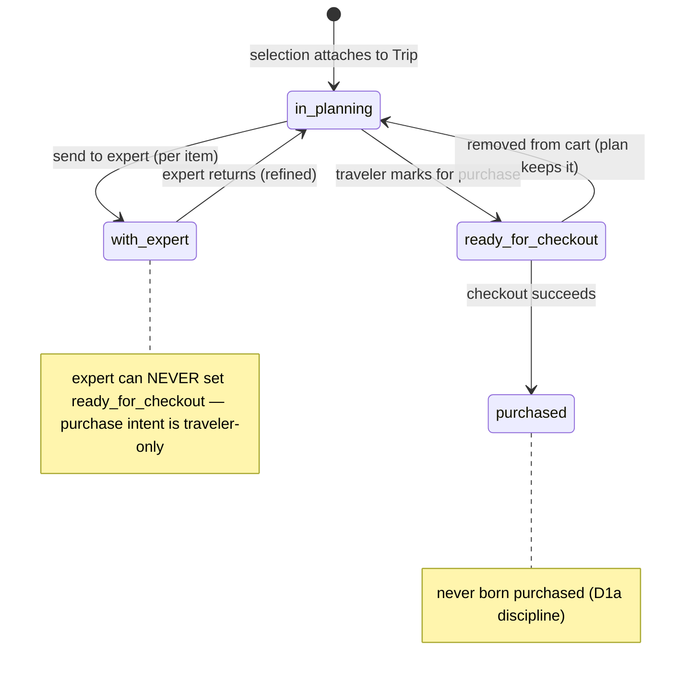

# The item lifecycle, end to end — where the money path breaks

**Why this document exists (Jul 31, 2026).** Four defects were found by hand-testing in one session: a shared
trip link that doesn't show the Trip Card, no way to add a payment method, dead preference chips, and cart items
that vanish into a trip with no way to ever pay for them. These are not four bugs. They are four symptoms of one
missing thing: **the platform has never defined the lifecycle of an *item* as it moves from discovery to plan to
payment to delivery.** Every flow was built locally correct, and the seams between them were never designed. This
document maps every edge as it exists in code today — each verdict carries a file receipt — so the holes can be
fixed as one program instead of patched one symptom at a time.

**The one-sentence diagnosis:** the platform is two worlds — a **commerce world** (cart → checkout → booking →
escrow) and a **planning world** (trip → itinerary → Trip Card) — each internally sound, connected only by
bridges that **strip the item's commercial identity on the way in and provide no way back**. §18 ratified "the
Trip Card is the FINAL PRODUCT," but today money cannot reach the final product, and the final product cannot
send an item back to money.

---

## 1. The map

Dashed red edges are the holes. Solid edges are verified intact.

---

## 2. Every edge, with receipts

| # | Edge | Carries the commercial link? | Where | Verdict |
|---|---|---|---|---|
| E1 | Discover/detail → add to cart | ✅ `cart_items.serviceId` FK, plus `slotId`, `tripId`, `contentMeta` | `shared/schema.ts` cartItems | intact |
| E2 | Cart → `/api/checkout` → booking | ✅ `serviceId` + `tripId` on `service_bookings`; §15 idempotent; slot-claimed; cart cleared before Stripe (recoverable) | `payments.routes.ts:283+` | intact |
| E3 | Booking → escrow → payout | ✅ full state machine, disputes, reversal | §15/escrow program, landed | intact |
| E4 | Cart → paid optimize → comparison → variants | ⚠️ **CORRECTED Jul 31, 2026** — the producer never wrote it (see the correction note below). **Fixed by Lane 5a Defect 3**; intact from that change forward. | `itinerary-optimizer.ts` variant-item inserts | was **H9**, now intact |
| E5 | Variant → **apply-to-cart** | ⚠️ **CORRECTED Jul 31, 2026** — the consumer was always correct, but with E4 broken it inserted **0 rows every time**. Unblocked by the same fix. | `routes.ts` apply-to-cart | intact — **but see H6** |
| E6 | Cart → **convert-to-itinerary** | ❌ writes `title`/`description`/`estimatedCost` string only, **drops `serviceId` it had in hand**, then `removeFromCart` | `routes.ts:5645–5712` | **H1** |
| E7 | Variant → **apply-to-trip** | ❌ inserts `title: item.name, itemType: item.serviceType` only — drops `providerServiceId` | `plancard.routes.ts` apply-to-trip | **H5** |
| E8 | Paid booking → trip itinerary | ❌ nothing writes `itinerary_items` after payment; the TripPlan assembler never reads `service_bookings` | `payments.routes.ts` (no write), `trip-plan.service.ts` (no read) | **H2** |
| E9 | Trip Card → cart / payment | ❌ no "Book this" action exists, even for items that DO carry `providerServiceId` | plancard components | **H3** |
| E10 | Trip Card → share link | ✅ **CLOSED (Lane 4, Jul 31 2026 ground-truth pass)** — see H4 below; this row was stale at authoring time | `trips.routes.ts` `/api/itinerary-share/:token`, `itinerary-view.tsx` | ~~H4~~ |
| E11 | Expert Workstation → trip | ✅ service picker POSTs with `providerServiceId` | `service-picker-modal.tsx:95` | intact |
| E12 | Ready-made purchase → cloned trip | ✅ clone spread-copies every column incl. `providerServiceId` | `ready-made-purchase.service.ts:88` | intact |

> ### ⚠️ Correction — Jul 31, 2026 (Lane 5 Phase-0 audit; fixed by Lane 5a Defect 3)
>
> The original E4/E5 "intact" verdicts were **wrong**, and wrong in an instructive way: they were written
> from the **consumer** side. `apply-to-cart` really does read `item.providerServiceId`, and
> `apply-to-trip`'s W5 fix really does copy it — so both consumers *looked* correct. Nobody checked the
> **producer**. `server/itinerary-optimizer.ts` prompted the model for `originalServiceId` and declared it
> on `OptimizedVariant`, but **neither `db.insert(itineraryVariantItems)` site ever wrote
> `providerServiceId`** — not the baseline insert, not the AI insert. Every variant item in the table
> carried NULL.
>
> Consequences, both previously invisible: `replaceUserCartWithVariantItems` filters on
> `if (providerServiceId)`, so **apply-to-cart inserted 0 rows on every single call** (the traveler saw
> "Cart updated" and got an empty cart); and apply-to-trip's W5 mapping faithfully copied NULL, so the
> H5 fix could never actually preserve a link. This was a real hole (call it **H9 — producer-side linkage
> loss**), structurally the same family as H1/H5 but one layer upstream.
>
> **Fixed on branch `claude/lane5a-optimizer-defects`:** `originalServiceId` is now threaded
> `OptimizedVariant → SequencedActivity → itinerary_variant_items.providerServiceId`, **validated against
> the set of `provider_services` actually offered to the model** (an LLM can invent an id; an invented one
> stays NULL, §13), and the baseline insert carries the cart row's joined `service.id`. Proven behaviorally:
> a valid id lands on the row, a hallucinated one lands NULL, and apply-to-cart then reports
> `itemsAdded: 1, skippedExternalItems: 1` instead of the perpetual 0.
>
> **The durable lesson:** a linkage verdict written from the consumer alone is not a verdict. Read the
> producer's INSERT column list — the H6 "reporting is honest now" work sat directly on top of this and
> still didn't surface it, because `itemsAdded: 0` looked like "the AI invented everything this time."

**The asymmetry worth staring at:** the *expert-built* path (E11) and the *store* path (E12) both preserve the
commercial link. Only the **traveler's own self-planned paths** (E6, E7) destroy it. The people the platform
most wants transacting are the ones routed through the lossy bridges.

---

## 3. Hole inventory

| ID | Hole | Class | Severity |
|---|---|---|---|
| **H1** | `convert-to-itinerary` drops `serviceId` and deletes the cart row — a **one-way door out of commerce**. The item becomes permanently unbuyable free text. | linkage loss | 🔴 P1 |
| **H2** | A **paid** booking never appears on the trip. Checkout writes `service_bookings` (with `tripId`!) but no itinerary item; the Trip Card assembler never reads bookings. The traveler pays and their plan doesn't change. | missing bridge | 🔴 P1 |
| **H3** | The Trip Card has **no Book/Pay action**. Even a properly-linked item (expert-added, ready-made-cloned) is a dead end for money. | missing bridge | 🔴 P1 |
| **H4** | ~~Share link renders the old `ItineraryCard`, not the Trip Card.~~ **CLOSED — this finding was already stale when this document was authored (Jul 31 07:05).** Ground-truthed by Lane 4 (`claude/lane4-share-tripplan`): the server endpoint (`GET /api/itinerary-share/:token`) was migrated onto the ONE TripPlan assembler's variant producer (`assembleTripPlanFromVariant`) by commit `ed19b0eb` "TripPlan variant producer (L3b')" (Jul 29 23:29) — predating this doc — and the client page (`itinerary-view.tsx`) already renders the non-expert view through `<PlanCard role="viewer" stage="full" days={...}>` and the expert-review view through the shared plancard sub-components (`HeroSection`/`StatsRow`/`DaySelector`/`SectionTabs`/`TransportSection`) since commit `32787272` (Jul 29 16:59) / `22d3c2cb` (Jul 30). `ItineraryCard` itself has **zero JSX importers anywhere in the client** — only 3 files (`itinerary.tsx`, `itinerary-view.tsx`, `ItineraryMapView.tsx`) import its co-located **types** (`ActivityDiff`/`TransportDiff`/etc.), not the component; left in place (not dead-code-lane material by itself — its exports are load-bearing). Behavioral proof (real local Postgres, fixture trip+booking+variant+share-token): anonymous `GET /api/itinerary-share/:token` returns zero of `bookings`/`booking`/`routingStatus`/`budget`/`changeLog`; the same trip's owner `GET /api/trips/:tripId/plancard` returns all of them. OG injection (`/itinerary-view/:token`) already uses the `preview` redaction level. No code change was required; the only edit in this lane is this doc correction (E2E_ITEM_LIFECYCLE.md + TRIP_CANON_MASTER_BRIEF.md) so later lanes don't re-scope already-closed work. | stale finding, now corrected | ~~🟠 P2~~ closed |
| **H5** | `apply-to-trip` (AI-optimized plan → trip) drops `providerServiceId` — second instance of the H1 class. | linkage loss | 🔴 P1 |
| **H6** | `apply-to-cart` silently *skips* variant items with no `providerServiceId` — external/AI-suggested items vanish from the applied plan with no message. | silent drop | 🟡 P3 |
| **H7** | No "Add card" flow — `/api/me/payment-methods` is list/default/remove only. (Save-on-payment IS wired: 3 sites set `setup_future_usage`, so the card copy is honest.) | missing feature | 🟡 P3 |
| **H9** | **(Added Jul 31, 2026 — the E4/E5 correction above.)** The optimizer's variant-item **producer** never wrote `providerServiceId` at either insert site, so every variant item was NULL-linked: apply-to-cart inserted 0 rows on every call and apply-to-trip's W5 fix copied NULL. Third instance of the H1/H5 class, one layer upstream. **FIXED — Lane 5a Defect 3** (validated against the offered catalog set; hallucinated ids stay NULL). | linkage loss | 🔴 P1 (closed) |
| **H8** | Travel Preferences chips are dead UI — no onClick, no state, Save never sends them. Same class as the removed decorative "Request Payout" buttons. | dead control | 🟡 P3 |

H1 + H5 are the same defect twice, which is itself the finding: **nothing in the system enforces that an
itinerary item born from a sellable service keeps its link.** Two independent authors made the same mistake
because no invariant existed to stop them.

---

## 4. Target state — Trip-as-Artifact (decision-maker direction, Jul 31 2026)

**Source of truth: `docs/briefs/TRIP_ARTIFACT_RECONCILE_BRIEF.md`** (supplied by the decision-maker; amends
`attached_assets/UNIFIED_PLANNING_FLOW_SPEC_v2_*.md`, reinforces G1 Trip-canonical). It supersedes BOTH earlier
proposals in this document's history — the two-store bridge repair AND the cart-as-planning-workspace model —
and is **gated on a Phase 0 read-only audit before any build**.

**Why it beats both earlier models in one sentence each:**
- vs. bridge repair: it removes the second store instead of keeping two stores synchronized forever.
- vs. cart-as-workspace: it separates **consideration from commitment** — a cart-as-workspace still hands the
  expert a purchase list and still can't route half a trip to an expert while buying the other half.

### The production line

### Per-item routing state (orthogonal to fulfillment state — see finding F-A below)

The two invariants the diagram encodes: **routing is a status flip on one row, never a copy** (removing from
the cart returns the item to planning instead of destroying it — the exact failure the current
`removeFromCart` has), and **`with_expert` / `ready_for_checkout` are exclusive per ITEM, not per trip** — half
a trip can sit with the expert while the other half is bought.

### What this does to the hole inventory

| Hole | Under trip-as-artifact |
|---|---|
| H1 convert-to-itinerary drops serviceId | **Dissolves** — no conversion bridge exists; selections attach to the Trip carrying `serviceId` from the start |
| H5 apply-to-trip drops the link | **Dissolves** — the optimizer operates on the Trip directly (G3/G4 retarget); no variant→trip copy |
| H2 paid booking never reaches the plan | **Dissolves structurally** — purchase is a status transition ON the trip item; it never left the plan |
| H3 no Book action on the Trip Card | **Becomes the core routing affordance** — "send to cart" = flip to `ready_for_checkout` |
| H6 apply-to-cart silently drops externals | **Dissolves** — non-service items simply stay `in_planning`; nothing is dropped because nothing is copied |
| H4 share renders the old component | **Already closed** (Lane 4 ground-truth, Jul 31 2026) — see the H4 row above; nothing left for trip-as-artifact to change here |
| H7 no add-card flow, H8 dead chips | **Survive, unchanged** — profile-surface fixes, independent of this model |

### Phase 0 findings — COMPLETE (Jul 31, 2026; all nine questions answered with receipts)

**Q1 — the assumption inventory (the brief's latent-bug list).** Every consumer of `cart_items`, and which
meaning of a cart row it assumes. Two meanings live on one table, exactly as the brief predicted:

| Consumer | Where | Assumes a cart row means… |
|---|---|---|
| `GET /api/cart` display | `routes.ts:5179` | selection (neutral) |
| **`/api/checkout`** | `payments.routes.ts:270` | **PURCHASE — buys every row** |
| `apply-to-cart` (variant→cart writer) | `routes.ts:6154` | purchase (staged to buy) |
| `convert-to-itinerary` | `routes.ts:5645` | selection (a plan to keep) |
| **Expert workspace handoff** | `booking-actions.ts:649` reads `getCartItems(booking.travelerId)` | selection ("plan under consideration") |
| Itinerary-share/export **cart fallback** | `trips.routes.ts:720,883` | selection (renders the cart as the plan) |
| Optimizer / comparisons | `routes.ts:5298` | selection (the plan to optimize) |
| Upsell engine context | `upsell-engine.service.ts` | selection (interest signal) |
| Guest cart + migrate | `storage.ts:1886,280` | selection |

**The split: 2 consumers treat the cart as a purchase list; 6 treat it as a plan.** Checkout will buy what the
expert believed was merely under consideration. This is the concrete, receipted form of the brief's §0 problem
statement — and the expert-handoff row is the "expert receives a purchase list" pollution, live in code.

**Q2 — G1 + state home.** `user_experiences.tripId` FK exists. Items live in `itinerary_items`, which already
carries `status` (fulfillment enum, `schema.ts:3052`) and `bookingStatus` — see F-A: routing state needs its
OWN column; the existing enum is a different axis.

**Q3 — guest.** More built than the brief assumed: `getGuestCartItems`, `addToCart(guestSessionId)`, and
`migrateGuestCart(guestSessionId, userId)` all exist (`storage.ts:274–280,1886`). G2's session-Trip retarget is
a **port of working machinery, not a green-field build**.

**Q4 — trip creation points.** Seven: convert-to-itinerary, quick-start, ai-itinerary-builder, saved-trip
conversion (`booking.service.ts:994`), checkout auto-trip (`booking.service.ts:94`), ready-made clone, expert
workstation. The first four assume a cart/selection precedes the trip — all four invert under this model.

**Q5 — checkout.** Server-computed, §15 idempotent (index now declared in schema.ts), slot-claimed. Clean.

**Q6 — expert handoff is ALREADY reference-based.** `expert_requests` carries `tripId` (FK, cascade),
`variantId`, `comparisonId` + a jsonb context — references, not copied content — and the workstation reads
**live** trip data (`getTrip`/`getItineraryItems`, `booking-actions.ts:645–648`). The brief's target shape
mostly exists; the one violation is the workspace ALSO reading the live **cart** (line 649) — which is the
container with the wrong meaning, per Q1.

**Q7 — NULL-userId overlap CONFIRMED.** The checkout auto-trip (`booking.service.ts:94`) and saved-trip
conversion (`:994`) are raw-SQL trip minters — the **same two paths** the L10 audit flagged as owner-less-trip
minters (no `trip_collaborators` owner row). Phase 1 rework of checkout→trip MUST route through the
`createTrip` helper (owner-row fix) rather than re-inheriting the bug. This brief must not merge ahead of that
fix on these shared paths.

**Q8 — migration posture is clean for this change.** All four tables (`cart_items`, `itinerary_items`,
`trips`, `user_experiences`) are baseline (`000_baseline_schema.sql`) AND declared in `schema.ts` — push and
migrations agree. `itinerary_items.status` has **no DB CHECK** (enum is TS-level), so adding a routing column
is additive-nullable with no publish-push trap — but per the deploy-push durability rule it MUST be declared
in `schema.ts`, not migration-only.

**Q9 — auth verified.** Cart CRUD (`routes.ts:5179,5440,5599,5617`) and `/api/checkout`
(`payments.routes.ts:270`) all carry `isAuthenticated`; trips router is mounted (§9 sweep). The known caveat
stands: trip-access predicates are the L10 divergence area — new routing-flip endpoints must use the canonical
gate, never `getTripRole` (brief §6 already forbids this).

### New Phase 0 finding to carry forward

**F-A — two orthogonal status axes, do not conflate.** `itinerary_items.status` is a **fulfillment** lifecycle
(`planned, booked, confirmed, in_progress, completed, cancelled, skipped` — `shared/schema.ts:3052`), i.e.
what happens during the trip. The brief's states are a **routing** lifecycle (where the item currently sits on
the production line). An item can be `ready_for_checkout` + `planned` today and `purchased` + `confirmed`
next week. Jamming routing values into the fulfillment enum would corrupt every existing reader of `status`;
the routing state almost certainly wants its own column. Schema shape = decision-maker ratification
(Coordination Prevention), decided on Phase 0 findings, not before.

### Open decisions (from the brief, to be decided on Phase 0 evidence)

1. **Cart as pure projection vs thin materialized table.** Early evidence leans thin-table: checkout is deeply
   coupled to `cart_items` (slot claims, idempotency, snapshot-into-bookingDetails all read it), so a
   single-writer materialized projection is likely the cheaper Phase 1 than ripping it out. Phase 0 confirms.
2. **Snapshot-on-purchase** — brief recommends yes, mirroring `ready_made_purchases`. Endorsed; it is also the
   already-ratified snapshot posture (§17/§18).
3. **Guest-Trip retention/expiry** for abandoned session trips.

Until Phase 0 findings are approved, none of H1–H6 gets patched — the brief's HARD STOP governs.
