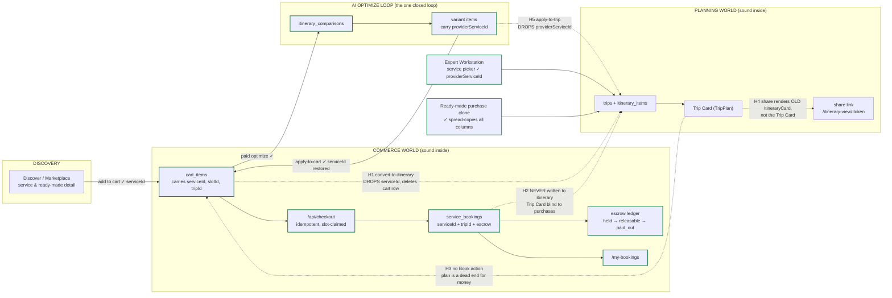
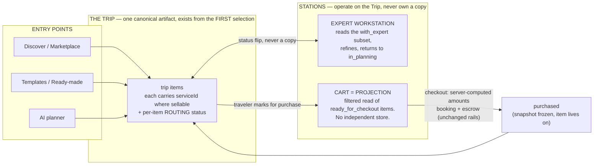
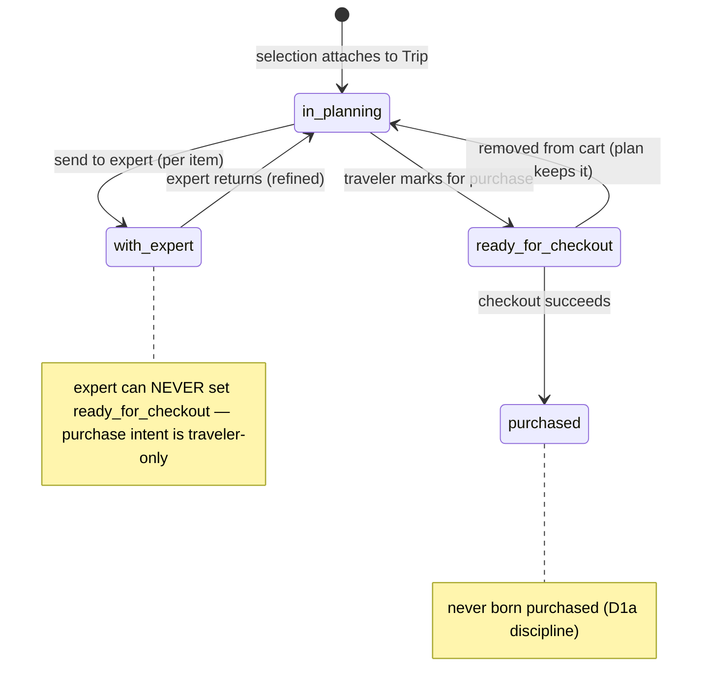

# The item lifecycle, end to end — where the money path breaks

**Why this document exists (Jul 31, 2026).** Four defects were found by hand-testing in one session: a shared
trip link that doesn't show the Trip Card, no way to add a payment method, dead preference chips, and cart items
that vanish into a trip with no way to ever pay for them. These are not four bugs. They are four symptoms of one
missing thing: **the platform has never defined the lifecycle of an *item* as it moves from discovery to plan to
payment to delivery.** Every flow was built locally correct, and the seams between them were never designed. This
document maps every edge as it exists in code today — each verdict carries a file receipt — so the holes can be
fixed as one program instead of patched one symptom at a time.

**The one-sentence diagnosis:** the platform is two worlds — a **commerce world** (cart → checkout → booking →
escrow) and a **planning world** (trip → itinerary → Trip Card) — each internally sound, connected only by
bridges that **strip the item's commercial identity on the way in and provide no way back**. §18 ratified "the
Trip Card is the FINAL PRODUCT," but today money cannot reach the final product, and the final product cannot
send an item back to money.

---

## 1. The map

Dashed red edges are the holes. Solid edges are verified intact.

---

## 2. Every edge, with receipts

| # | Edge | Carries the commercial link? | Where | Verdict |
|---|---|---|---|---|
| E1 | Discover/detail → add to cart | ✅ `cart_items.serviceId` FK, plus `slotId`, `tripId`, `contentMeta` | `shared/schema.ts` cartItems | intact |
| E2 | Cart → `/api/checkout` → booking | ✅ `serviceId` + `tripId` on `service_bookings`; §15 idempotent; slot-claimed; cart cleared before Stripe (recoverable) | `payments.routes.ts:283+` | intact |
| E3 | Booking → escrow → payout | ✅ full state machine, disputes, reversal | §15/escrow program, landed | intact |
| E4 | Cart → paid optimize → comparison → variants | ✅ variant items carry `providerServiceId` | variant producer | intact |
| E5 | Variant → **apply-to-cart** | ✅ `serviceId: item.providerServiceId` restored | `routes.ts:6154` | intact — **but see H6** |
| E6 | Cart → **convert-to-itinerary** | ❌ writes `title`/`description`/`estimatedCost` string only, **drops `serviceId` it had in hand**, then `removeFromCart` | `routes.ts:5645–5712` | **H1** |
| E7 | Variant → **apply-to-trip** | ❌ inserts `title: item.name, itemType: item.serviceType` only — drops `providerServiceId` | `plancard.routes.ts` apply-to-trip | **H5** |
| E8 | Paid booking → trip itinerary | ❌ nothing writes `itinerary_items` after payment; the TripPlan assembler never reads `service_bookings` | `payments.routes.ts` (no write), `trip-plan.service.ts` (no read) | **H2** |
| E9 | Trip Card → cart / payment | ❌ no "Book this" action exists, even for items that DO carry `providerServiceId` | plancard components | **H3** |
| E10 | Trip Card → share link | ❌ `/itinerary-view/:token` renders the old `ItineraryCard`, not the TripPlan renderer — §18 violation | `itinerary-view.tsx:15` | **H4** |
| E11 | Expert Workstation → trip | ✅ service picker POSTs with `providerServiceId` | `service-picker-modal.tsx:95` | intact |
| E12 | Ready-made purchase → cloned trip | ✅ clone spread-copies every column incl. `providerServiceId` | `ready-made-purchase.service.ts:88` | intact |

**The asymmetry worth staring at:** the *expert-built* path (E11) and the *store* path (E12) both preserve the
commercial link. Only the **traveler's own self-planned paths** (E6, E7) destroy it. The people the platform
most wants transacting are the ones routed through the lossy bridges.

---

## 3. Hole inventory

| ID | Hole | Class | Severity |
|---|---|---|---|
| **H1** | `convert-to-itinerary` drops `serviceId` and deletes the cart row — a **one-way door out of commerce**. The item becomes permanently unbuyable free text. | linkage loss | 🔴 P1 |
| **H2** | A **paid** booking never appears on the trip. Checkout writes `service_bookings` (with `tripId`!) but no itinerary item; the Trip Card assembler never reads bookings. The traveler pays and their plan doesn't change. | missing bridge | 🔴 P1 |
| **H3** | The Trip Card has **no Book/Pay action**. Even a properly-linked item (expert-added, ready-made-cloned) is a dead end for money. | missing bridge | 🔴 P1 |
| **H4** | Share link renders the old `ItineraryCard`, not the Trip Card. The §18 "one circulating plan object" contract has an unmigrated channel. | stale renderer | 🟠 P2 |
| **H5** | `apply-to-trip` (AI-optimized plan → trip) drops `providerServiceId` — second instance of the H1 class. | linkage loss | 🔴 P1 |
| **H6** | `apply-to-cart` silently *skips* variant items with no `providerServiceId` — external/AI-suggested items vanish from the applied plan with no message. | silent drop | 🟡 P3 |
| **H7** | No "Add card" flow — `/api/me/payment-methods` is list/default/remove only. (Save-on-payment IS wired: 3 sites set `setup_future_usage`, so the card copy is honest.) | missing feature | 🟡 P3 |
| **H8** | Travel Preferences chips are dead UI — no onClick, no state, Save never sends them. Same class as the removed decorative "Request Payout" buttons. | dead control | 🟡 P3 |

H1 + H5 are the same defect twice, which is itself the finding: **nothing in the system enforces that an
itinerary item born from a sellable service keeps its link.** Two independent authors made the same mistake
because no invariant existed to stop them.

---

## 4. Target state — Trip-as-Artifact (decision-maker direction, Jul 31 2026)

**Source of truth: `docs/briefs/TRIP_ARTIFACT_RECONCILE_BRIEF.md`** (supplied by the decision-maker; amends
`attached_assets/UNIFIED_PLANNING_FLOW_SPEC_v2_*.md`, reinforces G1 Trip-canonical). It supersedes BOTH earlier
proposals in this document's history — the two-store bridge repair AND the cart-as-planning-workspace model —
and is **gated on a Phase 0 read-only audit before any build**.

**Why it beats both earlier models in one sentence each:**
- vs. bridge repair: it removes the second store instead of keeping two stores synchronized forever.
- vs. cart-as-workspace: it separates **consideration from commitment** — a cart-as-workspace still hands the
  expert a purchase list and still can't route half a trip to an expert while buying the other half.

### The production line

### Per-item routing state (orthogonal to fulfillment state — see finding F-A below)

The two invariants the diagram encodes: **routing is a status flip on one row, never a copy** (removing from
the cart returns the item to planning instead of destroying it — the exact failure the current
`removeFromCart` has), and **`with_expert` / `ready_for_checkout` are exclusive per ITEM, not per trip** — half
a trip can sit with the expert while the other half is bought.

### What this does to the hole inventory

| Hole | Under trip-as-artifact |
|---|---|
| H1 convert-to-itinerary drops serviceId | **Dissolves** — no conversion bridge exists; selections attach to the Trip carrying `serviceId` from the start |
| H5 apply-to-trip drops the link | **Dissolves** — the optimizer operates on the Trip directly (G3/G4 retarget); no variant→trip copy |
| H2 paid booking never reaches the plan | **Dissolves structurally** — purchase is a status transition ON the trip item; it never left the plan |
| H3 no Book action on the Trip Card | **Becomes the core routing affordance** — "send to cart" = flip to `ready_for_checkout` |
| H6 apply-to-cart silently drops externals | **Dissolves** — non-service items simply stay `in_planning`; nothing is dropped because nothing is copied |
| H4 share renders the old component | **Survives, unchanged** — still the §18 renderer migration ("do not fork PlanCard" holds) |
| H7 no add-card flow, H8 dead chips | **Survive, unchanged** — profile-surface fixes, independent of this model |

### Phase 0 — what this document already answers (receipts in §2), what remains

| Brief Q | Status |
|---|---|
| Q1 `cart_items` schema + writers/readers | **Largely answered**: schema in §2/E1; writers = add-to-cart, apply-to-cart (`routes.ts:6154`), variant replace; readers = checkout (`payments.routes.ts:283+`), convert (`routes.ts:5645`). Remaining: the full reader sweep + which assume "selection" vs "purchase" (the assumption inventory) |
| Q4 trip-creation points | **Answered**: convert-to-itinerary, quick-start, ai-itinerary-builder, saved-trip conversion, checkout auto-trip (`booking.service.ts:93`), ready-made clone, expert workstation |
| Q5 checkout server-computed | **Answered**: §14-clean, §15 idempotent (index declared, migration 155/096) |
| Q2 G1 status | **Partially**: `user_experiences.tripId` FK EXISTS; items live in `itinerary_items` — which already carries `status` (fulfillment enum) AND `bookingStatus`. See F-A |
| Q3 guest carts | **Partially**: no `guest_sessions` table; `cart_items.guestSessionId` exists — the guest-Trip retarget needs its own design |
| Q6 expert handoff carries | open — trace `expert_request` reference-vs-copy |
| Q7 NULL-userId overlap | open — cross-check against the L10 owner-less-trip paths (three known minters) |
| Q8 push-vs-migration posture | open per table — note the deploy-push trap history (CLAUDE.md) |
| Q9 route auth | open — verify, don't assume (§9 class) |

### New Phase 0 finding to carry forward

**F-A — two orthogonal status axes, do not conflate.** `itinerary_items.status` is a **fulfillment** lifecycle
(`planned, booked, confirmed, in_progress, completed, cancelled, skipped` — `shared/schema.ts:3052`), i.e.
what happens during the trip. The brief's states are a **routing** lifecycle (where the item currently sits on
the production line). An item can be `ready_for_checkout` + `planned` today and `purchased` + `confirmed`
next week. Jamming routing values into the fulfillment enum would corrupt every existing reader of `status`;
the routing state almost certainly wants its own column. Schema shape = decision-maker ratification
(Coordination Prevention), decided on Phase 0 findings, not before.

### Open decisions (from the brief, to be decided on Phase 0 evidence)

1. **Cart as pure projection vs thin materialized table.** Early evidence leans thin-table: checkout is deeply
   coupled to `cart_items` (slot claims, idempotency, snapshot-into-bookingDetails all read it), so a
   single-writer materialized projection is likely the cheaper Phase 1 than ripping it out. Phase 0 confirms.
2. **Snapshot-on-purchase** — brief recommends yes, mirroring `ready_made_purchases`. Endorsed; it is also the
   already-ratified snapshot posture (§17/§18).
3. **Guest-Trip retention/expiry** for abandoned session trips.

Until Phase 0 findings are approved, none of H1–H6 gets patched — the brief's HARD STOP governs.
