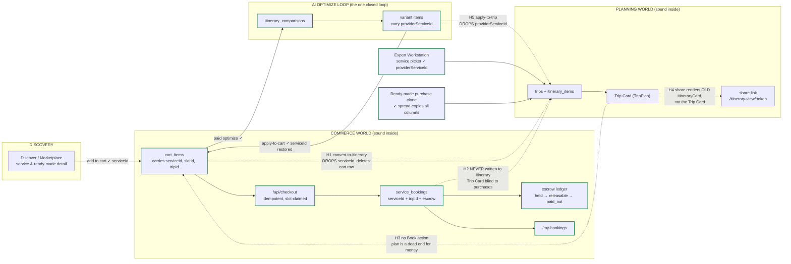
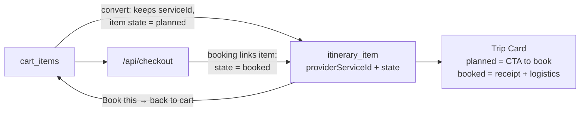

# The item lifecycle, end to end — where the money path breaks

**Why this document exists (Jul 31, 2026).** Four defects were found by hand-testing in one session: a shared
trip link that doesn't show the Trip Card, no way to add a payment method, dead preference chips, and cart items
that vanish into a trip with no way to ever pay for them. These are not four bugs. They are four symptoms of one
missing thing: **the platform has never defined the lifecycle of an *item* as it moves from discovery to plan to
payment to delivery.** Every flow was built locally correct, and the seams between them were never designed. This
document maps every edge as it exists in code today — each verdict carries a file receipt — so the holes can be
fixed as one program instead of patched one symptom at a time.

**The one-sentence diagnosis:** the platform is two worlds — a **commerce world** (cart → checkout → booking →
escrow) and a **planning world** (trip → itinerary → Trip Card) — each internally sound, connected only by
bridges that **strip the item's commercial identity on the way in and provide no way back**. §18 ratified "the
Trip Card is the FINAL PRODUCT," but today money cannot reach the final product, and the final product cannot
send an item back to money.

---

## 1. The map

Dashed red edges are the holes. Solid edges are verified intact.

---

## 2. Every edge, with receipts

| # | Edge | Carries the commercial link? | Where | Verdict |
|---|---|---|---|---|
| E1 | Discover/detail → add to cart | ✅ `cart_items.serviceId` FK, plus `slotId`, `tripId`, `contentMeta` | `shared/schema.ts` cartItems | intact |
| E2 | Cart → `/api/checkout` → booking | ✅ `serviceId` + `tripId` on `service_bookings`; §15 idempotent; slot-claimed; cart cleared before Stripe (recoverable) | `payments.routes.ts:283+` | intact |
| E3 | Booking → escrow → payout | ✅ full state machine, disputes, reversal | §15/escrow program, landed | intact |
| E4 | Cart → paid optimize → comparison → variants | ✅ variant items carry `providerServiceId` | variant producer | intact |
| E5 | Variant → **apply-to-cart** | ✅ `serviceId: item.providerServiceId` restored | `routes.ts:6154` | intact — **but see H6** |
| E6 | Cart → **convert-to-itinerary** | ❌ writes `title`/`description`/`estimatedCost` string only, **drops `serviceId` it had in hand**, then `removeFromCart` | `routes.ts:5645–5712` | **H1** |
| E7 | Variant → **apply-to-trip** | ❌ inserts `title: item.name, itemType: item.serviceType` only — drops `providerServiceId` | `plancard.routes.ts` apply-to-trip | **H5** |
| E8 | Paid booking → trip itinerary | ❌ nothing writes `itinerary_items` after payment; the TripPlan assembler never reads `service_bookings` | `payments.routes.ts` (no write), `trip-plan.service.ts` (no read) | **H2** |
| E9 | Trip Card → cart / payment | ❌ no "Book this" action exists, even for items that DO carry `providerServiceId` | plancard components | **H3** |
| E10 | Trip Card → share link | ❌ `/itinerary-view/:token` renders the old `ItineraryCard`, not the TripPlan renderer — §18 violation | `itinerary-view.tsx:15` | **H4** |
| E11 | Expert Workstation → trip | ✅ service picker POSTs with `providerServiceId` | `service-picker-modal.tsx:95` | intact |
| E12 | Ready-made purchase → cloned trip | ✅ clone spread-copies every column incl. `providerServiceId` | `ready-made-purchase.service.ts:88` | intact |

**The asymmetry worth staring at:** the *expert-built* path (E11) and the *store* path (E12) both preserve the
commercial link. Only the **traveler's own self-planned paths** (E6, E7) destroy it. The people the platform
most wants transacting are the ones routed through the lossy bridges.

---

## 3. Hole inventory

| ID | Hole | Class | Severity |
|---|---|---|---|
| **H1** | `convert-to-itinerary` drops `serviceId` and deletes the cart row — a **one-way door out of commerce**. The item becomes permanently unbuyable free text. | linkage loss | 🔴 P1 |
| **H2** | A **paid** booking never appears on the trip. Checkout writes `service_bookings` (with `tripId`!) but no itinerary item; the Trip Card assembler never reads bookings. The traveler pays and their plan doesn't change. | missing bridge | 🔴 P1 |
| **H3** | The Trip Card has **no Book/Pay action**. Even a properly-linked item (expert-added, ready-made-cloned) is a dead end for money. | missing bridge | 🔴 P1 |
| **H4** | Share link renders the old `ItineraryCard`, not the Trip Card. The §18 "one circulating plan object" contract has an unmigrated channel. | stale renderer | 🟠 P2 |
| **H5** | `apply-to-trip` (AI-optimized plan → trip) drops `providerServiceId` — second instance of the H1 class. | linkage loss | 🔴 P1 |
| **H6** | `apply-to-cart` silently *skips* variant items with no `providerServiceId` — external/AI-suggested items vanish from the applied plan with no message. | silent drop | 🟡 P3 |
| **H7** | No "Add card" flow — `/api/me/payment-methods` is list/default/remove only. (Save-on-payment IS wired: 3 sites set `setup_future_usage`, so the card copy is honest.) | missing feature | 🟡 P3 |
| **H8** | Travel Preferences chips are dead UI — no onClick, no state, Save never sends them. Same class as the removed decorative "Request Payout" buttons. | dead control | 🟡 P3 |

H1 + H5 are the same defect twice, which is itself the finding: **nothing in the system enforces that an
itinerary item born from a sellable service keeps its link.** Two independent authors made the same mistake
because no invariant existed to stop them.

---

## 4. Target state (proposal — decision-maker ratifies before any fix)

One rule, stated once, enforced by a gate:

> **An itinerary item that originated from a sellable service ALWAYS carries `providerServiceId`. Its
> commercial state lives WITH it. The Trip Card is both a buying surface and a receipt.**

Concretely, the fix program (order matters — schema decision first):

| Lane | What | Needs ratification? |
|---|---|---|
| **L-A** | Ratify the item-state model: `itinerary_items` gains nullable `bookingId` (FK → `service_bookings`); "planned vs booked" is **derived** from it, no new status enum. Additive migration, no CHECK. | **YES — schema (Coordination Prevention)** |
| **L-B** | Fix H1 + H5 at the write sites: both converters carry `serviceId`/`providerServiceId`. Pure bug fix once L-A defines where state lives. | no |
| **L-C** | Fix H2: checkout (and webhook confirm) links the booking to its itinerary item — creates one if the buy didn't come from a plan. Trip Card renders booked state. | rides L-A |
| **L-D** | Fix H3: "Book this" on planned items with a `providerServiceId` → adds back to cart. This **absorbs the blocked MP-4** — the same TripPlan amendment (`providerServiceId` at `full` redaction) serves both. | **YES — §18 TripPlan amendment** |
| **L-E** | Fix H4: share route becomes a TripPlan channel (`preview`/`teaser` redaction per §18) instead of the old component. | no — §18 already ratified this direction |
| **L-F** | H6/H7/H8 small fixes: surface skipped externals with a message; SetupIntent add-card; wire or remove the preference chips. | no |
| **L-G** | **The gate that makes this durable** (Tier 0): a linkage-preservation guard — any code path writing `itinerary_items` from a source that has a service id must carry it. This is the test that would have made H1 and H5 impossible to write. | no |

**Decision points for you (everything else follows mechanically):**
1. **Move vs copy** at cart→trip conversion. Recommend **move** — the item leaves the cart but stays buyable
   from the plan (the earlier "(b)" shape). With H3 fixed, move loses nothing.
2. **L-A schema shape** — nullable `bookingId` FK on `itinerary_items`, state derived. Yes/no.
3. **L-D TripPlan amendment** — `providerServiceId` (+ derived booked state) at `full` redaction level only.
   This is the same ask as the parked MP-4; one ratification closes both.

Until these are ratified, none of H1–H5 gets patched — per the decision that these are not to be fixed in
isolation.
