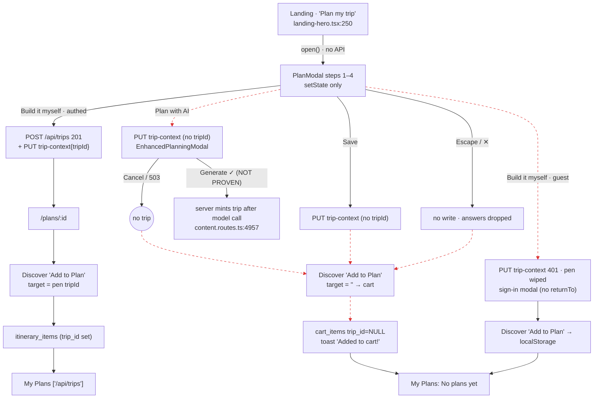

# J1: Plan My Trip → modal → Discover → My Plans. Behavioural verdict

**Lane:** Action→Effect audit, Phase 1 / A3, delivered on its own. Read-only: no app code was changed.
**Base:** `main` @ `858d28f` (branch `claude/lucid-galileo-hu7vgw`).
**Environment:**
- Production bundle (`npm run build` → `node dist/index.cjs`, `NODE_ENV=production`).
- Local Postgres 16 with all 322 migrations applied and the boot seed loaded (28 approved services, 1 seed trip). No other test data.
- Stub Stripe and AI keys, matching the CI journey suite.
- Chromium through Playwright, viewport 1360×900. Screenshots were downscaled to about 56% (765 px wide) and quantized to save repo space.

**Harness:** `docs/audits/journeys/harness/j1.mjs`, reproducible with the command in its header. Each run uses a fresh browser context and a freshly registered user.
For every step it captures three things:
- a **screenshot** of what the user saw;
- the **`/api` network log**, with method, URL, status, request body and response;
- a **row diff** of the tables the journey could touch: `trips`, `itinerary_items`, `cart_items`, `user_experiences`, `trip_contexts`, `trip_destinations`.

Moving between surfaces uses **client-side (SPA) navigation**, so the react-query cache survives exactly as it does for a real user.
Per-step evidence tables are in [`EVIDENCE.md`](EVIDENCE.md). The raw records are `R*/record.json` and the screenshots are `R*/step-{k}.png`.

---

## 0. The answer

**The seed repro is real. The trigger is the finish CTA the user chose.**

In the plan modal, only one CTA creates a trip: **"Build it myself"**, and only for a signed-in user.

Every other way out of the modal creates **no `trips` row**:
- **"Plan with AI"**, the coral primary CTA. It creates nothing until an AI generation succeeds, and a Cancel or a failed generation leaves no trip.
- **Save.**
- **Escape or ✕.**
- **Any finish as a guest.**

After any of those, Discover's **"Add to Plan"** has no trip to target. It writes `cart_items` with **`trip_id = NULL`**, or guest localStorage, and tells the user **"Added to cart!"** or **"Saved!"**.
My Plans is correctly empty, because there is no trip.

Separately, even when "Build it myself" **does** create the trip, My Plans shows **"No plans yet"** if the user visited My Plans earlier in the session. The list query is cached forever and nothing invalidates it (R5).

| Run | Auth | Modal exit | `trips` row? | Discover add wrote | My Plans (in-app) | My Plans (reload) |
|---|---|---|---|---|---|---|
| R1 | guest | Build it myself | **no** (client refused; sign-in modal) | localStorage `traveloure_guest_cart_pending` | redirected `/` + sign-in | same |
| R2 | guest | Plan with AI → sign-in prompt → Cancel | **no** | localStorage `traveloure_guest_cart_pending` | redirected `/` + sign-in | same |
| R3 | authed | Build it myself | **yes** (`POST /api/trips` 201) | `itinerary_items`, trip_id = new trip ✅ | **1 plan** ✅ | 1 plan ✅ |
| R4 | authed | Plan with AI → Cancel | **no** | `cart_items`, **trip_id NULL** | **No plans yet** | No plans yet |
| R4b | authed | Plan with AI → Generate (AI 503 with stub key) → Cancel | **no** | `cart_items`, **trip_id NULL** | No plans yet | No plans yet |
| R5 | authed, **My Plans pre-visited** | Build it myself | **yes** | `itinerary_items`, trip_id = new trip ✅ | **No plans yet** ❌ (no refetch) | **1 plan** |
| R6 | authed, pre-visited | Plan with AI → Cancel | **no** | `cart_items`, trip_id NULL | No plans yet | No plans yet |
| R6b | authed, pre-visited | Plan with AI → Generate (503) → Cancel | **no** | `cart_items`, trip_id NULL | No plans yet | No plans yet |
| R7 | authed | **Escape** (dismissal) | **no**, and **nothing** is saved | `cart_items`, trip_id NULL; Discover lost "Kyoto" | No plans yet | No plans yet |
| R8 | authed | **Save** | **no** (context saved only) | `cart_items`, trip_id NULL | No plans yet | No plans yet |

The dispatch asked for four core runs: guest and authed, each with "Build it myself" and with "Plan with AI". Those are R1, R2, R3 and R4. The cached variant it asked for is R5, and R6 is its AI twin. R4b, R6b, R7 and R8 are added controls, so that H1 and H6 can be decided.

---

## 1. Hypotheses

Verdicts use only what was observed in the runs above, plus the cited code that explains it.

| # | Hypothesis | Verdict | Evidence |
|---|---|---|---|
| **H1** | Modal completion only writes client state or URL params; no trip-create call fires | **PROVEN for the "Plan with AI" branch** (and for Save and dismissal). **DISPROVEN for "Build it myself" when signed in.** | **AI:** the only write is `PUT /api/trip-context` 200, which adds one `trip_contexts` row with `trip_id NULL` (R4 step 7, R6 step 9). No `POST /api/trips` fires. **Myself:** `POST /api/trips` 201 plus a `trips` row (R3 step 7, R5 step 9). Code: `BRANCHES_THAT_MINT=["myself","local"]` (`client/src/lib/plan-steps.ts:77`); the mint gate is at `components/trip/plan-modal.tsx:1179-1215`; the `ai` branch opens `EnhancedPlanningModal` without minting (`contexts/PlanningContext.tsx:308-313`). The AI trip is created **server-side only after a successful model call** (`server/routes/content.routes.ts:4957`, after the 503 exit at :4949). |
| **H2** | A trip-create call fires but fails or is swallowed | **DISPROVEN** (in every run observed) | Every `POST /api/trips` that fired returned 201 and produced a row (R3, R5). No run showed a failed mint. The failing call was `POST /api/ai/generate-itinerary` (503, stub key), and it was **surfaced** in the modal as "Our AI is experiencing high demand…" (R4b step 8 screenshot). Not silent. |
| **H3** | The trip is created, but My Plans reads a different source, or its query key isn't invalidated | **PROVEN** (the key-invalidation half). The "different source" half is **DISPROVEN**. | **R5:** the trip plus its item exist in the DB after step 12. My Plans in-app (step 13) shows **"No plans yet"**, fires **no** `GET /api/trips`, and the DOM holds 0 cards. After a full reload (step 14) it shows 1 card. **R3** (never cached) shows the plan straight away. **Source:** My Plans and Home both read `useTrips()` → key `["/api/trips"]` (`pages/my-trips.tsx:244`, `pages/dashboard.tsx:70`, `hooks/use-trips.ts:11-20`), which is the right source. **Invalidation:** `mintTripSlip` invalidates nothing (`lib/trip-slip.ts:151-176`); `commitPlan` invalidates only `user-experiences`, `plancard` and `guests` (`plan-modal.tsx:1133-1135`); defaults are `staleTime: Infinity`, `refetchOnWindowFocus:false` (`lib/queryClient.ts:98`). |
| **H4** | The guest path has no `userId`, so trip creation is silently skipped | **PROVEN, but "silently" is imprecise** | **R1:** clicking "Build it myself" fires **no** `POST /api/trips`, and the only write attempted is `PUT /api/trip-context` → **401**. A sign-in modal opens (step 7 screenshot), so it is not silent. **But** the modal says nothing about the plan, and the user's answers are wiped from the pen: storage goes to `{"pendingEvents":[],"pendingEventTitles":[]}` and Discover then has **no location** (R1 step 9). Code: `releasePendingEventsPen()` runs **before** the auth refusal (`plan-modal.tsx:1201` then `PlanningContext.tsx:281-284`); `finish` returns before `commitPlan` (`plan-modal.tsx:1214`); `openSignInModal()` has no `returnTo`. The server would refuse too: `POST /api/trips` → 401 (`server/routes.ts:1401-1406`). |
| **H5** | Discover writes `cart_items`/`user_experiences` without a `tripId`, or with a null one | **PROVEN, conditional on no trip being in the pen** | **R4, R4b, R6, R6b, R7, R8:** `POST /api/cart {serviceId,quantity:1}` → 201 and a `cart_items` row with **`trip_id NULL`**. **R1, R2:** only localStorage. **R3, R5** (a trip id in the pen): `POST /api/trips/:id/itinerary-items` 201 with `trip_id` set, so it is correct. `user_experiences` was never written in any run. Code: `resolveTargetTripId` = URL `?tripId`, then the pen `tripId`, then `""` (`lib/trip-target.ts:42-47`); `runAddToCart` falls to `/api/cart` when that is `""` (`pages/discover.tsx:1350+`). |
| **H6** | Completion and dismissal share one `onClose` path, so completion never gets distinct handling | **DISPROVEN** | The three exits produced three different effects. **Escape** (R7) wrote **nothing**: no network write and no DB change, and every answer was dropped (Discover had no location). **Save** (R8) wrote the pen (`PUT /api/trip-context`) and created no trip. **"Build it myself"** (R3) created the trip, committed it and navigated to `/plans/:id`. Code: dismissal = Radix `onOpenChange(false)` → `close()` (`plan-modal.tsx:1380`, `PlanningContext.tsx:251`); completion = `finish()` → `commitPlan` → `runBranch` (`plan-modal.tsx:1167-1222`, `PlanningContext.tsx:298`). |

### Phase 0 signals, reconciled

| Signal | Outcome |
|---|---|
| **S1:** the landing CTA only opens the modal; only myself/local mint | **Confirmed.** No API call on click (R3 step 2). Only "Build it myself" minted. "Get a local expert" was **not run** (see §5). |
| **S2:** completion and dismissal are separate paths | **Confirmed** (H6). |
| **S3:** a guest cannot mint, answers are lost, sign-in has no returnTo | **Confirmed** (H4, R1). The loss is observable. |
| **S4:** a My Plans list that is already cached goes stale | **Confirmed** (H3, R5). |
| **S5:** Discover's target is the pen, not the trip list; otherwise the cart | **Confirmed** (H5). Also, in R3 and R5 the grid shows **no banner naming the target plan**. The add lands on the pen's trip, and the toast says only "Added to your plan / Find it on your plan" (R3 step 10). |

---

## 2. Screen vs DB: where they disagree

A step passes only if the screenshot and the DB diff agree.

| Run / step | Screen says | DB / network says | Pass? | Gap class |
|---|---|---|---|---|
| R4 step 11 (and R4b, R6, R6b, R7, R8) | Button **"Add to Plan"** → toast **"Added to cart!"**; button turns "Added" | `cart_items` row, `trip_id NULL`; no plan exists | **FAIL** | **FALSE_PROMISE** (P1). The label promises a plan and the effect is a trip-less cart line. `discover.tsx:1270` (toast), card label on the `/services` grid (`discover.tsx:592`). |
| R1 step 10, R2 step 11 | "Add to Plan" → **"Saved!** Sign in to checkout and save your selection." | No DB write; localStorage only | **FAIL** | **FALSE_PROMISE**. It says "Saved", then asks the user to "save". `discover.tsx:1258`. |
| R5 step 13 | My Plans: **"No plans yet"** | `trips` has the user's plan with 1 item | **FAIL** | **STALE_CACHE** (P1: the user is told their work doesn't exist). |
| R1 step 7 | Sign-in modal: "Sign in to continue" | Pen wiped of destination and dates; nothing persisted | **FAIL** | **AUTH_DROP + LIFECYCLE_LOSS** (P1). |
| R7 step 7 | Modal closes, no message | No write; all answers discarded | **FAIL** | **LIFECYCLE_LOSS** (P2: answers lost on ✕/Escape). |
| R4 step 7 → 8 | AI modal "Plan Your Perfect Trip": "YOUR PLAN · Kyoto, Japan · … · 2 travelers (not stated)" | No plan row exists; `POST` sends `"travelers":2` | **FAIL** | **FALSE_PROMISE** (there is no plan yet) and **SPEC_DIVERGENCE** (a fabricated party of 2 is sent to the model; `EnhancedPlanningModal.tsx:290`). |
| R3 steps 7, 10, 11 | Slip opens; "Added to your plan"; My Plans 1 card | `trips` +1; `itinerary_items` +1 on that trip | **PASS** | — |
| R4b step 8 | "Our AI is experiencing high demand…" | 503 from `/api/ai/generate-itinerary`; no rows | **PASS** (the failure is visible) | — |

**Also observed:**
- `EnhancedPlanningModal` is a plain fixed `div`, not a Radix `Dialog`, so **Escape does not dismiss it**.
- It is mounted above the router (`PlanningContext.tsx:416`), so in a debugging run it **stayed open over `/services` after a client-side navigation** and blocked the grid.
- The class is **INCONSISTENT_AFFORDANCE** against the plan modal, which Escape does close (`components/EnhancedPlanningModal.tsx`, the `if (!isOpen) return null` block; no `Dialog` import).
- Its guest "Sign In" button goes to `/api/login` (`EnhancedPlanningModal.tsx:416`). On this non-Replit server that returns **404**, so whether it works on Replit is **NOT PROVEN** here.

---

## 3. Journey flow (J1)

Red dashed edges are broken:
- Edge 2 (guest "Build it myself") is **AUTH_DROP + LIFECYCLE_LOSS**.
- Edge 3 (Plan with AI → context only) is **ORPHAN_WRITE**: the pen gets destination and dates, but nothing creates the canonical Trip, which R-1 requires.
- Edges 12, 13 and 14 feed trip-less adds: **SPEC_DIVERGENCE** against UNIFIED_PLANNING_FLOW_SPEC_v2 §1–2 ("Everything resolves to one Trip … every path must reach a trip").
- Edge 16 is **FALSE_PROMISE**: "Add to Plan" becomes "Added to cart!".
- The **STALE_CACHE** break on the edge into My Plans (`["/api/trips"]`) happens only when that list was already cached (R5), so it is not drawn separately.

---

## 4. Findings filed from J1 (for the gap register)

| ID | Class | Sev | Summary | Evidence |
|---|---|---|---|---|
| J1-F1 | SPEC_DIVERGENCE / ORPHAN_WRITE | **P1** | "Plan with AI" (and Save) finishes the modal without a Trip. The spec says every entry path resolves to a `tripId` (R-1; spec §1–2). | R4, R6, R8; `PlanningContext.tsx:308`; `plan-steps.ts:77` |
| J1-F2 | FALSE_PROMISE | **P1** | "Add to Plan" writes a trip-less `cart_items` row and says "Added to cart!". | R4 step 11 png; `discover.tsx:1265-1270` |
| J1-F3 | STALE_CACHE | **P1** | A new plan is invisible on My Plans for the rest of the session once the list has been loaded. Four more mint sites share the gap (concierge, experience template, quick-start, cart convert; static, Phase 0 §5 S4). | R5 steps 13–14; `trip-slip.ts:151-176`; `queryClient.ts:98` |
| J1-F4 | AUTH_DROP + LIFECYCLE_LOSS | **P1** | Guest "Build it myself": answers are wiped, sign-in has no return, and the modal does not reopen. | R1 steps 7, 9; `plan-modal.tsx:1201-1214` |
| J1-F5 | LIFECYCLE_LOSS | P2 | Escape/✕ drops every answer without warning. | R7 step 9 (no location) |
| J1-F6 | FALSE_PROMISE | P2 | The guest add says "Saved!" for a localStorage-only list. | R1 step 10; `discover.tsx:1258` |
| J1-F7 | INVISIBLE_RESULT | P2 | A pen-targeted add shows no target-plan banner, and the toast doesn't name the plan. | R3 step 10; `discover.tsx:1550` (banner only for URL `?tripId`) |
| J1-F8 | INCONSISTENT_AFFORDANCE | P2 | The AI modal ignores Escape and persists across route changes. The plan modal honours Escape. | `EnhancedPlanningModal.tsx` (custom overlay), `PlanningContext.tsx:416` |
| J1-F9 | SPEC_DIVERGENCE (§13) | P3 | The AI request sends `travelers: 2` when the party was never stated, while the screen says "(not stated)". | R4b step 8 network body; `EnhancedPlanningModal.tsx:290` |

---

## 5. NOT PROVEN (J1)

| Claim | Why it is not proven | What would prove it |
|---|---|---|
| A **successful** "Plan with AI" generation mints a trip, and the pen then carries its `tripId` for a later Discover add | The xAI base URL is hardcoded (`server/services/grok.service.ts:35`), so no local mock could stand in and the stub key always returns 503. The static read says the server mints at `content.routes.ts:4957` and the client only navigates to `/itinerary-comparison/:id` (`EnhancedPlanningModal.tsx:372`); I found **no** client write of that `tripId` into the pen. | A run with a real XAI key (a staging deploy), or a base-URL override plus a mock provider. Then diff `trips` and the pen after Generate, and repeat the Discover add. |
| "Get a local expert" finish (authed mints per `plan-steps.ts:77`) | Not in the four runs A3 asked for | Add a run with `branch:"local"` to the harness. |
| The guest's AI "Sign In" → `/api/login` works on Replit | The route is Replit-OAuth only and 404s off-Replit here | Run on a Replit deploy. |
| Mobile viewport behaviour | Desktop viewport only | Re-run with a mobile context. |
| The Home (`/dashboard`) list shows the same staleness | Same key `["/api/trips"]` (`dashboard.tsx:70`), but not exercised | Pre-visit `/dashboard` in the R5 flow. |
