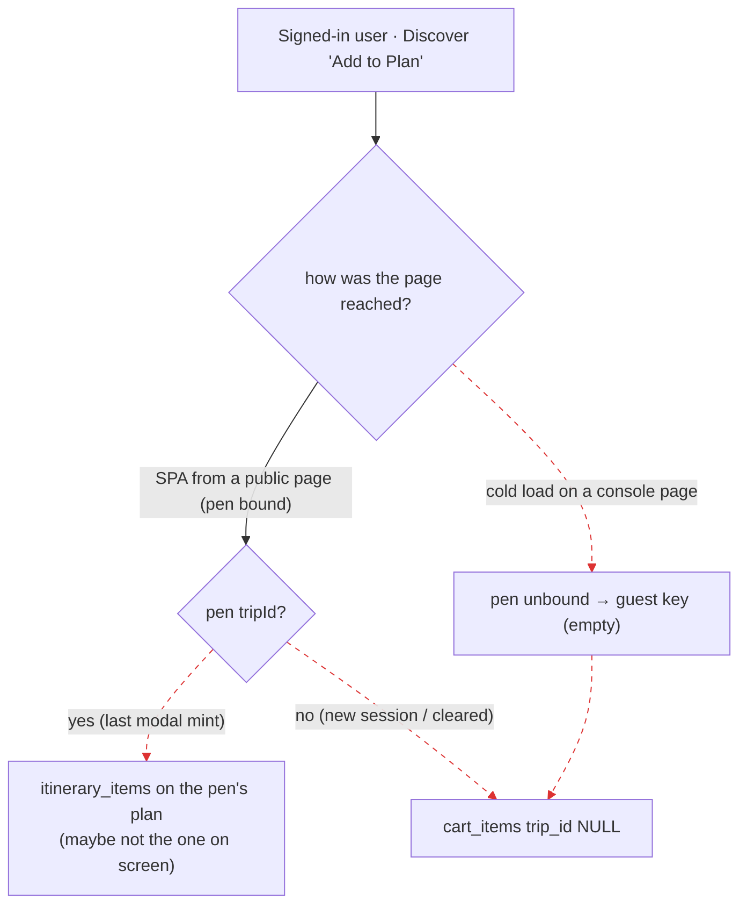

# J2: Discover "Add to plan" with no prior modal (0 / 1 / 2+ trips)

The harness, environment and evidence standard are the same as J1 (`../J1/README.md`). The script is
`docs/audits/journeys/harness/j2.mjs`, with helpers in `harness/lib.mjs`. Per-step tables are in [`EVIDENCE.md`](EVIDENCE.md).

**Expected**
- UNIFIED_PLANNING_FLOW_SPEC_v2 §2: "Add to my plan" targets the trip the user is currently building. With no
  plan, the add lands in the Cart, which is the hinge (§4).
- R-1: every path resolves to a `tripId`.

## Runs

| Run | State | How Discover was reached | Add wrote | Target correct? |
|---|---|---|---|---|
| R1 | authed, **0 plans** | cold load of `/services` | `cart_items`, `trip_id NULL`; "Added to cart!" | Consistent with the spec's Cart hinge (§4). But the label says **"Add to Plan"** (FALSE_PROMISE, as in J1-F2). |
| R2 | authed, **1 plan** made in an earlier session; new session | cold load of `/my-trips` (1 card), then SPA `/services` | `cart_items`, `trip_id NULL` | **No.** The user has a plan and My Plans shows it (H8 D1(i) and D6). |
| R2b | same, but session 2 starts on the **public landing** | landing, then SPA `/services` | `cart_items`, `trip_id NULL` | **No.** The pen was bound and hydrated from the legacy row, which is `{}` (H8 D1(ii)). |
| R3 | authed; plan A (modal) → **second modal "Build it myself" for Osaka** → plan B (Create New, Tokyo) | sidebar Discover from B's slip, then `/services` | Osaka: **no plan, no navigation, no message**; the trip strip shows "YOUR TRIP · Osaka". Add → `cart_items`, `trip_id NULL` | **No** (H8 D3). |
| R4 | authed; A (modal), B (Create New); viewing **B's slip** | sidebar Discover, then **full load** of `/services` | `cart_items`, `trip_id NULL`, while the pen held A's `tripId` under the user key | **No** (H8 D6: the pen was never bound on the console shell). |
| R4b | same as R4 | sidebar Discover, then **SPA** `/services` | `itinerary_items` on **plan A**; B is empty | **No.** The user was viewing B (H8 D2). |

**Summary**
- J2 has the same user intent on the same data in six variants, and they produce **four different outcomes**:
  a cart line, a trip-less cart line while plans exist, an item on a plan the user is not viewing, and a
  phantom plan.
- The add target depends on **how the page was reached**, not on what the user sees.

## Gaps filed from J2

| ID | Class | Sev | Summary | Evidence |
|---|---|---|---|---|
| J2-F1 | KEY_MISMATCH / LIFECYCLE_LOSS | **P1** | The pen binder exists only in the public `Layout`. On every console cold load, the pen reads the guest key and every add falls to the cart. | R4 step 5; `components/layout.tsx:596`, `components/browse-shell.tsx:19-21` |
| J2-F2 | ORPHAN_READ | **P1** | A new session never recovers the active trip, because hydration reads the legacy `trip_contexts` row and not the plan the user owns. | R2b; `lib/trip-context.ts:506-534`; `server/routes/trip-context.routes.ts:225-239` |
| J2-F3 | DEAD_TRIGGER + FALSE_PROMISE | **P1** | A second "Build it myself" with a new city while a plan is bound creates nothing, says nothing and navigates nowhere, and the trip strip then shows a plan that does not exist. | R3 step 4 png and `trip_contexts` diff; `plan-modal.tsx:1179-1185`, `:851-852` |
| J2-F4 | SPEC_DIVERGENCE (R-2) | **P1** | Viewing plan B and adding from Discover writes to plan A. | R4b step 5; `lib/trip-target.ts:42-47`; `lib/trip-selection.ts:15` (the rebinder, with zero callers) |
| J2-F5 | INVISIBLE_RESULT | P2 | The `/services` grid never names the plan a pen-targeted add lands on (the banner only shows for URL `?tripId`). | R4b step 5; `discover.tsx:1550` |
| J2-F6 | FALSE_PROMISE (§13) | P3 | IntakePanel "Create" mints a plan showing "2 travelers" that the user never entered. | R3 step 7 png. The static cause (a default in IntakePanel's travelers field) is **not yet traced**. |

The dashed edges are **KEY_MISMATCH** (edges 2 and 5: the guest key is read for a signed-in user), **SPEC_DIVERGENCE**
(edge 3: the wrong plan), and **ORPHAN_READ** (edge 4: a plan exists but is unresolved).

## NOT PROVEN (J2)

- A guest with 1 or more plans is impossible: anonymous mints are refused (`server/routes.ts:1401-1406`).
- The mobile viewport was not run.
- R3 used `?location=Kyoto` to guarantee that a listing rendered. It carries no `tripId`, so target resolution is
  unchanged. The Osaka-filtered grid had no listings in this seed.
