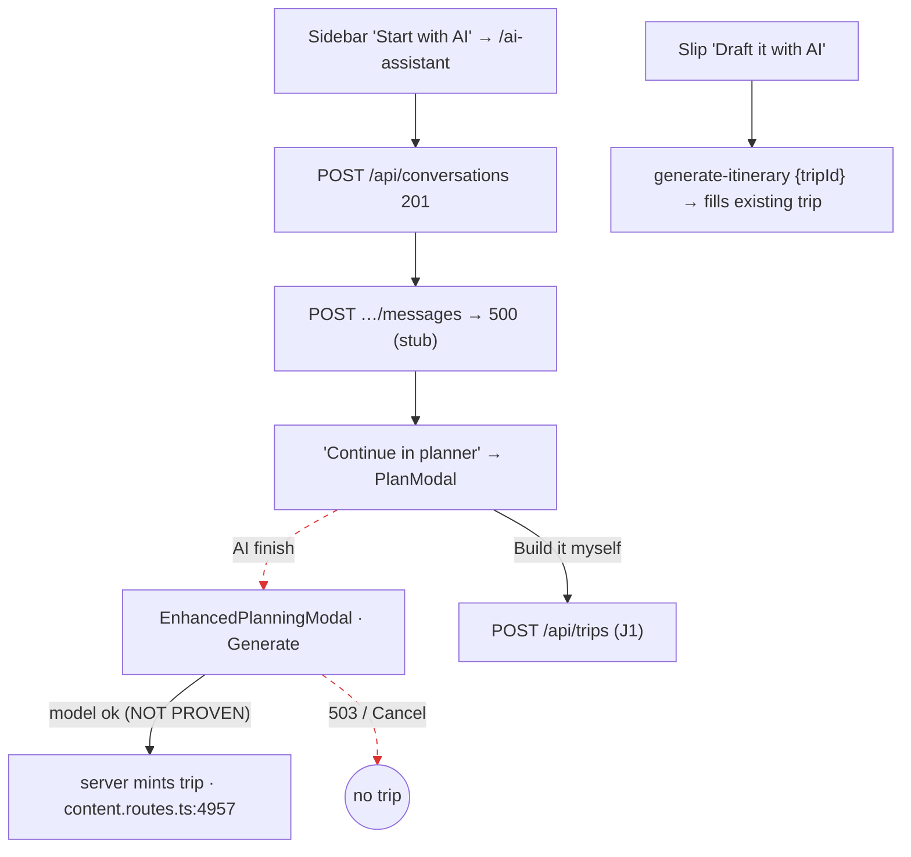

# J3: AI planner → draft → does it produce a `tripId`?

The harness is `harness/j3j4.mjs` and the environment is the same as J1. Evidence is in [`EVIDENCE.md`](EVIDENCE.md).
**Limit:** the AI providers are stubbed, and xAI's base URL is hardcoded (`server/services/grok.service.ts:35`,
FU-AE-4). **No successful generation could be run.** Every "success path" claim below is therefore **static** and
listed under NOT PROVEN.

**Expected:** UNIFIED_PLANNING_FLOW_SPEC_v2 §1–3 says the prompt-and-generate entry fills the Cart and resolves to one Trip,
with a free draft.

There are **three AI entry points on traveler surfaces, and they create plans differently**:

| Entry | What it calls | Creates a trip? | Evidence |
|---|---|---|---|
| **A. `/ai-assistant` chat** (sidebar "Start with AI") | `POST /api/conversations` 201, then `POST /api/conversations/1/messages` → **500** (stub). The draft panel then extracts context into the pen (`ai-planner-draft-panel.tsx:87-93`, which itself needs AI). "Continue in planner" **opens the plan modal** (`:183`) | **No.** The chat never creates a trip. It hands off to the modal, so J1's rules then apply (only "Build it myself" mints). | **R1** steps 2–5: a conversation row was created. The 500 was **not** shown: the thread stayed empty, the prompt stayed in the input box, and the error appears only in the console. "Continue in planner" was clicked, and My Plans shows 0. |
| **B. Plan modal → "Plan with AI" → `EnhancedPlanningModal` → Generate** | `POST /api/ai/generate-itinerary` | **Only on a successful model call.** The server mints inside `saveGeneratedItinerarySnapshot` (`server/routes/content.routes.ts:4957`), after the 503 exit at `:4949`. | J1 R4b/R6b: 503, no row. |
| **C. Slip "Draft it with AI"** (an existing, empty plan) | `POST /api/ai/generate-itinerary {tripId}` | No. It fills the **existing** trip (`slip-action-draft-ai`, `SlipRail.tsx:442-463`). | **R2** step 2: 503, and the failure is surfaced on the slip. |

## Flow

Edges 3 and 5 are broken: **SPEC_DIVERGENCE**. The chat entry reaches no `tripId` unless the user then picks "Build it myself".

## Findings

| ID | Class | Sev | Summary | Evidence |
|---|---|---|---|---|
| J3-F1 | SPEC_DIVERGENCE | **P1** | The AI chat entry ("Start with AI") never produces a `tripId`. It ends in the plan modal, where the AI finish again mints nothing until a generation succeeds (J1-F1). | R1 steps 3–5; `ai-planner-draft-panel.tsx:183` |
| J3-F2 | SILENT_FAILURE_UI | P2 | A failed chat send shows **nothing**: the thread is empty and the prompt sits in the input as if unsent. The error is logged to the console only. | R1 step 3 png plus console `Error sending message: HTTP error! status: 500` |
| J3-F2b | INCONSISTENT_AFFORDANCE | P2 | Three different "plan with AI" controls behave differently: the chat (no trip, hands off to the modal), the modal AI finish (opens a second modal) and the slip draft (fills an existing plan). Their failure handling differs too: silent vs a sanitized "high demand" message. | R1 step 3 vs J1 R4b step 8 vs R2 step 2 |
| J3-F3 | STALE_CACHE | P2 (static) | A successful Generate (B) mints server-side, but the client invalidates nothing, so My Plans would stay stale (H7 §C). | `EnhancedPlanningModal.tsx:324-381` |

## NOT PROVEN

- **A successful generation.** Whether B mints a trip that My Plans then shows, and whether the pen is bound to it
  afterwards: static reading says the client only navigates to `/itinerary-comparison/:id`
  (`EnhancedPlanningModal.tsx:372`) and does not write the pen. This needs a real xAI key or an overridable base URL.
- **A successful chat** (A), and what the extracted draft carries into the modal.
