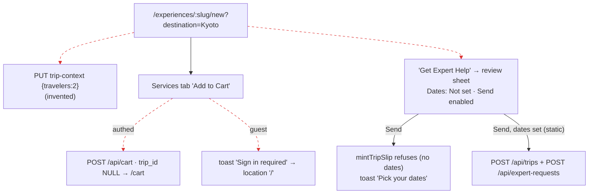

# J4: Experience template entry → trip resolution

The harness is `harness/j3j4.mjs`, plus the probe `harness/j4-send-probe.mjs` for the toast timing. Evidence is in [`EVIDENCE.md`](EVIDENCE.md).

**Expected:** UNIFIED_PLANNING_FLOW_SPEC_v2 §2 treats the template as the "guided" entry. It writes to the one Cart, and
everything resolves to one Trip (R-1). LD 32(a): the template's expert-help lead must create the slip first, and it must
**ask** for missing dates, never guess them.

## Runs

| Run | Step | Screen | Network / DB | Pass? |
|---|---|---|---|---|
| R1 authed | open `/experiences/travel/new?destination=Kyoto` | Trip strip: "YOUR TRIP · Kyoto, Japan · **2 travelers**" | `PUT /api/trip-context {…"travelers":2…}` with **no user input** (step 2) | **FAIL**: FALSE_PROMISE (§13). A party of 2 is invented and shown as the user's. |
| R1 | Services tab → "Add to Cart" | Navigates to `/cart` | `POST /api/cart` → `cart_items`, **`trip_id NULL`** (step 4) | Label and effect agree ("Add to Cart"). But no trip exists, which is **SPEC_DIVERGENCE** (R-1): the guided entry reaches a trip only through the cart's later `resolve-trip` or `convert-to-itinerary`. |
| R1 | "Get Expert Help" → review sheet | The sheet lists "Dates: **Not set**", "Travelers: 2 travelers", and an enabled **"Send request"** button | — | **FAIL**: FALSE_PROMISE. The button is offered even though the precondition (dates) is already known to fail. |
| R1 | "Send request" | Toast: "Your plan needs a few basics first · Pick your dates…" (visible about 0.3–1.2 s after the click, `j4-send-probe`) | No mint, no expert request (only `PUT /api/trip-context`) | **PASS** as a refusal, and it follows LD 32(a). The toast is the only feedback, and the sheet has already closed (`experience-template.tsx:1663`). |
| R1 | My Plans | 0 plans | — | consistent |
| R2 guest | "Add to Cart" | The page **navigates to `/`** after 1.5 s | No write at all | **FAIL**: AUTH_DROP and LIFECYCLE_LOSS. The guest's selection and position are lost, and no sign-in opens (`experience-template.tsx:1725-1727`). |

## Flow

Broken edges:
- Edge 0 is **FALSE_PROMISE**: the party size is invented.
- Edge 2 is **SPEC_DIVERGENCE**: the add creates no trip.
- Edge 3 is **AUTH_DROP**: the guest is redirected and the selection is lost.
- Edge 4 is **FALSE_PROMISE**: Send is offered although it will be refused.

## Findings

| ID | Class | Sev | Summary |
|---|---|---|---|
| J4-F1 | AUTH_DROP + LIFECYCLE_LOSS | **P1** | A guest "Add" on a template redirects to the landing page and loses the selection (R2 step 4). |
| J4-F2 | SPEC_DIVERGENCE | P2 | The template's add never targets a trip unless the pen already holds one (`experience-template.tsx:1738`, the same `resolveTargetTripId`). With no plan, it goes to a trip-less cart line and navigates away to `/cart` (R1 step 4). |
| J4-F3 | FALSE_PROMISE (§13) | P2 | "2 travelers" is invented and written to the pen and the trip strip with no input (R1 step 2). |
| J4-F4 | FALSE_PROMISE | P2 | The review sheet offers "Send request" while showing "Dates: Not set", which it knows will be refused (R1 step 5 png). |
| J4-F5 | SILENT_FAILURE | P3 | `POST /api/geocode` → 404 "Location not found" for "Kyoto, Japan", which is an operating market (R1 step 2). The environment has no Google key, so production behaviour is **NOT PROVEN**. |

## NOT PROVEN

- The template "Start your plan" ribbon (it opens the plan modal, so J1 applies) was not run separately.
- The Travelpayouts cards on the Hotels, Activities and Flights tabs render nothing without live partner feeds (A5).
