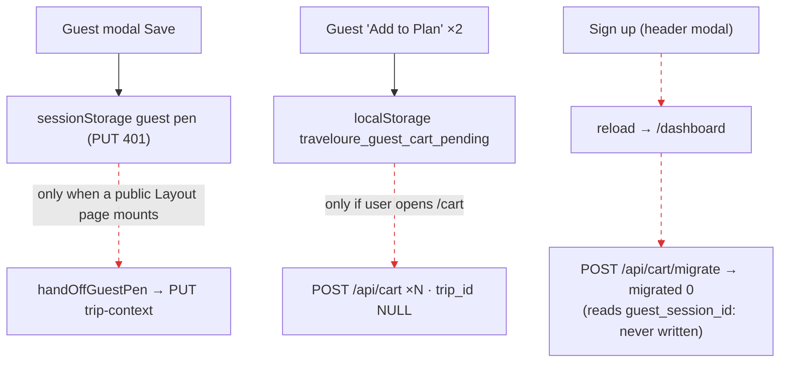

# J5: Guest builds a cart and plan answers → signs up → migrated or dropped? (G2)

The harness is `harness/j5j6.mjs`. Evidence is in [`EVIDENCE.md`](EVIDENCE.md).

**Expected:**
- UNIFIED_PLANNING_FLOW_SPEC_v2 §4 (G2): a guest session cart plus a **migrate-on-signup** endpoint.
- CLAUDE.md LD 39: the trip-less guest cart is sanctioned as a fallback until G2 (guest trips), which is **HELD**.
- `server/routes.ts:1401-1406`: an anonymous trip mint is refused. **So "no trip for a guest" is ruled behaviour, not a gap.**
  The audit checks whether guest state **survives** sign-up.

## Run R1: guest fills the modal (Save) and adds 2 services, then signs up through the header modal

| Step | Screen | Network / DB / storage | Verdict |
|---|---|---|---|
| 2: modal Save (guest) | Modal closes | `PUT /api/trip-context` → **401**. Answers are kept in the sessionStorage guest pen `experienceContext`. | Expected (guest) |
| 3: 2 × "Add to Plan" (guest) | "Saved!" toasts | Written to localStorage `traveloure_guest_cart_pending` only | FALSE_PROMISE (J1-F6) |
| 5: sign-up submit | Full reload to **`/dashboard`**, not the page the guest was on | `POST /api/auth/register` 201; `POST /api/cart/migrate` ×2 → **`migrated: 0`** | **AUTH_DROP (P2):** no return to the surface. **ORPHAN_READ:** `/api/cart/migrate` moves `cart_items.guest_session_id` rows, and **nothing writes that column**. `POST /api/cart` requires auth (`server/routes.ts:9154`) and the projection writes `guestSessionId: null` (`server/services/cart-projection.service.ts:330`). The guest's two items were in localStorage, so 0 migrated. |
| 6: `/cart` | 2 items shown | `POST /api/cart` ×2 → `cart_items`, `trip_id NULL` | **Migration happens only on visiting `/cart`** (`pages/cart.tsx:666-693`). A new user who never opens Trip Cart keeps the items only in this browser's localStorage. |
| 7: My Plans | 0 plans | — | Ruled (G2 held) |
| 8: back to `/` → reopen modal | The modal is pre-filled from the handed-off pen | `GET /api/trip-context` ×2, `PUT /api/trip-context` → a new legacy `trip_contexts` row | The guest pen is handed over **only once a public-`Layout` page mounts**. Steps 5–7 were on the console shell, where the pen binder is absent (H8 D6), so the handover was deferred until step 8. |

## Flow

Broken edges:
- Edge 2 is **AUTH_DROP**: no return to the surface.
- Edge 3 is **ORPHAN_READ**.
- Edges 4 and 5 are **LIFECYCLE_LOSS / KEY_MISMATCH**: migration is conditional on where the user happens to go next.

## Findings

| ID | Class | Sev | Summary |
|---|---|---|---|
| J5-F1 | ORPHAN_READ | P2 | `/api/cart/migrate` (called by `GuestCartMigrator` `App.tsx:1271` **and** `SignInModal`) migrates a store no path writes. It always returns `migrated: 0` for real guests. |
| J5-F2 | LIFECYCLE_LOSS | P2 | Guest Discover picks migrate only if the user opens `/cart` in the same browser (`cart.tsx:666-693`). Nothing else reads `traveloure_guest_cart_pending`. |
| J5-F3 | AUTH_DROP | P2 | Sign-up from the header modal lands on the role home, not on the guest's surface (`SignInModal.tsx:146-154`, prop `returnTo` unset by `button-sign-in`). `/signup` ignores return-to entirely (static, Phase 0). |
| J5-F4 | KEY_MISMATCH | P2 | The guest pen handover waits for a public-`Layout` mount (H8 D6). Until then, a signed-in console shows no plan answers. |

## NOT PROVEN

- Sign-up via Replit OAuth (`/api/login`), which is unavailable off-Replit.
- A guest concierge claim (`useClaimGuestConcierge`); DoneForYouCard was not run.
