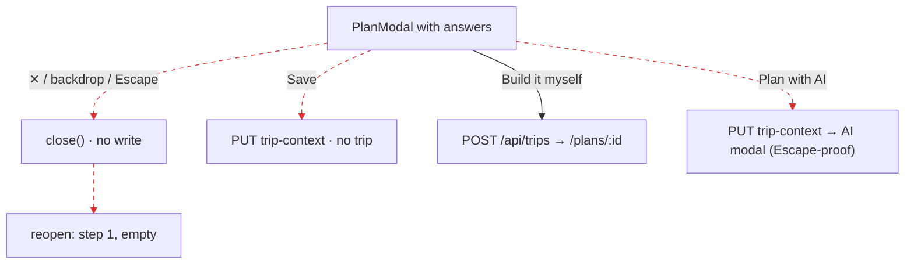

# J6: Plan modal dismissed mid-flow vs completed. Same effect?

The harness is `harness/j5j6.mjs`; J1 R3, R7 and R8 are reused. Evidence is in [`EVIDENCE.md`](EVIDENCE.md).

**Answer: no.** Dismissal and completion are **different code paths with different effects**, so H6 is disproven
(J1 §1). But **every dismissal throws away the user's answers**, and nothing tells them.

| Exit | Code path | Network / DB | On reopen | Evidence |
|---|---|---|---|---|
| ✕ close button | Radix `onOpenChange(false)` → `PlanningContext.close()` (`plan-modal.tsx:1380`, `PlanningContext.tsx:251`) | **none** | Restarts at step 1, "What are you planning?", with nothing selected | J6 R-close-x steps 2–3 |
| Backdrop click | same | **none** | Restarts empty | J6 R-backdrop steps 2–3 |
| Escape | same | **none** | Restarts empty | J6 R-escape steps 2–3; J1 R7 (Discover also lost the location) |
| **Save** | `save()` → `commitPlan` → `onOpenChange(false)` (`plan-modal.tsx:1151`) | `PUT /api/trip-context`; **no trip** | Pre-filled | J1 R8 |
| **"Build it myself"** (authed) | `finish()` → mint → `commitPlan` → `runBranch` (`plan-modal.tsx:1167-1222`) | `POST /api/trips` 201 plus context and occasion writes | → `/plans/:id` | J1 R3 |
| **"Plan with AI"** | `finish('ai')` → `commitPlan` → opens `EnhancedPlanningModal` | `PUT /api/trip-context`; **no trip** | — | J1 R4 |

## Flow

Broken edges:
- Edges 0 and 1 are **LIFECYCLE_LOSS**.
- Edge 2 is **ORPHAN_WRITE**: the pen is written with no Trip.
- Edge 4 is **ORPHAN_WRITE** plus **INCONSISTENT_AFFORDANCE**.

## Findings

| ID | Class | Sev | Summary |
|---|---|---|---|
| J6-F1 | LIFECYCLE_LOSS + SILENT_FAILURE_UI | P2 | All three dismissals drop every answer with no confirmation and no draft. The modal state lives in component state and is re-seeded from the pen on open (`plan-modal.tsx:486`), and only Save or a finish writes the pen. **Arguably P1 under the rubric ("the user loses work"). It is kept at P2 because no persisted object is lost.** |
| J6-F2 | INCONSISTENT_AFFORDANCE | P2 | Save commits the answers but creates no plan. "Build it myself" creates the plan. "Plan with AI" commits and opens a second modal that Escape cannot close (J1-F8). The same modal has four different "done" semantics. |
