# Contact sheet: traveler path (landing → plan modal → Discover → add → My Plans → slip)

Captured by `docs/audits/journeys/harness/u4-contact-sheet.mjs` against the local production build of `858d28f`, signed in, desktop viewport.
Images are downscaled (about 765 px wide).

Each image lists the **gap row ids visible on it**. The ids are from [`../action-effect.json`](../action-effect.json) and
[`../GAP_REGISTER.md`](../GAP_REGISTER.md). **—** means no registered gap is visible in that frame.

The flow is split into three paths:
- **A:** the path that works.
- **B:** My Plans was loaded earlier in the session.
- **C:** the other ways out of the modal.

## Path A: "Build it myself" (the path that works)

| # | Screen | What it shows | Gap row ids visible |
|---|---|---|---|
| 01 | 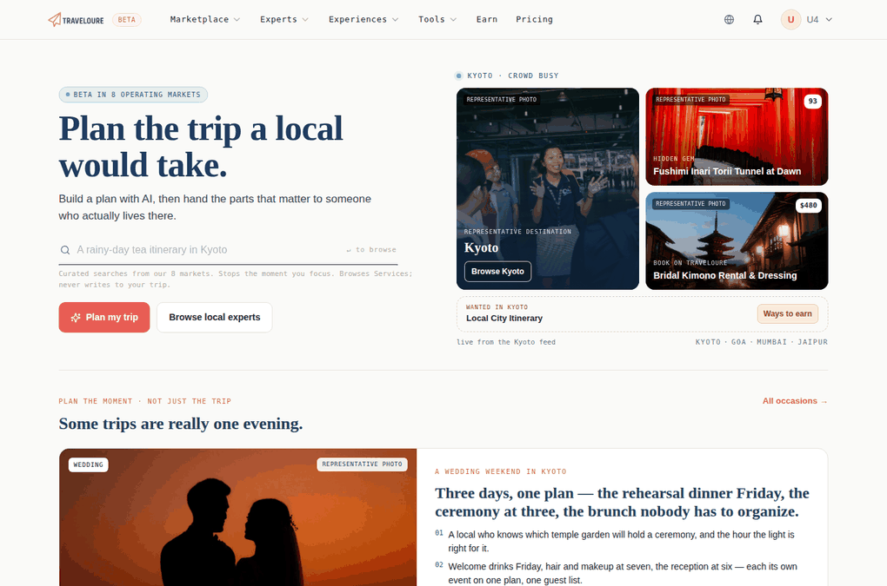 | Landing, signed in. "Plan my trip" opens the modal and makes no API call. | — |
| 02 | 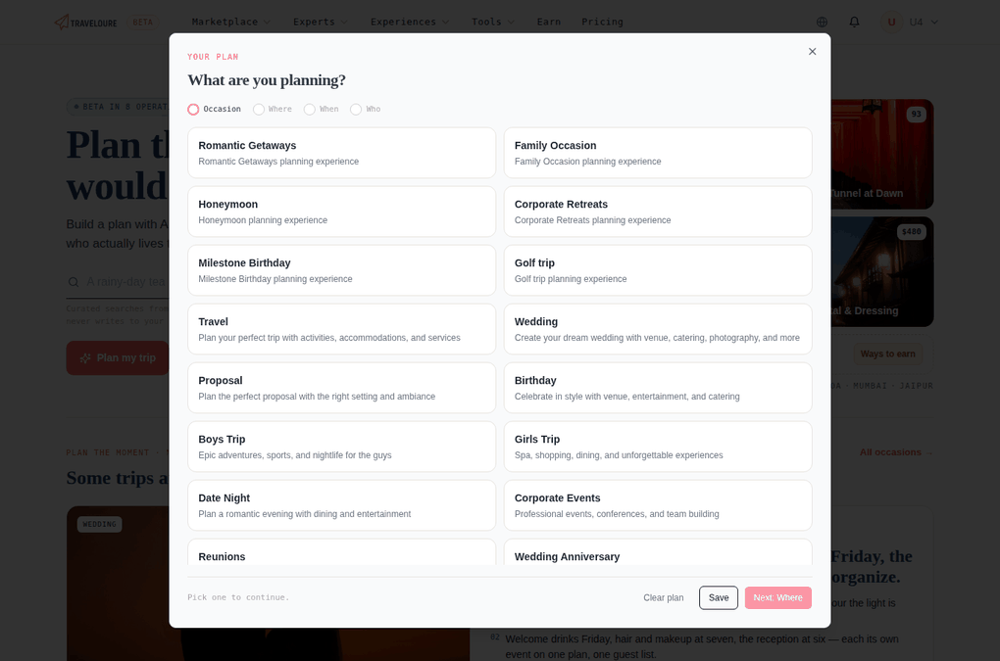 | Step 1, Occasion | `plan-modal:dialog-on-open-change` (the ✕ here, like Escape and the backdrop, drops every answer: LIFECYCLE_LOSS / SILENT_FAILURE_UI, **U2 CONFIRMED**) |
| 03 | 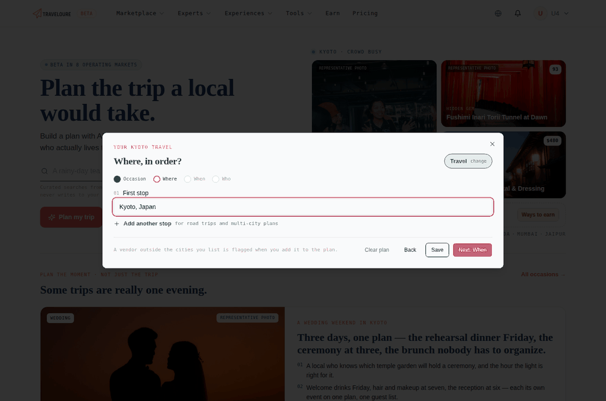 | Step 2, Where | `plan-modal:dialog-on-open-change` |
| 04 | 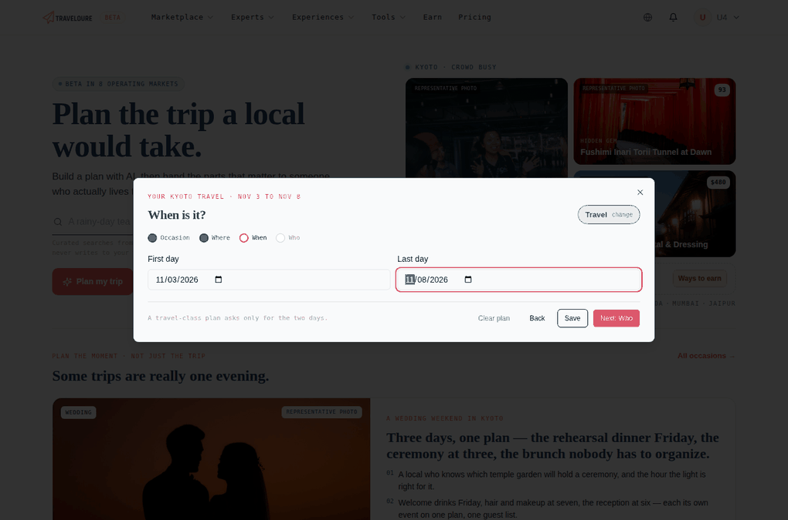 | Step 3, When | `plan-modal:dialog-on-open-change` |
| 05 | 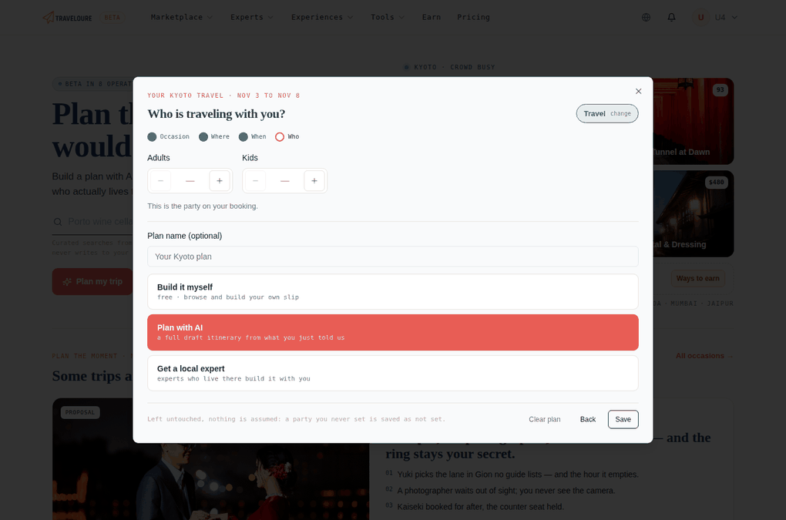 | Step 4, Who, plus the four ways to finish. Only "Build it myself" creates a plan. | `plan-modal:planning-option-ai` (SPEC_DIVERGENCE **P1**: no Trip); `plan-modal:button-etp-save` (ORPHAN_WRITE **P1**, SILENT_SUCCESS P2 **U2 CONFIRMED**); `plan-modal:planning-option-branch` (DEAD_TRIGGER **P1** when a plan is already bound and the city changes; guest AUTH_DROP / LIFECYCLE_LOSS **P1**); `plan-modal:dialog-on-open-change` |
| 06 | 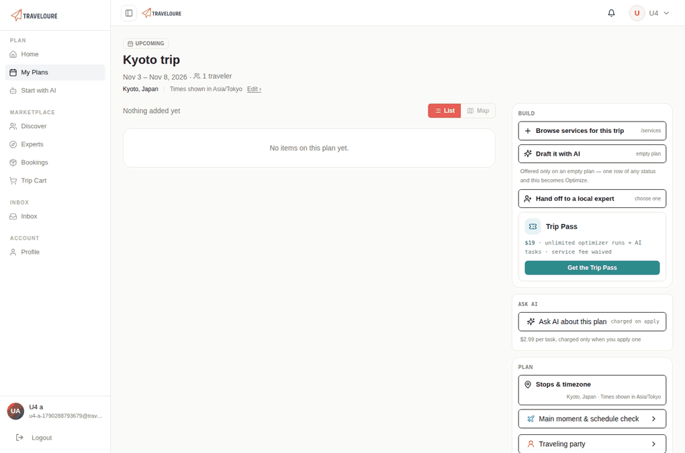 | "Build it myself" lands on the new plan's slip | `planning-provider:mint-plan` (STALE_CACHE **P1**, invisible here; see #12) |
| 07 | 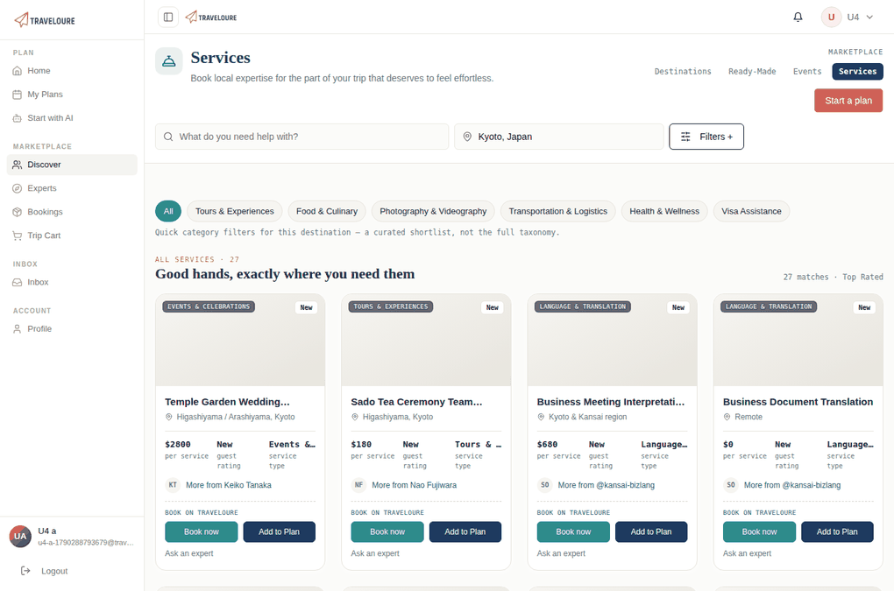 | Discover `/services`. The pen is bound to the new plan, but **no banner names it**. | `services:add-to-plan` (INVISIBLE_RESULT P2, **U2 CONFIRMED**) |
| 08 | 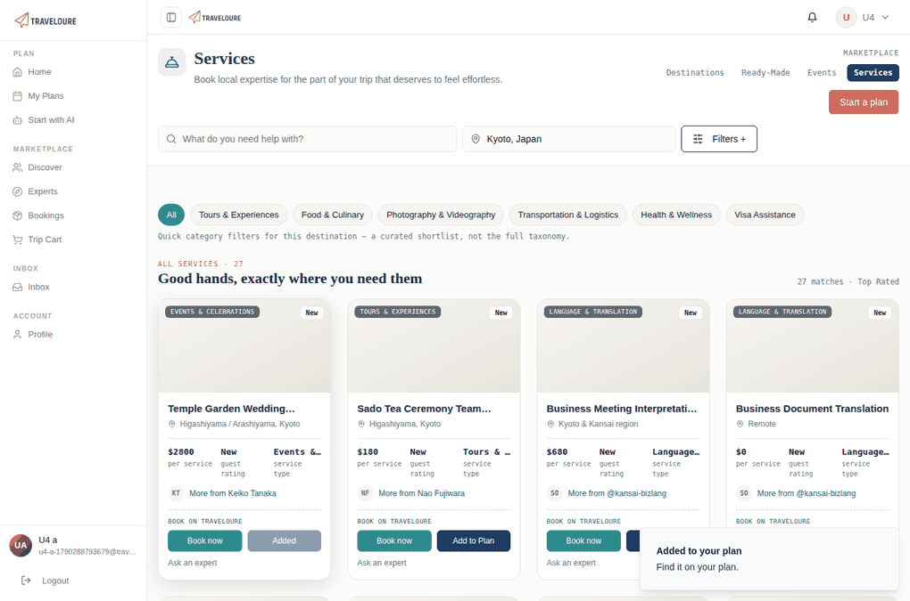 | "Add to Plan" → "Added to your plan · Find it on your plan", which doesn't say *which* plan | `services:add-to-plan` (INVISIBLE_RESULT P2, **U2 CONFIRMED**) |
| 09 | 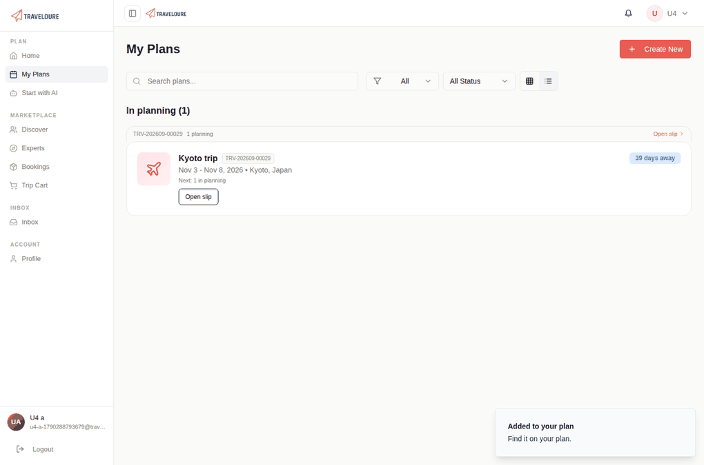 | `/my-trips`, loaded for the first time here, so it's correct: 1 plan | — |
| 10 | 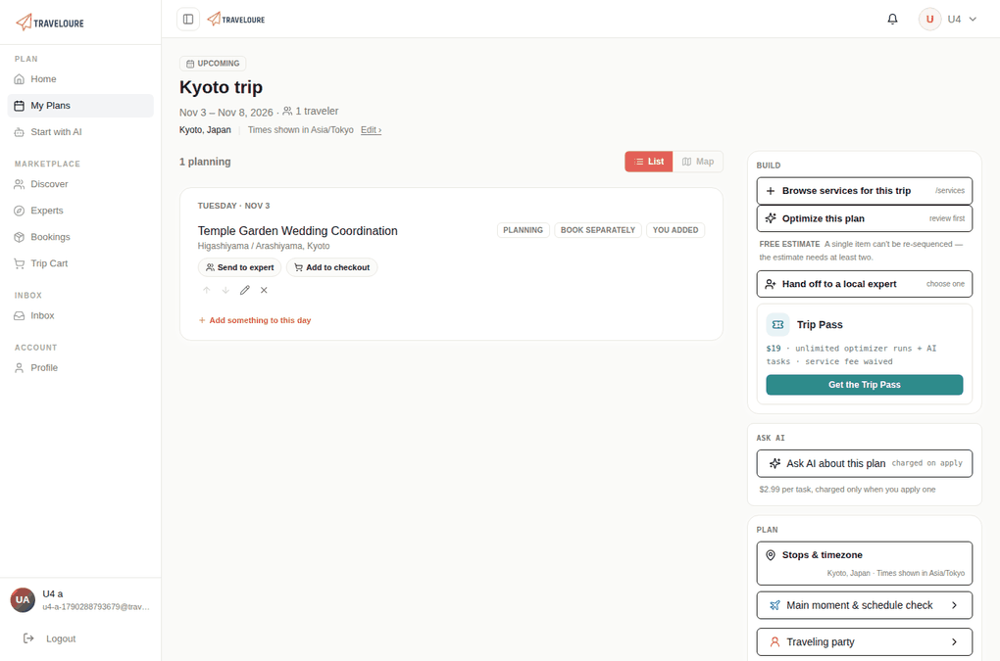 | `/plans/:tripId`, the slip, with the added item | — (**new observation, not registered:** the header reads "1 traveler" although the party was never set in the modal; the §13 posture is "untouched ⇒ not stated". **NOT PROVEN** as a gap; it needs tracing.) |

## Path B: My Plans loaded before planning (stale list)

| # | Screen | What it shows | Gap row ids visible |
|---|---|---|---|
| 11 |  | `/my-trips` visited first. The empty list is now cached. | — |
| 12 | 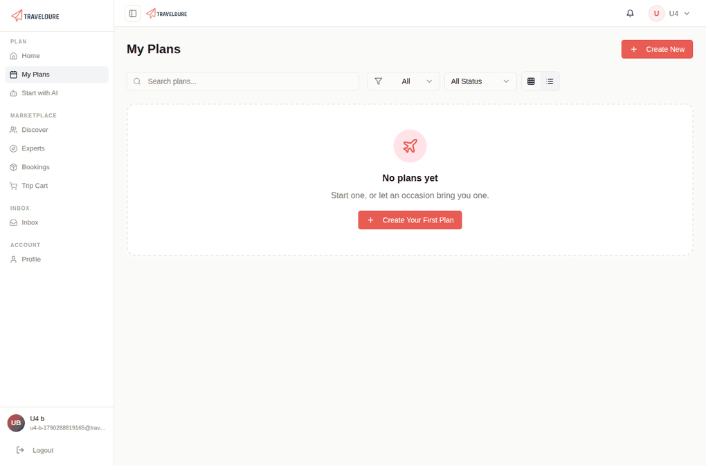 | After "Build it myself" in the same session, the list still says **"No plans yet"** | `planning-provider:mint-plan`, `plan-modal:planning-option-branch` (STALE_CACHE **P1**, behavioural J1 R5) |

## Path C: the other exits, then "Add to Plan"

| # | Screen | What it shows | Gap row ids visible |
|---|---|---|---|
| 13 | 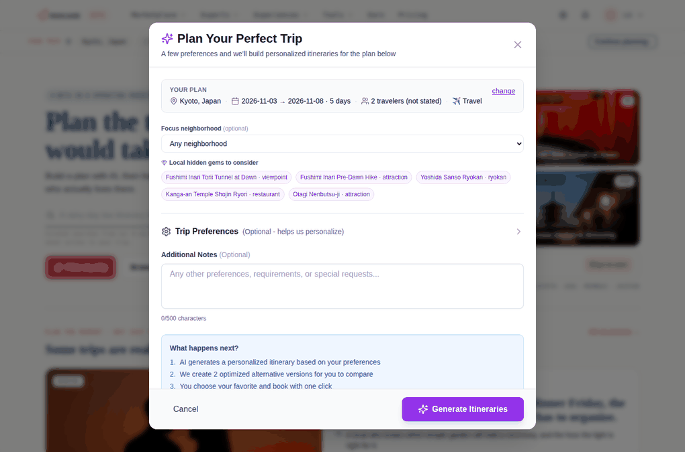 | "Plan with AI" opens a second modal. The "YOUR PLAN" card describes a plan that doesn't exist yet, and shows **"2 travelers (not stated)"**. | `plan-modal:planning-option-ai` (SPEC_DIVERGENCE **P1**); `planning-provider:run-branch-ai` / `planning-provider:ai-modal-on-close` (INCONSISTENT_AFFORDANCE P2: Escape and the backdrop don't close it, **U2 CONFIRMED**); J1-F9 (travelers: 2 sent, P3) |
| 14 |  | After the AI exit, "Add to Plan" → **"Added to cart!"** | `services:add-to-plan` (FALSE_PROMISE **P1**, **U2 CONFIRMED**) |
| 15 |  | `/my-trips`: No plans yet (correct, because no plan exists) | `plan-modal:planning-option-ai` (SPEC_DIVERGENCE **P1**) |
| 16 | 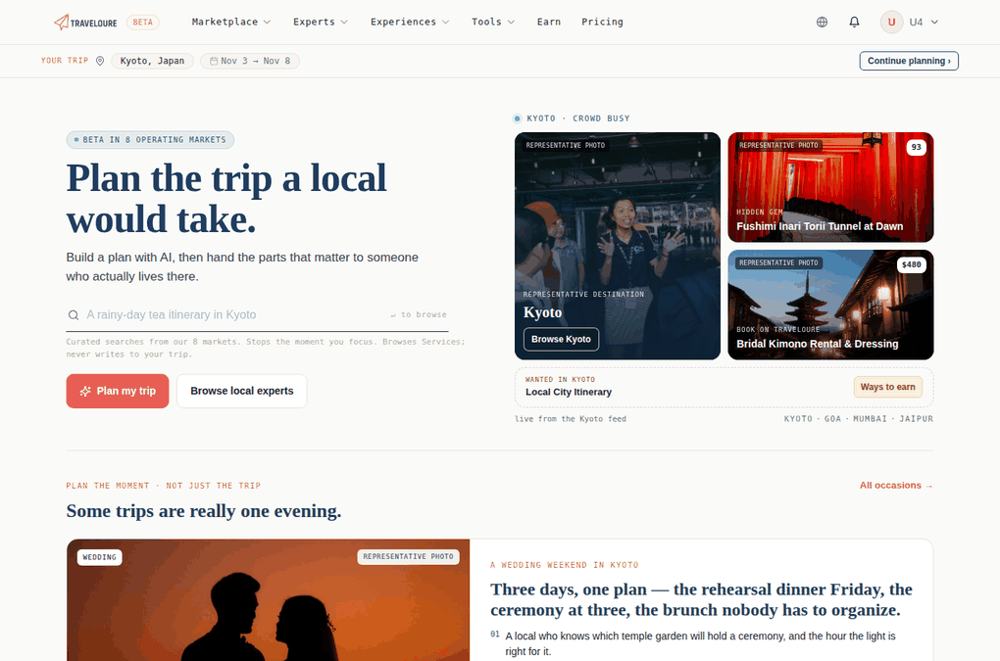 | Save closes the modal with no confirmation. Only the "YOUR TRIP" strip changes, and no plan exists. | `plan-modal:button-etp-save` (ORPHAN_WRITE **P1**, SILENT_SUCCESS P2 **U2 CONFIRMED**) |
| 17 | 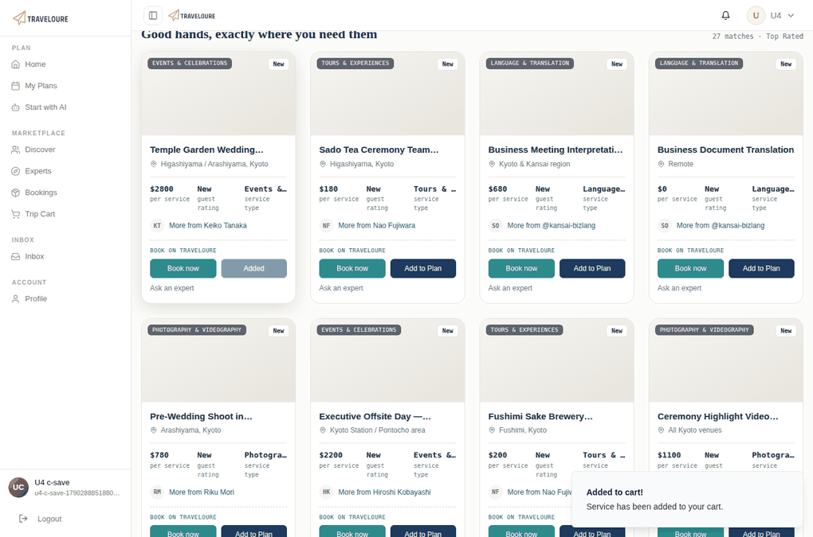 | After Save, "Add to Plan" → "Added to cart!" | `services:add-to-plan` (FALSE_PROMISE **P1**) |
| 18 | 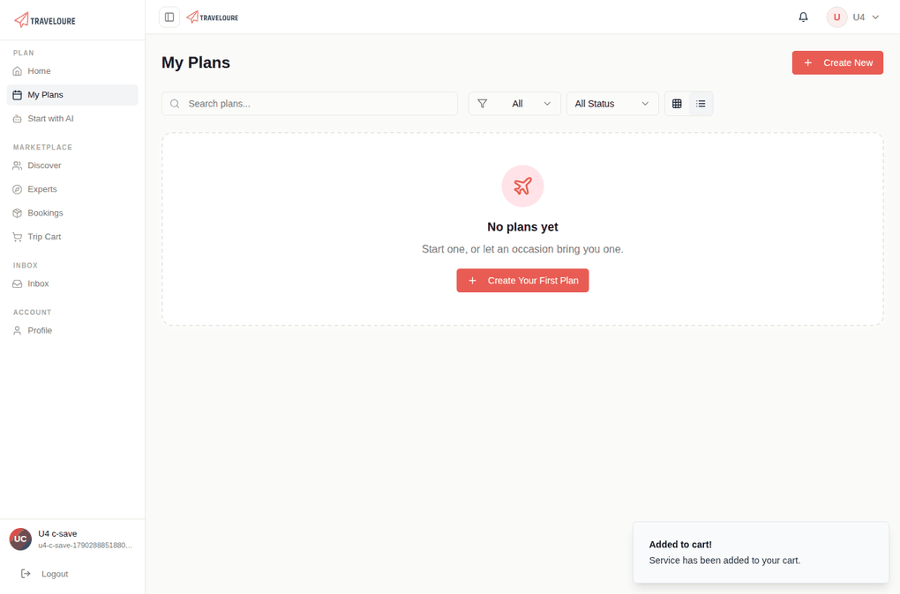 | `/my-trips`: No plans yet | `plan-modal:button-etp-save` |
| 19 |  | Escape closes the modal and keeps nothing | `plan-modal:dialog-on-open-change` (LIFECYCLE_LOSS / SILENT_FAILURE_UI, **U2 CONFIRMED**) |
| 20 | 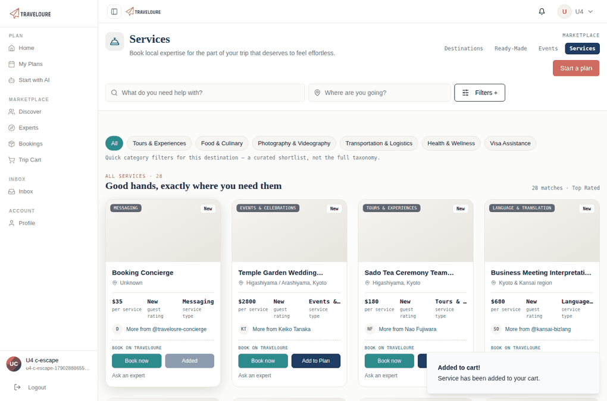 | Discover has lost the city ("Where are you going?" is empty). "Add to Plan" → "Added to cart!" | `services:add-to-plan` (FALSE_PROMISE **P1**) |
| 21 |  | `/my-trips`: No plans yet | — |
