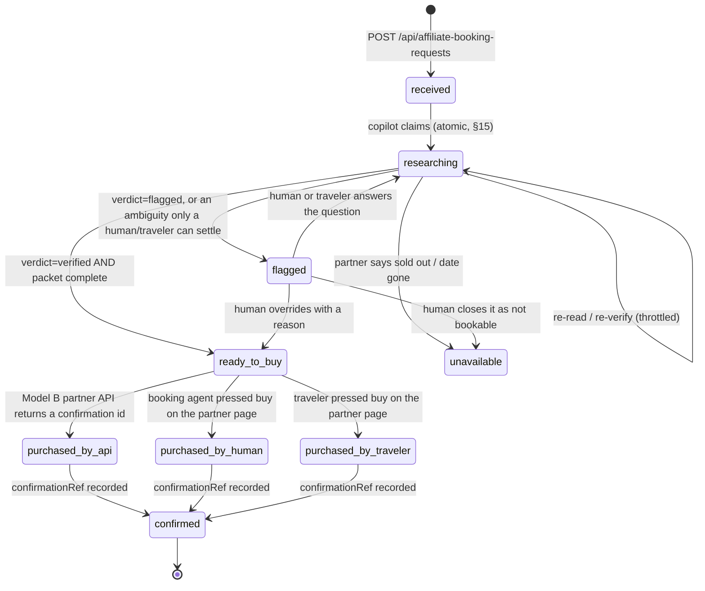

# The AI Booking Agent — copilot first, human or API purchase, read-only browser

> **RATIFIED — decision-maker, in session, Sep 5, 2026 (evening).** Recorded as **CLAUDE.md Locked
> Decision 44** and ledger row `2026-09-05-ai-booking-agent`. This brief is the **content of record**
> for that ruling: the ruling is the short form, this is the long one. **This lane is DOCUMENTATION
> ONLY — no product code, no schema, no migration.** Every phase below is unbuilt unless the
> "Verified today" column says otherwise.

**Namespacing (ruling 37):** the phases below are **LD 42 build-order wave 2b**. Never write a bare
"Wave 2" for them.

---

## 0. The problem

The platform already tells the traveler, on every partner-fulfilled item, that *"our booking agent
will handle this and add it to your trip"* (`client/src/components/plancard/AffiliateBookButton.tsx`).
That promise is currently kept by a pooled human queue and nothing else. Three things follow, and
all three are verifiable in the repo today:

1. **The "agent" is whoever the table returns first.** Auto-assignment is
   `getExpertUserIds(10)[0]` (`server/routes/content.routes.ts:7534` and `:7628`), and
   `getExpertUserIds` is `SELECT id FROM users WHERE role='expert' LIMIT 10`
   (`server/services/content-query.service.ts:568`). The comment above the call says *"based on
   category (city match optional, fallback any expert)"* — **there is no category match and no city
   match in the code**. The comment describes an intent the function does not implement.
2. **The traveler is told nothing after they press the button.** `GET
   /api/affiliate-booking-requests/user` (`server/routes/content.routes.ts:7650`) exists and
   **has zero callers in `client/`** (verified by grep). The traveler's request enters a queue they
   cannot see, on a plan surface that never mentions it again.
3. **The one piece of machine help that exists is mounted on one screen.** The verification leg
   (`server/services/booking-verification.service.ts`, route at `content.routes.ts:7898`) is real,
   ratified and live — and its only client caller is the trip-scoped Workstation
   (`client/src/pages/expert/workspace.tsx:3121-3152`). The **pooled** queue an unassigned request
   actually lands in — `AgentBookingRequestsSection` in `client/src/pages/expert/inbox.tsx:462` —
   has no verify control at all, so the requests most in need of a machine pre-pass are the ones
   that never get one.

So the machinery exists in pieces and the human is the only thing holding them together. This
ruling names which piece does what, and — the part that matters more — **which piece is forbidden
from doing the thing it looks capable of**: pressing the final buy.

---

## 1. The ruling (LD 44, verbatim)

**THE PLATFORM'S BOOKING AGENT IS THE AI COPILOT FIRST; A HUMAN OR A PARTNER API MAKES THE
PURCHASE; BROWSER CONTROL IS READ-ONLY.**

**(a)** Every affiliate booking request is assigned to the AI copilot on creation, before any
human. The copilot researches (Tavily) and verifies (the existing verification leg), resolves
ambiguities with the traveler through the LD 40 conversation rail (which time slot, which room
class), prepares an exact purchase packet, and drafts the traveler-facing confirmation. Humans see
only requests that are **READY TO BUY** or **FLAGGED**.

**(b)** API partners are booked **END TO END** by the agent through the partner's booking API
(Amadeus is the precedent): a real confirmation id, idempotent by construction (§15), amount
server-derived (§14).

**(c)** Affiliate (link) partners get a **ONE-CLICK HUMAN PURCHASE**: the human booking agent, or
the traveler themselves, presses the final buy on the partner's page opened through the platform's
tracked redirect (`sub_id` carrying the request id — the parallel lane
`2026-09-05-affiliate-subid-live`). The agent never types a card into a partner form and never
completes a purchase by browser automation: affiliate programs treat automated conversions as
fraud, a bot purchase is a money movement with no server-verified actor or idempotent claim, and
card handling outside Stripe is a PCI exposure.

**(d)** Browser control (Playwright or a hosted browser) is **READ-ONLY**: verification and price
capture where Tavily's extract falls short. Revisited only with a partner's written consent,
recorded in the ledger.

**(e)** Status vocabulary is honest (§13):
`received → researching → ready_to_buy → purchased_by_<human|traveler|api> → confirmed`, plus
`flagged` and `unavailable`; **"booked" is said only with a confirmation in hand**. The slip's
bookings section (LD 42 D9) renders *"prepared, awaiting purchase"* distinctly from *"booked"*.

**(f)** Cost and honesty: every copilot model call writes `ai_cost_tracking`; the copilot never
invents availability, price or policy (null with reason); a partner page that cannot be read leaves
the request `researching` with the reason, never `ready_to_buy`.

---

## 2. What exists today — the rails this brief relies on (verified)

| Rail | Path | State |
|---|---|---|
| Request row | `affiliate_booking_requests` (`shared/schema.ts:9178-9212`) — `status varchar(30) default 'pending'`, **no DB CHECK**, `verification jsonb` (migration 170), partial index `idx_abr_expert_id` | **exists** |
| Create (item / vault token / registry / transport / partner route) | `POST /api/affiliate-booking-requests` (`server/routes/content.routes.ts:7462`) — §16 server-resolved URL, **client never supplies or receives it** | **exists** |
| Create (catalog reference) | `POST /api/affiliate-booking-requests/from-catalog` (`:7577`) | **exists** |
| Auto-assign | `getExpertUserIds(10)[0]` (`:7534`, `:7628`; impl `server/services/content-query.service.ts:568`) | **exists — arbitrary, see §0.1** |
| Traveler read | `GET /api/affiliate-booking-requests/user` (`:7650`) | **exists, NO client caller** |
| Agent read | `GET /api/affiliate-booking-requests/expert` (`:7666`) | **exists** |
| Agent write / confirm | `PATCH /api/affiliate-booking-requests/:id` (`:7713`) — allowlist `["status","expertNotes","confirmationRef","price","expertId"]`; cross-trip guard; **§15 atomic confirm claim** `storage.confirmAffiliateBookingRequest` (`server/storage.ts:7360`) | **exists** |
| Confirm side-effects | itinerary item written with `origin:"expert"`, `suggestedBy:"expert"` (`:7787-7805`); `reFinalizeIfCurrentlyFinal`; `affiliate_earnings` row with commission fields honestly `"0.00"` pending the partner report (`:7828-7866`) | **exists** |
| Verification leg | `server/services/booking-verification.service.ts`; route `POST /api/affiliate-booking-requests/:id/verify` (`:7898`) | **exists** |
| Verification cost tracking | `trackAnthropicResponse(resp, { sourceType: "ai_expert", userId: request.expertId ?? null, requestId })` → `ai_cost_tracking` (`booking-verification.service.ts`; tracker at `server/services/ai-cost-tracker.ts:64`) | **exists** |
| Outbound attribution | `applyAttributionSubId` / `parseAttributionSubId` (`server/services/travelpayouts/travelpayouts-client.ts:41,59`), flag `TP_SUBID_ATTRIBUTION` — **dormant by default**; the sub_id is baked into the STORED `affiliate_url` at create (`content.routes.ts:7541`, `:7620`) | **exists, dormant** |
| Commission adoption | `server/services/affiliate-reconciliation.service.ts` — exact-token adoption matcher keyed on `external_report_data.affiliateBookingRequestId`; **adopts the partner's real amount, never estimates** (MONEY_MAP F-5) | **exists, dormant with the flag** |
| Tracked informational outbound | `POST /api/content/affiliate-redirect` (`:8627`) — **content-addressed**, returns a URL to the client, approved-partner gated | **exists — NOT request-addressed (see §7)** |
| Partner money models | `docs/MONEY_MAP.md` §0a (`:140-156`) — Model A (we are MoR) / Model B (partner MoR, in-platform API) / Model C (redirect affiliate) | **exists (doctrine)** |
| Conversation rail | `POST /api/conversations/start` (`server/routes/conversations.routes.ts:53`); `conversation_contexts` kinds `{storefront, service, booking}`, app-enforced, **no DB CHECK** (`shared/schema.ts:1716-1755`) | **exists — two HUMAN participants (see §6)** |
| Per-item thread | `trip_item_comments` (`shared/schema.ts:330`) | **exists** |
| Item routing vocabulary | `ROUTING_STATUSES = ["in_planning","with_expert","ready_for_checkout","purchased"]` (`shared/schema.ts:55`) | **exists** |
| Slip | `client/src/components/plancard/SlipView.tsx`, `FinalizeBookingModal.tsx` | **exists** |

**Rails that do NOT exist, stated plainly:**

- **There is no partner BOOKING api client anywhere in `server/`.** Grepped for `createHotelOrder`,
  `hotel-booking`, `hotelOrders`, `/bookings` across every partner service. Nothing.
- **Amadeus is DROPPED, not a live precedent.** Ledger row 34 (2026-08-05) decommissioned it; the
  service file is deleted, the provider-health entry was removed entirely
  (`server/services/provider-health.service.ts:88-89`), and `GET /api/amadeus/flights` is retired
  (`content.routes.ts:3237`). `GET /api/amadeus/locations` (`:3135`) survives as a **cache read
  only** — cache miss returns `[]` with a comment naming ruling 34. **The ruling cites Amadeus as
  the SHAPE of the API-partner path, not as running code.** Phase 2 has no partner to build against
  until one is signed and ratified (§8).
- **There is no request-addressed tracked redirect.** `/api/content/affiliate-redirect` resolves by
  content item, not by `affiliate_booking_requests.id`, and returns the URL to whoever asks.
  Phase 3 needs a new, authorization-gated rail (§7).
- **There is no traveler-facing status surface** for a booking request (§0.2).
- **The copilot is not a participant on any conversation rail.**
  `buildConversationId` concatenates two `users.id` values, so a thread is structurally
  human↔human (LD 40). §6 states what (a)'s "resolves ambiguities with the traveler" must therefore
  use.

---

## 3. The request state machine

**Rules the diagram encodes and that must not be weakened:**

1. **`researching` is the honest resting state, not an error state.** (f): a partner page that
   cannot be read leaves the request in `researching` **with the reason**, never in `ready_to_buy`.
   Today `verifyBookingRequest` already returns `{available:false, reason:"partner_page_unreachable"
   | "verification_unavailable" | "no_partner_url" | "request_not_found"}` and **writes nothing**
   when it cannot read — that refusal is the model for this transition.
2. **`ready_to_buy` is a CLAIM ABOUT A PAGE, and it decays.** A verification snapshot carries
   `verifiedAt`; a stale snapshot does not authorize a purchase. The staleness window is an open
   question (§9 Q3) and must be a config value, never a literal in a handler.
3. **`purchased_by_*` and `confirmed` are DIFFERENT FACTS.** `purchased_by_*` means a purchase was
   attempted by a named actor; `confirmed` means **we hold a confirmation reference**. (e): *"booked"
   is said only with a confirmation in hand.* The gap between them is exactly where a traveler is
   currently told "booked" by a system that has no proof.
4. **`unavailable` is a partner's answer, `flagged` is a question.** Collapsing them is the §13 lie
   this vocabulary exists to prevent: "we could not read the page" and "the partner says it is sold
   out" are not the same sentence.
5. **No transition is a check-then-update.** Every one of them is an atomic conditional
   (`UPDATE … WHERE status = <expected>`), the §15 shape `storage.confirmAffiliateBookingRequest`
   (`server/storage.ts:7360`) already uses for `→ confirmed`. That existing claim is the pattern for
   all of them; it is not replaced.

### 3a. Mapping from today's live vocabulary

Today's values are written in exactly three places and are **`pending` | `assigned` | `confirmed` |
`failed`** (create: `content.routes.ts:7536`, `:7630`; PATCH: `"confirmed"` from
`inbox.tsx:544` / `workspace.tsx:3101`, `"failed"` from `inbox.tsx:558`).

| Today | Becomes | Why |
|---|---|---|
| `pending` (no expert row found) | `received` | Nobody has picked it up. Same fact, honest name. |
| `assigned` (an expert id was stamped) | `received` | **Assignment is not work.** Today's `assigned` says a row got an `expert_id`, not that anyone looked. Under (a) the copilot is assigned on creation, so an assignment stamp stops being a status at all. |
| — | `researching` | **New.** The copilot has claimed the request and is working. |
| — | `ready_to_buy` | **New.** The purchase packet is complete and current. |
| — | `purchased_by_human` / `purchased_by_traveler` / `purchased_by_api` | **New.** Who pressed buy. |
| `confirmed` | `confirmed` | Unchanged, keeps its atomic claim and both its side-effects. |
| `failed` | `flagged` **or** `unavailable` | Today's single bucket conflates "needs a human" with "the partner said no" (rule 4 above). |

**Migration posture for the vocabulary:** the column is `varchar(30)` with **no DB CHECK**
(`shared/schema.ts:9197`) and none is added — the publish-trap posture every additive column since
migration 181 has taken. The value set is **app-enforced**. **NO BACKFILL of historical rows**:
a row that was `assigned` under the old vocabulary was assigned under the old vocabulary, and
rewriting it to `received` would be inventing a fact about work nobody did (§13). Readers map
legacy values explicitly and say so.

---

## 4. The copilot per state — inputs, outputs, and who writes what

The copilot is a **server-side service**, not a chat surface. Its model is env-configured
(`booking-verification.service.ts` already reads `process.env.BOOKING_VERIFICATION_MODEL`); no model
name belongs in this brief or in a handler.

| State | Copilot INPUT | Copilot OUTPUT | Written where | Never |
|---|---|---|---|---|
| `received` | the row: `itemName`, `partnerName`, `partnerCategory`, `travelDate`, `travelers`, `userNotes`, `price` (what the traveler was shown), `tripId` | the claim itself | `status` (atomic conditional) | Never reads `req.body` for any of it (§14) |
| `researching` | the row + the **server-resolved** `affiliateUrl` (never returned to a client) + partner page text via Tavily extract | `verification` snapshot: `price`, `currency`, `availability`, `dateAvailable`, `cancellation`, `operatingHours`, `verdict`, `flags[]`, `agentNote`, `verifiedAt`, `source` | `affiliate_booking_requests.verification` (jsonb, migration 170) via `storage.setAffiliateBookingRequestVerification` | **Never** the `affiliateUrl` in the snapshot — enforced structurally today (the URL is a local variable that never flows into the object) |
| `researching` → question | the snapshot's `flags[]` + the ambiguity | a question addressed to the traveler | see §6 — **not** a new conversation rail | Never a question invented to look busy; never a guessed default answer |
| `ready_to_buy` | verified snapshot + traveler's answers | the **purchase packet** (§5) + a **draft** traveler-facing confirmation | the packet: see §9 Q1 (open — jsonb on the row vs. a typed child table) | Never a purchase |
| `flagged` | a hard flag (`price_drift`, `possibly_sold_out`, `date_unavailable`) or an unanswerable ambiguity | the flag, the reason, and what a human should decide | `verification.flags` + `expertNotes` | Never a silent downgrade to `ready_to_buy` |
| `unavailable` | `availability === "sold_out"` or `dateAvailable === false`, stated by the page | the partner's own words | `verification` + `expertNotes` | Never inferred from a failed fetch |
| after `confirmed` | the confirmation | the traveler-facing confirmation copy, **drafted** | drafted, sent by the existing confirm path | Never sent by the copilot on its own authority (§9 Q5) |

**Never-fabricates is already load-bearing and is inherited, not re-implemented.**
`safeParseExtractedFacts` (`booking-verification.service.ts:140`) returns every field `null` /
`"unclear"` on unparseable model output; `buildFlagsAndVerdict` (`:177`) makes `verdict="unclear"`
when `parsed === false`; `draftAgentNote` (`:214`) says *"Could not read a clear product status"*
rather than composing a confident sentence out of nulls. **A second extractor written beside these
is the derivation-drift class §18 rule 1 names** — Phase 1 extends this module, it does not fork it.

**Cost (f) is already wired and must stay wired.** Every model call goes through
`trackAnthropicResponse` into `ai_cost_tracking`. Note the table is one of the two objects CLAUDE.md
names as a **deploy-push casualty risk** (created by `025b_ai_cost_tracking.sql`, missing from
`shared/schema.ts`) — a copilot that multiplies the call volume makes that a bigger hole, and
declaring the table is a prerequisite this brief records rather than a nicety. `sourceType` today is
`"ai_expert"` with `userId = request.expertId ?? null`; under (a) the first actor is the copilot, so
the source type and the null-user case need a decision (§9 Q4).

**Throttling and money-spend are already claimed before the paid call.**
`verifyBookingRequest` adds to `inFlight` and stamps `lastAttemptAt` **before** the Tavily and model
calls, precisely so a duplicate caller cannot also spend credits (`:296-300`). A copilot loop that
re-reads on a schedule must claim through that same gate; a second throttle is a second answer to
"are we already doing this".

---

## 5. The purchase packet

The packet is what makes `ready_to_buy` a real state rather than a label. It is **everything a human
needs to press buy in one motion, and everything an API needs to book without a second decision**:

- the partner and the exact product/option identity as the partner names it;
- the date, the time slot or room class **as chosen**, with the traveler's answer recorded when the
  copilot had to ask;
- traveler count and any per-traveler detail the partner form requires;
- the **verified** price with its `verifiedAt` and currency — and, where the page did not state one,
  a `null` with the reason, never a carried-forward figure from the feed;
- the cancellation terms as the page stated them;
- the traveler's own notes.

**§14 binds the packet.** The price in it is a **server-derived** fact read from the partner page or
the partner API — never `req.body`, and never a client-supplied "the traveler agreed to $X". When
the packet feeds a Model B API call, the amount that call sends is derived the same way. A packet is
evidence, not an instruction from a client.

**§19 binds how it is written.** Whatever carrier it lands in, the field is **not** admitted through
`insertAffiliateBookingRequestSchema` (which is `.omit()`-based today, `shared/schema.ts:9210` — a
denylist, so a new column is client-settable BY DEFAULT). It is server-written only, and the PATCH
allowlist (`content.routes.ts:7725`) is **not** extended to include it.

---

## 6. Talking to the traveler — what (a)'s "conversation rail" can actually be

(a) says the copilot *"resolves ambiguities with the traveler through the LD 40 conversation rail"*.
**Read literally, that rail cannot carry it today**, and the brief says so rather than pretending:

- `POST /api/conversations/start` (`server/routes/conversations.routes.ts:53`) opens a thread
  between **two people**, addressed by handle / service / booking. `buildConversationId` concatenates
  two `users.id` values — a thread is structurally a pair of human accounts (LD 40).
- `conversation_contexts.context_kind` is `{storefront, service, booking}`, **app-enforced with no
  DB CHECK** — which LD 42 D10 already noted is *"precisely so a fourth kind is a code change and
  not a publish trap"*.

So there are three honest options, and choosing between them is **open (§9 Q2)**:

1. **A fourth context kind** — `booking_request` — on the existing rail, with the copilot writing as
   the assigned human agent's assistant. Cheap; but it puts machine-authored text in a thread whose
   whole value is whose words those are (the LD 42 D4 objection, one surface over).
2. **The per-item thread** — `trip_item_comments` (`shared/schema.ts:330`) — where the question sits
   beside the item it is about. Natural home; but a booking request is not always item-linked
   (`tripId` is nullable, `content.routes.ts:7478`) and discover-surface requests have no item.
3. **A question on the request itself**, rendered by the traveler's own bookings section (§8), with
   no thread at all. Smallest; loses the back-and-forth.

**What is NOT open:** whichever is chosen, **the copilot's words are attributed to the copilot**.
A machine-drafted question rendered as an expert's message is the same false attribution LD 42 D4
refused for `expert_note`, and no volume of convenience buys it.

---

## 7. The affiliate one-click human purchase — (c)

**The shape.** `ready_to_buy` → the authorized presser (booking agent, or the traveler) opens the
partner page **through the platform's tracked redirect** → presses buy on the partner's own page
with their own payment method → returns and records the confirmation reference → `confirmed`.

**What already exists.** The `sub_id` carrying the request id is real and **already baked into the
stored `affiliate_url` at create time** (`content.routes.ts:7541`, `:7620` via `applyAttributionSubId`),
gated on `TP_SUBID_ATTRIBUTION=1` — dormant by default. The reconciliation side is built to match on
it: `affiliate-reconciliation.service.ts`'s exact-token adoption matcher finds the
`affiliate_earnings` row whose `external_report_data.affiliateBookingRequestId` equals the token and
**adopts the partner's REAL reported amount** rather than estimating one (MONEY_MAP F-5). Turning the
flag on is the parallel lane `2026-09-05-affiliate-subid-live`; **this lane depends on it and does
not do it.**

**What does not exist and must be built in Phase 3.** A **request-addressed, authorization-gated**
redirect. `POST /api/content/affiliate-redirect` (`:8627`) is content-addressed, unauthenticated, and
hands the URL back to whoever asks — appropriate for its informational job, wrong for this one. The
Phase 3 rail resolves `affiliate_booking_requests.affiliate_url` **by request id**, admits only the
request's own traveler or its assigned agent, records the click, and returns the URL to that one
caller. **§16 is not loosened by this**: the prohibition §16 states is on *untracked raw outbound and
off-site booking CTAs*; a tracked, gated, request-scoped redirect that exists **so the commission is
preserved and the purchase is attributable** is the agent rail completing itself, not a leak out of
it. It stays a decision-maker-visible line, which is why it is written here.

**Why not automate the press — the three reasons, kept together because each alone is sufficient:**

1. **Affiliate programs treat automated conversions as fraud.** A bot conversion risks the
   partner relationship and the commission the whole rail exists to preserve.
2. **A bot purchase is a money movement with no server-verified actor and no idempotent claim.**
   §14 requires the acting user to come from the session; §15 requires a retry to produce one
   effect. A headless press satisfies neither — there is no session subject, and a re-run is a
   second real charge with nothing atomic standing between them.
3. **Card handling outside Stripe is a PCI exposure.** MONEY_MAP §0a already draws this line for
   Model B (*"a hard PCI gate … REJECTED unless ratified"*); typing a card into a partner form is
   the same exposure with a worse actor.

---

## 8. The API-partner path — (b), and the honest state of its precedent

**Model B in MONEY_MAP terms** (`docs/MONEY_MAP.md:148-155`): the partner is merchant of record,
the booking happens in-platform through their API, commission rides the `affiliate_earnings` +
reconciliation rail — *"F-5 adopt-external-truth, never estimate"*. The blueprint's money rules
apply to the **partner's** charge; we never touch the money.

**The precedent is a shape, not a running integration.** Amadeus was dropped by ledger row 34
(2026-08-05): credentials dead, service file deleted, provider-health entry removed
(`provider-health.service.ts:88`), `GET /api/amadeus/flights` retired (`content.routes.ts:3237`),
`GET /api/amadeus/locations` reduced to a `location_cache` read. **Revival requires new credentials
AND a new ruling** — ruling 34 says so in its own text. Phase 2 therefore has **no partner to build
against on `main` today**, and building a speculative client for one is how a second unaudited money
path gets written.

**The nearest live thing, and it is genuinely useful:** `server/services/viator.service.ts` already
has `checkAvailability(productCode, travelDate, paxMix)` (`:318`) — a **real partner availability
API**, plus `getProductDetails` (`:308`). For a Viator product that is a **strictly better
`researching` input than a Tavily page extract**: it is the partner's own answer rather than a
reading of their marketing page. It has **no booking call**, so it does not make Phase 2 possible —
but it makes a *Phase 1 refinement* possible that the phasing must account for (see §10).

**When a partner IS signed, the shape (b) requires:**

- **A real confirmation id** from the partner, recorded on the row's `confirmationRef` — the
  existing column. No synthesized reference, ever; `purchased_by_api` without one stays
  `purchased_by_api` and never becomes `confirmed` (§3 rule 3).
- **Idempotent by construction (§15).** The claim precedes the partner call, the claim is the
  concurrency guard, and a retry produces one booking. The canonical shape is the one
  `server/services/checkout-claim.service.ts` proves for our own checkout: **CLAIM (provisional) →
  AUTHORIZE → PROMOTE**, with a **TTL reclaim** rather than a compensating rollback. The §15b
  pre-flight-marker rule applies verbatim: **a sweep must never void a request whose partner booking
  may exist** — an unmarked row is provably un-attempted and safe to void with no network call, a
  marked row is only ever reconciled against the partner (found ⇒ promote, definitively-absent ⇒
  void, unreachable ⇒ quarantine, never guess).
- **Amount server-derived (§14).** The amount sent to the partner comes from the partner's own
  priced availability response, not from the packet's display price and never from a client.
- **Commission stays honest.** The confirm path already writes `affiliate_earnings` with
  `commissionRate`/`totalCommission`/shares recorded `"0.00"` and a note saying the partner's real
  commission is not yet known (`content.routes.ts:7845-7862`). That is the §13-correct posture and
  Phase 2 does not "improve" it by estimating; reconciliation adopts the truth when the report lands.

---

## 9. What the traveler sees on the slip, per state

The bookings section is LD 42 **D9** — on the slip, audience = the owner and a `payer`-role
participant, gated by the **same** `canPayBalance` predicate the route runs
(`server/services/balance-payer.service.ts`), read rather than re-typed. Partner-booked rows join
that section; they do not get a second one.

| State | Traveler sees | Explicitly NOT |
|---|---|---|
| `received` | "Requested — your agent has it" with the time it was sent | Not "booking in progress" |
| `researching` | "Checking availability and price with {partner}" — and, when a read failed, **the reason** (f) | Not a spinner that never resolves; not a fabricated ETA |
| `researching` + question | The question, answerable in place (§6) | Not a default answer pre-selected on the traveler's behalf |
| `ready_to_buy` | **"Prepared, awaiting purchase"** — the packet's verified price, its `verifiedAt`, cancellation terms as stated — and, when the traveler is the presser, the one-click buy (§7) | **Not "booked"** (e). This is the distinction the ruling names by name. |
| `flagged` | "Needs a decision" + what changed (e.g. price drift *was → now*, which `buildFlagsAndVerdict` already computes) | Not hidden until a human resolves it |
| `unavailable` | The partner's own answer: sold out / date not available | Not "we couldn't book it", which blames the wrong party |
| `purchased_by_*` | "Purchased — waiting for {partner}'s confirmation" | **Not "booked"** — no confirmation in hand yet |
| `confirmed` | **"Booked"**, with the confirmation reference | Not "booked" one state earlier |

**Where a field is absent, the row is OMITTED, not zero-filled (§13).** A `null` price is "the page
did not state one", not "$0"; a `null` cancellation is "not stated", not "no cancellation". This is
the same posture ruling 24 took for `what_to_bring` / `access_notes` and the same one the
verification snapshot already takes internally.

**The item and the request stay distinct.** An `itinerary_items` row's `routingStatus`
(`in_planning | with_expert | ready_for_checkout | purchased`, `shared/schema.ts:55`) describes
**our** cart projection (LD 39); an `affiliate_booking_requests.status` describes a **partner**
purchase. They are not merged, not mirrored, and not derived from each other. The confirm path
already writes a **new** `itinerary_items` row on confirmation (`content.routes.ts:7787`) —
`origin:"expert"`, `suggestedBy:"expert"` — and under (a) the provenance question that raises is
open (§10 Q6).

---

## 10. Negative space — what this ruling does NOT do

Stated because a green build within stated bounds is the only kind this codebase accepts (§18d).

- **It does not let the copilot spend money.** No Stripe call, no partner charge, no card entry, no
  headless purchase — (c) and (d) together, and §7's three reasons.
- **It does not make browser control a build item beyond READ.** (d): Playwright or a hosted browser
  is verification and price capture only, where Tavily's extract falls short. Any write-capable
  automation against a partner needs **the partner's written consent, recorded in the ledger** —
  which is a ruling, not a ticket.
- **It does not create a second booking store.** `affiliate_booking_requests` is the row;
  `service_bookings` is the platform rail; the cart is `itinerary_items`' `ready_for_checkout`
  projection (LD 39). Three existing stores, no fourth.
- **It does not touch §14/§15/§17 on the platform money path.** No amount becomes client-sourced, no
  idempotency key changes, no atomic claim is relaxed. The Stripe reconciliation job
  (`server/jobs/stripeReconciliation.ts`, ruling 40) scans platform rails and is **out of scope** —
  partner bookings never produce a platform PaymentIntent (LD 43 (c): *"AFFILIATE PURCHASES NEVER
  SEE WALLETS — the partner takes that payment (§16), and we do not create a PaymentIntent for it at
  all"*).
- **It does not estimate a commission.** The `"0.00"`-pending-report posture stands; adoption comes
  from the partner report through the existing matcher.
- **It does not change how a request is CREATED.** The §16 server-resolution rewrite at
  `content.routes.ts:7455-7462` — the client supplies a booking reference, never a URL, and never
  receives one — is untouched and is the reason this lane is safe to build at all.
- **It does not fix the assignment function.** §0.1's arbitrary `getExpertUserIds(10)[0]` is
  recorded as a finding here; under (a) the copilot is assigned first, which makes the *human*
  assignment matter later rather than sooner. Routing an escalation to the **right** human is a
  separate lane and needs its own ruling.
- **It does not build a traveler↔copilot chat product.** §6 is one question, answered in place,
  attributed to the copilot.
- **It adds no schema in this lane.** Phase 0 is a vocabulary and an assignment change; the packet's
  carrier (§9 Q1) is a Phase 1 decision that will need its own ratification if it is a table.

---

## 11. Open questions

| # | Question | Why it is open |
|---|---|---|
| Q1 | **Where does the purchase packet live** — a jsonb column beside `verification`, or a typed child table on the `dmo_extracted_places` / `service_route_points` pattern? | jsonb is zero-migration and matches `verification`'s precedent; a child table is queryable and CHECK-free per-field. A packet with per-traveler rows argues for the table. Needs ratification either way (schema). |
| Q2 | **Which rail carries the copilot's question to the traveler** (§6's three options)? | Each has a real cost. The one thing settled: the copilot's words are attributed to the copilot. |
| Q3 | **How long is a verification snapshot good for** before `ready_to_buy` decays back to `researching`? | Must be config, never a literal (§8 posture). A same-day tour and a hotel three months out are not the same number. |
| Q4 | **What `sourceType` and `userId` does a copilot-initiated model call write to `ai_cost_tracking`?** | Today it is `"ai_expert"` with `userId = request.expertId ?? null`. Under (a) the first actor is not a human; a null user with an `"ai_expert"` label would misattribute copilot spend in the admin cost breakdown. |
| Q5 | **Who sends the drafted traveler confirmation** — copilot on confirm, or a human press? | (a) says the copilot *drafts* it. It does not say it sends it, and this brief does not decide. |
| Q6 | **What `origin` does a copilot-prepared, human-pressed booking's itinerary item carry?** | The confirm path writes `origin:"expert"` today (`content.routes.ts:7803`), which is true when an expert pressed buy and false when the traveler did. `itinerary_items.origin` is `'ai'|'traveler'|'expert'`, app-enforced (ruling 12) — so all three are already legal values and picking one is a decision, not a schema change. |
| Q7 | **Which partner is Phase 2's first API partner?** | None exists on `main` (§8). Amadeus revival needs new credentials AND a new ruling (row 34). Until then Phase 2 is designed and unbuilt. |

---

## 12. Phased build sequence — LD 42 build-order **wave 2b**

Each phase appends its **own** ledger row naming what it landed and what it left — the LD 42 build-order
discipline. A phase is a sequence, not a batch.

### Phase 0 — assignment + status vocabulary
*No schema. No new table, column or index.*
- Assign every new request to the **copilot** on creation (a), replacing `getExpertUserIds(10)[0]` as
  the FIRST actor. The human assignment stays as the escalation target, unchanged and unfixed (§10).
- Land the (e) vocabulary as an app-enforced value set beside `ROUTING_STATUSES`
  (`shared/schema.ts:55` is the precedent shape) — **no DB CHECK**, publish-trap posture.
- Map the legacy four values explicitly at every reader (§3a). **No backfill.**
- Extend the PATCH allowlist (`content.routes.ts:7725`) only to the statuses a human may set —
  `flagged`, `unavailable`, `ready_to_buy` (override, with a reason), `confirmed`. `researching` and
  `purchased_by_api` are **server-written only**; a human cannot type themselves into a machine
  state.
- Every transition an atomic conditional, on `confirmAffiliateBookingRequest`'s existing model.
- **Gives:** a queue whose statuses mean what they say. **Blocks nothing else.**

### Phase 1 — copilot research / prepare
*Extends `booking-verification.service.ts`; does not fork it.*
- Copilot claims `received → researching` and drives the existing verification leg on its own
  schedule, through the existing in-flight/throttle claim (`:296-300`), never beside it.
- Build the purchase packet (§5) once Q1 is ratified; drive `researching → ready_to_buy | flagged |
  unavailable` off the existing `buildFlagsAndVerdict` verdict — **one predicate, one more caller**.
- Ask the traveler where an ambiguity blocks the packet (§6, once Q2 is ratified).
- Wire the pooled queue's missing verify affordance so `inbox.tsx`'s section is not the one screen
  that cannot see the machine's work (§0.3).
- **Refinement the code makes available now:** for a Viator product, prefer
  `viator.service.ts:checkAvailability` over a Tavily page extract — the partner's own answer beats
  a reading of their page. This is a **source selection inside the same module**, not a second
  extractor.
- Declare `ai_cost_tracking` in `shared/schema.ts` before multiplying the call volume through it
  (the deploy-push durability rule; CLAUDE.md names this table by name as at risk).
- **Gives:** humans see only `ready_to_buy` and `flagged` — (a)'s actual promise.

### Phase 2 — API-partner end to end
*Designed here, buildable only when a partner is signed and ratified (§8, Q7).*
- Partner client → `ready_to_buy → purchased_by_api → confirmed`, with a real confirmation id.
- §15 CLAIM → AUTHORIZE → PROMOTE with a TTL reclaim and the §15b pre-flight marker; **no
  compensating rollback**.
- §14 amount from the partner's own priced availability response.
- Commission stays `"0.00"`-pending-report; adoption via the existing matcher.
- **Blocked on Q7. Do not build a speculative client.**

### Phase 3 — one-click human purchase UX
*Depends on the parallel lane `2026-09-05-affiliate-subid-live` being ON.*
- The **request-addressed, authorization-gated** tracked redirect (§7) — the rail that does not
  exist today. Admits the request's own traveler or its assigned agent; records the click; returns
  the URL to that one caller and nobody else.
- The one-click press on the slip's bookings section (owner / `payer` audience, D9) and on the
  agent's queue, with the `purchased_by_traveler` / `purchased_by_human` distinction recorded at the
  press.
- Confirmation-reference capture → `confirmed`, through the **existing** atomic confirm claim and
  its existing side-effects. **No second confirm path.**
- The traveler-facing states of §9, including the "prepared, awaiting purchase" / "booked"
  distinction (e) — which is the whole reason this phase is last and not first.

---

## 13. Invariants this lane inherits (checklist for every phase)

- **§13** — never a fabricated availability, price or policy; `null` **with a reason**; an absent
  row is omitted, never zero-filled; a read failure is `researching`, never `ready_to_buy`.
- **§14** — the amount is server-derived; the actor is the session; a client-supplied price or user
  id never reaches a money or ownership decision. Applies to **reads** too: the request list is
  owner-scoped from the session, never a query-string id.
- **§15 / §15b** — atomic conditional transitions; claim before the external call; the claim is not
  the commitment; TTL reclaim over rollback.
- **§16** — the affiliate URL stays server-side; no raw off-site booking CTA; the Phase 3 redirect is
  tracked, gated and request-scoped.
- **§18 rule 1** — one implementation per decision: one extractor, one verdict predicate, one
  throttle, one confirm claim, one advisor/agent-assignment author.
- **§19** — allowlist admission. `insertAffiliateBookingRequestSchema` is `.omit()`-based
  (`shared/schema.ts:9210`), i.e. a **denylist**: any new privileged column is client-settable by
  default and must be strip-and-clamped in **two** layers, and the route's own allowlist
  (`content.routes.ts:7725`) is not widened for a server-written field.
- **Publish-trap posture** — additive nullable, **no DB CHECK**, **no default**, **declared in
  `shared/schema.ts`** (tables and indexes both — the deploy push is authoritative over anything
  that file does not declare).

---

*Content of record for CLAUDE.md Locked Decision 44 and ledger row `2026-09-05-ai-booking-agent`.
Rail claims verified against `origin/main` at the SHA in this lane's commit; a later divergence is a
finding, never a silent correction of this document.*
