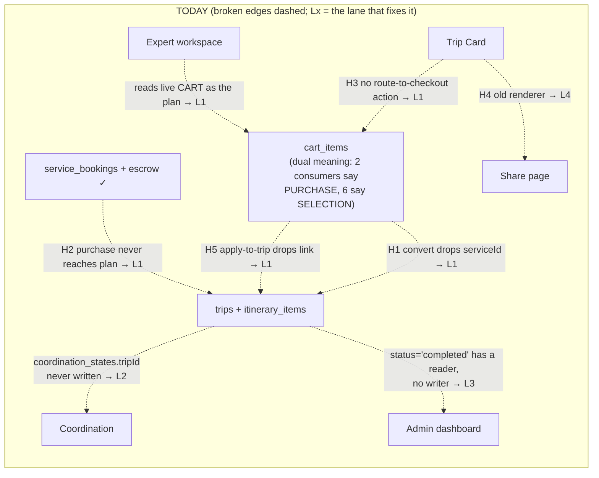
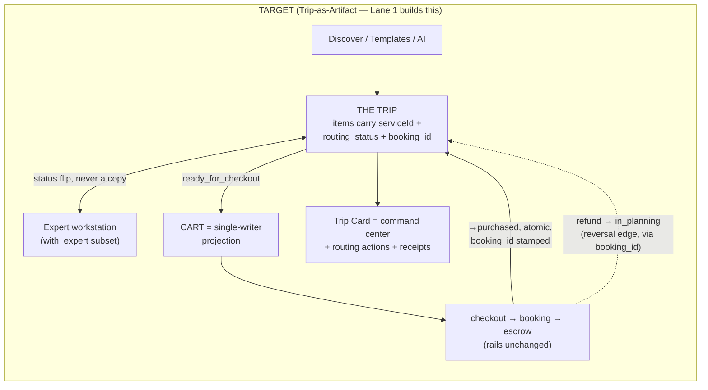
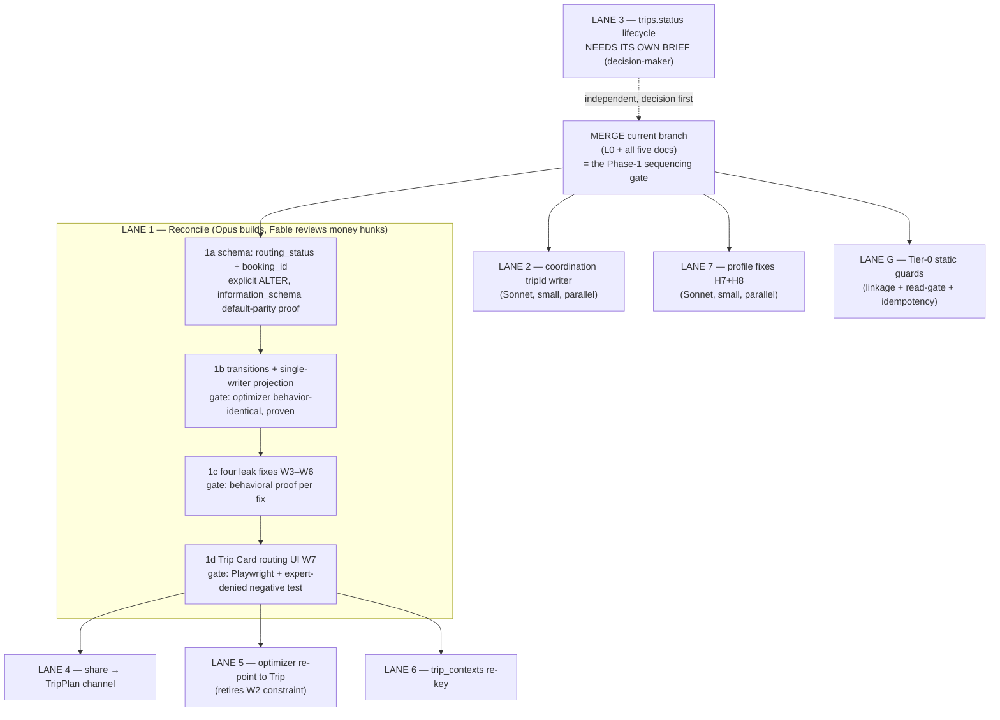

# Trip-Canon Master Brief — all findings, one plan

**Date:** Jul 31, 2026 · **Status:** consolidated execution plan, built from five ratified/reviewed documents.
This brief SYNTHESIZES — it does not restate. Detail and receipts live in the sources; this document owns the
merged gap registry, the diagrams, and the lane plan. When this brief and a source disagree, flag it — do not
silently pick one.

| Source | Owns |
|---|---|
| `docs/E2E_ITEM_LIFECYCLE.md` | Current-state edge map (E1–E12, receipts), holes H1–H8, reconcile Phase 0 findings |
| `docs/planning/TRIP_GRAVITY_AUDIT_FINDINGS.md` | S1–S21 × L1–L7 matrix, transition ownership, ranked P0–P3 inventory |
| `docs/briefs/TRIP_ARTIFACT_RECONCILE_BRIEF.md` | The target model (Trip-as-Artifact) |
| `docs/briefs/RECONCILE_PHASE1_SCOPE.md` | W1–W7 work items, phases 1a–1d, out-of-scope lane names |
| `docs/briefs/ROUTING_STATE_CONTRACT.md` | Per-component WRITES/READS/NEVER contract, refund reversal edge |

---

## 1. The whole story in three sentences

The platform is two internally-sound worlds — commerce (cart→checkout→booking→escrow) and planning
(trip→itinerary→Trip Card) — whose bridges strip an item's commercial identity going in and provide no way
back. The ratified fix (Trip-as-Artifact) makes the **Trip the single canonical container from the first
selection**: routing to the expert or to checkout becomes a per-item status flip, and the cart becomes a
single-writer projection of `ready_for_checkout` items. Everything below is either that build (Lane 1), a
finding that dissolves under it, or an independent gap with its own small lane.

## 2. The one diagram — every hole, and the lane that closes it

Item routing state machine and the full component contract: `ROUTING_STATE_CONTRACT.md` §1–2.

## 3. Unified gap registry — every finding, exactly one lane

| Finding | Source | Lane | Disposition |
|---|---|---|---|
| Cart selection-vs-purchase disagreement (9 consumers, 2 meanings) — **P0** | Audit §5 / Lifecycle Q1 | **L1** | Dissolved by routing_status + projection |
| H1 convert-to-itinerary drops `serviceId`, deletes cart row | Lifecycle | **L1** (W3) | Conversion becomes a status flip |
| H2 purchases never reach the plan | Lifecycle | **L1** (W4) | `→purchased` atomic with booking; assembler reads bookings |
| H3 Trip Card has no route-to-money action | Lifecycle | **L1** (W7) | Routing actions on PlanCard (extend, never fork) |
| H5 apply-to-trip drops `providerServiceId` | Lifecycle | **L1** (W5) | Preserve link on applied variants |
| H6 apply-to-cart silently skips externals | Lifecycle | **L1** (W5) | Surface the skip; behavior unchanged |
| Expert workspace reads the live cart (`booking-actions.ts:649`) | Audit P1 | **L1** (W6) | Read trip items `in_planning`+`with_expert` |
| Refund leaves item `purchased` (H2's mirror) | Contract §1 | **L1** (W4 amend) | Reversal edge, refund-path sole writer |
| **Item↔booking key missing** (reversal can't find its item) | This session's flag | **L1** (1a amend) | `booking_id` FK ships WITH `routing_status` in the same migration |
| `getTripRole` mutate exposure + owner-less trips — **P0** | Audit P0 / L10 | **L0 — DONE** | Advisor predicate unified (landed earlier); 3 owner-less minters fixed + proven (`83e275ad`); merge pending |
| Saved-trip conversion owner-less minter | Audit P2 | **L0 — DONE** | Same commit |
| `coordination_states.tripId` reader-without-writer | Audit P1 | **L2** | Create paths write tripId where a trip exists |
| `trips.status` dead lifecycle field with believing admin reader; L4→L5→L6 unowned | Audit P2/P3 | **L3** | Own brief: own the transitions OR derive-and-drop the field (decision-maker call) |
| H4 share page renders old `ItineraryCard` (§18 violation) | Lifecycle | **L4** | Share becomes a TripPlan channel (`preview`/`teaser` redaction) |
| Optimizer is cart-based (spec said tripId) — W2 behavior-identical constraint | Audit P1 / Scope §0 | **L5** | Re-point optimizer to the Trip; retires the W2 merge gate |
| `trip_contexts` keyed by userId, not tripId | Audit P2 | **L6** | Re-key after L1 lands |
| H7 no add-card flow (save-on-payment already honest) | Lifecycle | **L7** | SetupIntent "Add card" on the profile card |
| H8 dead Travel-Preferences chips | Lifecycle | **L7** | Wire to state + save, or remove |
| No linkage/contract invariant exists (H1+H5 were written twice) | Lifecycle §3 | **LG** | Tier-0 gates: linkage-preservation guard + contract-role assertions (1b/1d ship the in-code half) |
| Guest expiry unowned · L7 afterlife (rebooking, RM prompts) · repeat-pair rails rate (spec-ahead) · guest-invite trip linkage (#154) · no RM review object | Audit P3 | **deferred** | Documented inventory; pulled only explicitly |

Deliberate non-gaps (snapshot-at-money posture, notification freezing, claim-at-pay slots, provider
booking-scope): recorded in the audit §3 tail so they are never re-found.

## 4. The execution plan

**Order and rationale:**

| # | Lane | Tier | Blocked by | Why this position |
|---|---|---|---|---|
| 0 | **Merge the branch** (PR) | human read | — | Satisfies the scope's "after L10 remediation merges" gate; carries all governing docs |
| 1 | **Reconcile 1a→1d** | Opus, Fable money-review | merge | The core build; absorbs 9 of 19 registry rows; each phase gated per scope §3 + contract §4 |
| 2 | Coordination tripId | Sonnet | merge only | Independent of routing state; unblocks coordinator↔Trip Card join |
| 7 | Profile H7+H8 | Sonnet | nothing | Fully independent; can start today |
| G | Tier-0 guards | Sonnet | merge only | The durable half: any itinerary-item write from a service-bearing source must carry the id; public reads must gate on approval; concurrent same-key checkout ⇒ one charge |
| 4 | Share renderer | Sonnet | L1d | Channel redaction levels want the finished TripPlan item shape (routing state included) |
| 5 | Optimizer re-point | Opus | L1d | Retires the W2 behavior-identical constraint; touches the paid path |
| 6 | trip_contexts re-key | Sonnet | L1 | Context follows a specific trip once the Trip is canonical |
| 3 | trips.status | — | **decision-maker brief** | Two honest options (own the L4–L6 transitions vs derive-and-drop the field); neither is mine to pick |

**Standing rules that bind every lane** (from the sources, not new): one lane one branch one agent; no
direct-to-main; contract's WRITES/READS/NEVER is enforced in code where cheap; undeclared = NEVER; no fee
literals / client-trusted amounts / `getTripRole` mutations; PlanCard extended, never forked; PR descriptions
carry the consumer-disposition table (1b) and touched-contract-rows list (all).

**Baseline correction for gate-runners:** tsc baseline is **209**, not the 254 written in the scope.

## 5. What the decision-maker still owns

1. **Approve this consolidated plan** (the lane order above).
2. **The booking_id amendment to 1a** — flagged per contract §3; recommended shape: additive nullable FK →
   `service_bookings`, `ON DELETE SET NULL`, indexed, written atomically with `→purchased`.
3. **Lane 3's shape** — needs its own short brief before any code: own the trip lifecycle transitions, or
   make the admin dashboard derive from dates and drop the dead field.
4. Anything pulled from the deferred inventory.

Everything else is scoped, contracted, and sequenced.
