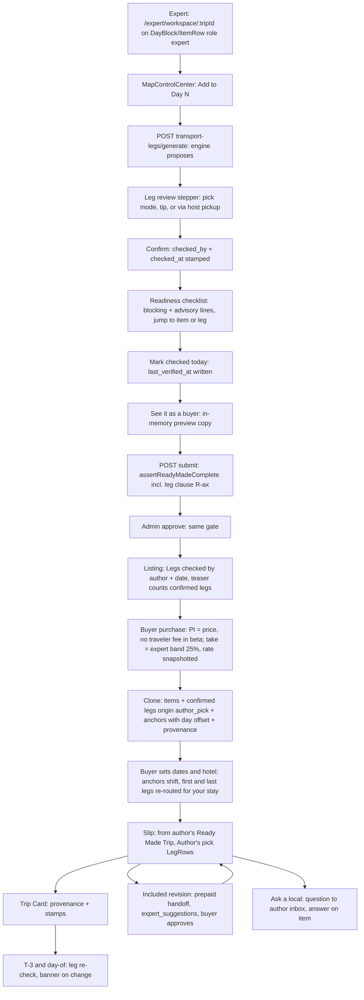

# Expert console × Ready Made Trips: work plan

> **Changelog 2026-10-04 11:53 ET:** Leon ratified R-bc (fees), R-bo (expert scrape jobs) and R-bm (clone from client plans) on 2026-10-04, "aligned with the beta launch". Updated: rulings table, L1-8, L1-12, new L1-19 (scrape-jobs gate) and L1-20 (reuse consent), L1-18, L2-14, the new L2-15, priority, flow, risks, open questions and unverified items. Everything else is unchanged.

- **Repo:** github.com/Nardo758/Traveloure-Real-, main = **`80df9a0`** (2026-10-04 10:51 ET). Refreshed at 11:45 ET and unchanged.
- **Production:** `97221c1` (`/api/health`, built 08:48 ET), one commit behind main. Production RMT store: `/api/ready-made` → `{"listings":[]}` `[prod]`.
- **Inputs:** `expert-console-audit.md` (same folder), Trip Slip & Trip Card spec v1.3.2 (§1, §3, §10, §12, §14).
- **Tags:** `[code]` = read at 80df9a0 · `[doc]` · `[prod]` · `[inferred]` · `[unverified]`. Nothing here was run against prod beyond logged-out GETs.
- **Migration rule used throughout:** added columns are nullable, with no DEFAULT, CHECK, index or FK. New tables carry only a PK. SQL goes in the PR body and is held for the founder's ruling. The latest migration on main is **345**, so the numbers below (346+) are placeholders.

> **Correction to the audit.** Provenance is **partially rendered** today. `ConciergeCard` (`client/src/components/marketplace/concierge-card.tsx:76-77`, "Concierge support from your expert · Included with this Ready-Made trip · built by {expert}") is mounted on `client/src/pages/slip-view.tsx:67`. It reads `GET /api/ready-made/purchases/by-clone/:tripId` (`ready-made.routes.ts:1512`). The audit's "no provenance UI" was wrong. What's missing is the specific "from [author]'s Ready Made Trip" line on the slip header and the Trip Card.

---

## 1. Summary and goals

**Goal:** a local expert builds a Kyoto Ready Made Trip in the Workstation on the same slip components the traveler sees. The expert picks a mode for every leg, with a tip or a host pickup where it applies. Verified stamps go on legs and stops. The trip can't ship with unpicked legs. The buyer receives a copy that keeps the author's picks, re-routes the first and last legs to their hotel, re-checks legs at T-3, and shows where the plan came from. The included revision arrives as suggestions, not direct edits. The expert has one inbox, sales numbers, supply hooks and seasonal notes.

**Where we start (short version):**
- The leg engine and model are real (`transport_legs`, generate, pick, confirm).
- The publish gate, the clone, stamps, the fee band and the Workstation surface are the gaps.
- Of the 9 enhancements, **7 exist in partial form**: 1, 2, 3, 6, 7, 8, 9. **2 are missing**: 4 (bulk verify; only per-fact confirm exists) and 5 (clone and adapt).

**Launch-essential (P0):** the audit's server core (Lane 1 items L1-1…L1-6), plus enhancements **1 (readiness checklist)**, **2 (leg review)** and **6 (one inbox)**. Everything else is P1/P2.

### Status of the 9 enhancements

| # | Enhancement | Status | What exists (key refs) | Smallest change |
|---|---|---|---|---|
| 1 | Publish readiness checklist | **partial** | `assertReadyMadeComplete` (`ready-made.routes.ts:529-566`) returns `[{requirement, message}]` for title, planType, hero, price, market and empty days; shown **only as a toast after a failed submit** (`ready-made-listing-panel.tsx:226-227`). Advisory `build-review` (:782, panel :266, :550-570). | Add `GET /api/expert/ready-made/:id/readiness` that reuses the gate plus new item-level checks (legs, hours/facts, photos, anchors), each line carrying `itemId`/`legId`/`dayNumber`. Panel list with jump-to. |
| 2 | Leg review mode | **partial** | `TransportLegsPanel`/`TransportLegRow` (`workspace.tsx:1988`, :1874) list legs with a mode select (`legModeOptions` :1854), Confirm and Remove; engine options in `alternative_modes`; booking options via `GET /api/transport-legs/:legId/options` (`transport-hub.routes.ts:285`); Routes API returns `encodedPolyline` (`routes.service.ts:65-101`) but **`transport_legs` stores no polyline** `[code]`. | Stepper UI over the same list (prev/next and the first unpicked leg), tip field (needs L1-1), a single-hop map (straight line between the two coordinates now; polyline later). No new route needed for v1. |
| 3 | Buyer preview | **partial** | "Preview" on `/expert/ready-made` (`client/src/pages/expert/ready-made.tsx:177-184`) opens `/ready-made/:id`, the same redacted DTO with the server's preview flag (`ready-made.routes.ts:1111-1117`). That's a **listing preview only**; there's no slip preview with sample dates or hotel. | Server: `POST /api/expert/ready-made/:id/preview-copy` builds an in-memory (not persisted) copy through the same clone function plus the re-route rules against sample dates and a sample stay. UI: render it on the slip read-only (Lane 2). |
| 4 | Verify in bulk + 90-day staleness | **missing** (per-fact building block exists) | Per-fact R-p confirm: `POST /api/trips/:tripId/place-facts/:factId/confirm` (`content-facts.routes.ts:61`), writing `place_facts.verified_by/verified_at` (`shared/schema.ts:12162`, `place-facts.service.ts:~570-611`); UI `ItemFactConfirm` (`workspace.tsx:1194`). `ready_made_trips.last_verified_at` has **no writer or reader**. Legs have no stamp. | `POST /api/expert/ready-made/:id/verify` that stamps all confirmed legs (L1-1 columns) and writes `last_verified_at`. Stops are stamped by confirming their confirmable facts in a loop (no new fact writer). Add a daily job that flags listings with `last_verified_at` older than 90 days and notifies the author. |
| 5 | Clone and adapt | **missing** | Ship-to-store from an author build only (`POST /api/expert/ready-made/from-trip/:tripId`, :160). The comment at :150-154 says client trips are deliberately not shippable ("clone-to-build decision deferred to W-2+", privacy). Item copy allowlist exists (`buildClonedItineraryItem`, `itinerary-item-clone.ts:244`). Legacy `expert_templates` (`schema.ts:6926`) is a separate, older product `[inferred]`. | `POST /api/expert/ready-made/builds/:tripId/duplicate` (from own build or listing) → new authoring trip (`userId NULL`, `authorId` = me) with items through the allowlist, plus legs and anchors through L1-3's copy helpers. Client-plan source only for plans with the client's recorded reuse consent, **and** always scrubbed (R-bm, ratified 2026-10-04). |
| 6 | One expert inbox | **partial** | `/expert/inbox` (`client/src/pages/expert/inbox.tsx`, tabs Queue/Assigned/History/Messages :1628-1631). It already shows **RMT revision requests** (badge + buyer note :1441-1456, fields :126-129), **concierge handoffs** (:466, :567), bookings, affiliate booking requests (:491) and coordination engagements (:414). **Ask-a-local questions are missing**: stored only as `funnel_events` `expert_interest` (`expert-door.service.ts:~255-261`) with no expert-side read or answer. | `GET /api/expert/inbox/questions` (questions for the expert's market or neighbourhoods) plus `POST …/:id/answer`. Questions tab in the inbox. Revision rows get a "Suggest" action once Lane 2's suggestions exist. |
| 7 | Sales and performance | **partial** | Earnings preview per listing (`/api/expert/ready-made/:id/earnings-preview`, :870); my-offerings table lists RMT rows (`my-offerings-table.tsx:158-175`); short-link analytics include `ready_made` clicks, bookings and revenue (`link-analytics-panel.tsx`, `short-links.routes.ts:65,114`); author earnings rows in `expert_earnings` (written in `ready-made-purchase.service.ts:~169`); concerns route (:1439). Missing: per-listing **views** (no view counter; :1060-1066 says "no rating column, no review table, no salesCount"), copies sold per listing for the expert, and post-trip feedback by listing (`feedback_events`, migration 345, keyed by `plan_id`, "never read by a public surface"). | `GET /api/expert/ready-made/:id/performance` aggregating `ready_made_purchases` (sold, refunded, concern), `expert_earnings` (net), `feedback_events` joined via `clone_trip_id` (author-only, private), plus a views count from a new `funnel_events` `ready_made_view` emit on `GET /api/ready-made/:id` (no migration). |
| 8 | Supply hooks | **partial** | Venue-less item flag `isSupplySlot` computed in `server/services/trip-plan.service.ts` ("Not drawn yet", `plancard-types.tsx:343`); `ItemRow` "Find a host" opens Browse (`ItemRow.tsx:53`, slip only). Expert gap queue: `content_gap_alerts` with `GET /api/expert-workspace/gaps`, `PATCH …/gaps/:id/assign`, `PATCH …/gaps/:id/resolve` (`expert-workspace.routes.ts:889-950`). `service_gap_analysis` table (`schema.ts:7765`) read by recommendation and market-insights services. **"Census" is a doc concept** (spec §5, §14.4: "the private-car census item"), with no table or route `[code]`. No "Recommend a provider" flow found. | `POST /api/expert/supply-recommendations` (venue-less item → provider name, contact, category) into a new PK-only table, routed to admin. Surface the census (start with the private car: count approved+active `private_transportation` listings per city, the same predicate spec §5 uses) in the expert gaps panel. |
| 9 | Seasonal variants | **partial** | `ready_made_trips.best_season` varchar(60) (`schema.ts:10958`), edited in the panel (`ready-made-listing-panel.tsx:454`), on public DTOs (:1029, :1127). `city_events` (`schema.ts:10258`; `starts_at`, `series_key` migration 335). No per-item season note or swap. | Nullable `itinerary_items.season_note text` (cloned) for v1. Later, swap pairs. Show `city_events` that overlap the buyer's dates on the copy (read only). |

---

## 2. Rulings needed

Format follows the spec's §1 table. States: **proposed** = new and needs a ruling · **open** = needs Leon's decision · **correction** = fixes the spec to match the code.

| # | Ruling | State |
|---|---|---|
| R-ax | **Leg gate.** A Ready Made Trip can't be submitted or approved unless every consecutive pair of geocoded stops on every day has a trip-scoped `transport_legs` row with `proposal_status='confirmed'` and either `user_selected_mode` or `pickup_provider_service_id`. `assertReadyMadeComplete` returns `{requirement:"legs", dayNumber, legId?}` per gap. The public teaser counts confirmed legs only. | proposed |
| R-ay | **Author's tip.** `transport_legs.author_tip` is plain text, ≤140 chars (app-enforced), written by the author or assigned expert. It renders under the leg as "Author's pick: {mode} · {tip}", is cloned with the leg, and is never rewritten by the engine. | proposed |
| R-az | **Via host pickup.** `transport_legs.pickup_provider_service_id` (varchar, no FK) points at a `provider_services` row. It's selectable only when that listing's `transport_provision` ∈ {`pickup_included`,`pickup_available`} **and** `pickup_confirmed_at` is set by the provider (R-au). It renders "as described by the host". Free-text `pickup_point`/`pickup_time` stay for chauffeured modes. | proposed |
| R-ba | **Copy keeps picks.** The purchase copy carries the source's confirmed legs (mode, tip, pickup ref, checked stamp) with `origin='author_pick'`, plus anchors with their day offset. Day 1's first leg and the last day's last leg are removed and recomputed when the buyer sets a stay, marked `origin='rerouted_for_stay'` ("re-routed for your stay"). | proposed |
| R-bb | **Re-check.** Copied legs are re-checked at T-3 and on each trip day (R-aw) through `recomputeLegForMode`. A changed or broken pick sets `leg_check_status` and shows a banner; the author's pick stays visible until the buyer changes it. | proposed (extends R-aw) |
| R-bc | **RMT take rate stays 25%, equal to the beta expert band.** The `ready_made_trip` band follows the expert band in the admin Fees screen: one setting drives both. It's editable and logged, and a change applies to new purchases only. The unused migration-258 `ready_made:platform_band = inherit_expert` row is retired or ignored, never read. During beta, buyers pay **no 7% traveler fee** on an RMT purchase (PaymentIntent = `priceCents`, as today at `ready-made.routes.ts:1310`). The traveler fee still applies to bookings made from the copy. | **ratified 2026-10-04 (Leon): "aligned with the beta launch"** |
| R-bd | **Revision is a prepaid §12 handoff.** The included revision opens a §12 handoff at price 0 (already paid). The author's changes arrive as `expert_suggestions` that the buyer accepts or declines (R-n), with auto-approve after 7 days and two rounds (R-s). `request-revision` stops granting an `accepted` `trip_expert_advisors` row (today :1592/:1643 via `upsertTripAdvisorRow`). Blocked on §12 step 7. | proposed |
| R-be | **Provenance.** A copy shows "from {author}'s Ready Made Trip" on the slip header and the Trip Card, derived from `ready_made_purchases.clone_trip_id` → listing → author (the existing `/purchases/by-clone/:tripId`), or from a new `trips.source_ready_made_trip_id`. The existing `ConciergeCard` line stays. | proposed |
| R-bf | **Local-verified stamps.** "Legs checked by {author} · {date}" comes from `transport_legs.checked_by/checked_at`. Bulk verify (`POST /api/expert/ready-made/:id/verify`) stamps confirmed legs and writes `ready_made_trips.last_verified_at`. Stops count as verified through R-p `place_facts.verified_at`. The stamp shows on the listing and the copy; after 90 days without a re-check the listing shows "last checked {date}" and the author is reminded. | proposed |
| R-bg | **Template anchors.** In an authoring build, a flight or lodging anchor's day is its offset from the build's synthetic `start_date`. The copy re-materialises anchors against the buyer's dates. Until `dates_confirmed_at` is set, the anchors render as placeholders. The re-date rail (`PATCH /api/trips/:id`) shifts anchors by the same delta. | proposed |
| R-bh | **Workstation surface.** The Workstation's day surface is `DayBlock`/`ItemRow` with `mode="edit" role="expert"`, and its map is `MapControlCenter` with `onAddCandidate` ("Add to Day N"). `ItemsEditorPanel` and `CanvasMapSection`/`LeafletPlanMap` are removed in step 7. | proposed |
| R-bi | **Readiness checklist.** One server readiness read lists blocking lines (the R-ax legs plus the existing gate) and advisory lines (stops missing hours/facts, missing photos once `place_photos` exists, anchors without an offset, validate-schedule gaps). Each line carries a target id for jump-to. Only blocking lines stop submit. | proposed |
| R-bj | **Expert inbox.** Ask-a-local questions for the expert's market reach `/expert/inbox` → Questions. Answers follow R-q (authorize at Ask, capture on accept). On an RMT copy, the author is the default local. | proposed |
| R-bk | **Performance is private.** Per-listing views, sales, net earnings, concerns and post-trip feedback are shown only to the author and admins. Feedback is shown aggregated (codes and counts), with no buyer identity. | proposed |
| R-bl | **Supply recommendations.** From a venue-less stop, an expert can "Recommend a provider". The recommendation goes to admin and is never auto-listed. Census gaps (starting with the private car per city) are shown to experts as counts. | proposed |
| R-bm | **Clone and adapt.** An expert can duplicate their own build or listing into a new build. A past client plan can seed a build only with the client's consent **and** scrubbing. The consent prompt is shown to the client at approval or delivery: *"Can [expert] reuse this plan's route as a public trip? Your name and details are never shared."* The answer is stored on the request or plan, and only consented plans can be cloned. The clone drops names, dates, bookings, notes, messages, the party and any personal data; only the route survives (stops, day order, legs). | **ratified 2026-10-04 (Leon): "aligned with the beta launch"** |
| R-bn | **Seasonal notes.** v1: a per-item `season_note` (author text, cloned) plus the listing's `best_season`. The copy shows `city_events` that overlap the buyer's dates. Swaps are a later ruling. | proposed |
| R-bo | **`/api/expert-workspace/scrape-jobs` gated now.** It goes behind an admin-only flag, **`EXPERT_SCRAPE_JOBS_ENABLED`**, which is off in production and declared by name in deployment config. Background: today any expert (`requireExpert`) can queue `search_extract`/`crawl`/`batch_scrape` jobs over arbitrary URLs (`expert-workspace.routes.ts:953-990`, executor :1029), with no flag on the route (`DMO_INGEST_ENABLED` gates only the scheduler, `dmo-ingest-scheduler.service.ts:29`) `[code]`. When re-enabled, it's allowed only for **non-transport** content from **registry sources with `public_ok`**, per R-as and R-p. | **ratified 2026-10-04 (Leon): "aligned with the beta launch"** |
| R-bp | **Spec correction: leg table.** The spec's `plan_legs` is `transport_legs` (`shared/schema.ts:8037`, migration 154). §3 `LegRow.userSelectedMode` = `transport_legs.user_selected_mode`. There's no `plan_legs` or transport-segments table. | correction |
| R-bq | **Spec correction: routing config.** The spec's `ROUTES_ENABLED`/`ROUTES_DAILY_CAP`/`ROUTES_COST_CENTS` (R-at) don't exist. The engine switch is `TRAVEL_TIME_SERVICE_ENABLED` (`server/config/travel-time.config.ts`), with tiers Google Routes → matrix → straight-line "est." (`trip-transport-legs.service.ts:~119-123`). I found no routes daily cap; `FLIGHT_LOOKUP_DAILY_CAP` is the only similar cap. Either rename the spec or add the three config keys. | correction |
| R-br | **Spec correction: §10.** "Workstation `ItemsEditorPanel` rows: done" is wrong. It's still defined (`workspace.tsx:784`) and mounted (:4050). Set it to pending until R-bh ships. | correction |
| R-bs | **Spec correction: item-level transport fields.** `itinerary_items.travelFromPrevious`/`transportProvided`/`pickupPoint`/`dropOffPoint` overlap `transport_legs` and are carried by the clone allowlist (`itinerary-item-clone.ts:75`). Rule: `transport_legs` is the only leg source. Once R-ba ships, item-level fields are read-only legacy and dropped from the allowlist. | correction |

---

## 3. Lane 1: server, START NOW

Runs parallel to Track A. No slip component changes. Each item lists what exists, the change, acceptance criteria, dependencies, the migration and a size.

### L1-1. `transport_legs` authoring columns (P0, S)
- **Exists:** `transport_legs` (`schema.ts:8037`). The PATCH allowlist is `userSelectedMode`/`pickupPoint`/`pickupTime`/`proposalStatus` (`transport-legs.routes.ts:161`). Auth is `authorizeTripLogistics`.
- **Change:** add `author_tip`, `pickup_provider_service_id`, `checked_by`, `checked_at`, `origin`, `leg_check_status`, `leg_checked_at`.
  - Widen PATCH to `authorTip` (≤140) and `pickupProviderServiceId`, validated against R-az server-side.
  - On Confirm (`proposalStatus → confirmed`) by the author, stamp `checked_by`/`checked_at`.
  - The `generate` path must preserve these columns on confirmed legs (it already keeps confirmed legs).
- **Acceptance:**
  - PATCH accepts and round-trips the tip.
  - Over 140 chars → 400.
  - A pickup ref to a listing that isn't pickup-capable or isn't provider-confirmed → 400.
  - Confirm stamps checked fields.
  - Regenerate doesn't touch confirmed legs' new columns.
  - Unit and DB tests.
- **Depends:** L1-7 (provider confirmation) for pickup selection to succeed. The tip has no dependency.
- **Migration 346 (held):**
  ```sql
  ALTER TABLE transport_legs ADD COLUMN author_tip text;
  ALTER TABLE transport_legs ADD COLUMN pickup_provider_service_id varchar;
  ALTER TABLE transport_legs ADD COLUMN checked_by varchar;
  ALTER TABLE transport_legs ADD COLUMN checked_at timestamp;
  ALTER TABLE transport_legs ADD COLUMN origin varchar(30);
  ALTER TABLE transport_legs ADD COLUMN leg_check_status varchar(20);
  ALTER TABLE transport_legs ADD COLUMN leg_checked_at timestamp;
  ```

### L1-2. Leg clause in publish validation, plus teaser fix (P0, S)
- **Exists:** `assertReadyMadeComplete` (`ready-made.routes.ts:529-566`), used at submit (:694) and admin approve (`admin.routes.ts:1267`). Teaser sums all trip legs (:1227-1238).
- **Change:**
  - Add the R-ax clause. Build stop pairs per day from geocoded items in order; require a confirmed leg with a mode or pickup ref.
  - Items without coordinates go to an advisory line ("Day N: {title} has no location"), matching `generate`'s skip reasons.
  - Teaser filters `proposal_status='confirmed'`.
- **Acceptance:**
  - Submit returns 400 with `requirement:"legs"` lines when any leg is unpicked; admin approve is refused the same way.
  - A fully picked build passes.
  - The teaser excludes proposed legs.
- **Depends:** none. **Migration:** none.

### L1-3. Copy confirmed legs and anchors into the buyer's copy (P0, M)
- **Exists:** the clone (`ready-made-purchase.service.ts:~215-305`) creates the trip, the owner row and allowlisted items. It copies **no** `transport_legs` and **no** `temporal_anchors`. Item ids change, so leg `from/to` item refs need remapping.
- **Change:**
  - `buildClonedItineraryItem` returns the new id; keep an old→new id map.
  - Copy confirmed source legs with remapped item refs, `trip_id` = clone, carrying mode, tip, pickup ref, checked stamp, and `origin='author_pick'`.
  - Copy anchors with offset-preserved datetimes: offset from the source build's `start_date` (R-bg) applied to the clone's start date.
  - Do it all inside the same pre-claim build step, so the orphan delete still cascades (both `transport_legs.trip_id` (`schema.ts:8045`) and `temporal_anchors.trip_id` (:5986) are `onDelete: cascade` in the drizzle schema `[code]`; the live DB constraint is unverified).
- **Acceptance:**
  - A copy has N confirmed legs matching the source, the same modes and tips, with remapped from/to ids.
  - Anchors keep their day offset.
  - Losing the claim race leaves no orphan legs or anchors.
  - The source is untouched.
- **Depends:** L1-1 (columns to carry). **Migration:** none.

### L1-4. Re-route first and last legs when a stay is set; re-date shifts anchors (P0, M)
- **Exists:**
  - Anchor create `POST /api/trips/:tripId/anchors` (`trips.routes.ts:1637`).
  - `generateTripTransportLegs` keeps confirmed legs (:200).
  - Airport↔lodging legs are rendered by `LegRow` (`client/src/components/plan/LegRow.tsx`, R-i).
  - Re-date rail `PATCH /api/trips/:id`; I found no anchor shift in it `[code, grep only]`.
- **Change:**
  - On a copy (`origin` present on any leg), when a lodging anchor is created or changed: delete day 1's first leg and the last day's last leg, then compute stay→first-stop and last-stop→stay through `recomputeLegForMode` with the author's mode when it's valid, else the engine's recommendation. Mark them `origin='rerouted_for_stay'`.
  - On re-date, shift anchors by the date delta.
- **Acceptance:**
  - Setting a hotel creates exactly 2 re-routed legs; the author's middle legs are unchanged.
  - Re-dating keeps anchor offsets.
  - Free-plan rule R-e: legs show only because an RMT is a paid plan (confirm that RMT copies count as "paid" under R-e; `[inferred]` yes).
- **Depends:** L1-3. **Migration:** none (uses L1-1 `origin`).

### L1-5. Leg re-check at T-3 and day-of (P1, M)
- **Exists:** `recomputeLegForMode` (:153). I found no leg job in the schedulers `[code, grep]`.
- **Change:** a scheduled pass over trips with copied legs and confirmed dates. At T-3 and on each trip day, recompute and compare duration and availability against the thresholds (config). Set `leg_check_status` ∈ {`ok`,`changed`,`broken`} and `leg_checked_at`, and expose them on the plancard payload.
- **Acceptance:** a forced provider failure marks the leg `broken`; the plancard JSON carries the status; the job respects `TRAVEL_TIME_SERVICE_ENABLED` and a cap.
- **Depends:** L1-3, L1-1. **Migration:** none (uses L1-1).

### L1-6. Provenance data (P0, S)
- **Exists:** `/api/ready-made/purchases/by-clone/:tripId` (:1512) already returns the author's first name and status. `ConciergeCard` uses it.
- **Change:**
  - Add `sourceReadyMadeTripId`, `authorDisplayName` and `lastVerifiedAt` to the plancard and Trip Card payloads for copies, so the slip header and Trip Card don't need a second fetch.
  - Optional column for cheap reads.
- **Acceptance:** the plancard JSON for a copy has provenance; for a non-copy it's null.
- **Depends:** none.
- **Migration 347 (optional, held):** `ALTER TABLE trips ADD COLUMN source_ready_made_trip_id varchar;`. The clone writes it.

### L1-7. Provider pickup confirmation, R-au (P1, M)
- **Exists:** pickup fields on `provider_services` (`pickup_available`, `pickup_address`, `pickup_radius_km`, `transport_provision`, `pickup_coverage_mode`, `meeting_point`, `drop_off_point`; `schema.ts:1196-1250`, migrations 195/199). Migration 195 says "capture-only… no consumer". No confirmation column.
- **Change:** `pickup_confirmed_at` and `pickup_confirmed_by`, written only by the listing owner through the provider service form when they confirm the pickup block. Any later edit to the pickup fields clears it.
- **Acceptance:** an unconfirmed listing can't be a leg pickup ref (L1-1); editing the pickup address clears the confirmation.
- **Depends:** none. The extraction pass is a Content & Signals lane (spec §14.2), out of scope.
- **Migration 348 (held):** `ALTER TABLE provider_services ADD COLUMN pickup_confirmed_at timestamp; ALTER TABLE provider_services ADD COLUMN pickup_confirmed_by varchar;`

### L1-8. Fee band: RMT follows the expert band (P1, S; R-bc ratified 2026-10-04)
- **Exists:**
  - `resolveReadyMadeTakeRate` (`ready-made-purchase.service.ts:51`) reads the `ready_made_trip` band (0.25 / min 0.10 / max 0.25, migration 133) and falls back to `getExpertSplitRates()` (`server/services/commission.ts:110`, the `expert_standard` band: 0.25 / min 0.15 / max 0.25, migrations 033/174).
  - Row 258 (`inherit_expert`) is unread.
  - The earnings preview (:870) uses the same resolver.
  - Admin fee screen: `client/src/pages/admin/fee-bands.tsx`; `PATCH /api/admin/fee-bands/:bandKey` (`admin.routes.ts:7564`) already writes an audit log.
  - `ready_made_purchases` stores `price_paid_cents` but **no rate snapshot**; the rate is resolved at fulfilment/credit time `[code]`.
- **Change:**
  1. Make `resolveReadyMadeTakeRate` return the expert band's rate (`getExpertSplitRates().platformFeeRate`), so one setting (the expert band) drives both.
  2. In the admin Fees screen, show `ready_made_trip` as "follows Expert band" (read-only row, or edits redirected to the expert band), so there is one editable, logged setting.
  3. Snapshot the rate on the purchase row at purchase creation (:596). Credit and earnings preview for that purchase use the snapshot, so changes apply to new purchases only.
  4. Leave row 258 unread. Add a comment at the resolver and in the fee-bands doc that it's retired; optionally delete it by a held data migration.
  5. Buyer price: keep PI = `priceCents` (no 7% traveler fee on RMT purchases during beta). Bookings made from the copy keep the normal traveler fee path (no change; add a test).
- **Acceptance:**
  - With the expert band at 25%, a purchase credits the author 75%.
  - After an admin changes the expert band, new purchases use the new rate and existing purchases (including a re-entrant credit retry) keep their snapshot.
  - The change appears in the fee-band audit log.
  - The earnings preview matches.
  - No rate literal; nothing reads `inherit_expert`.
  - The RMT PaymentIntent amount equals `priceCents`.
  - A booking from the copy carries the traveler fee.
- **Depends:** none.
- **Migration 352 (held):** `ALTER TABLE ready_made_purchases ADD COLUMN platform_fee_rate numeric;`. Optional held data migration to retire the row: it's a `fee_bands` row (`band_key='ready_made:platform_band'`, `rate_type 'rule'`, `name 'inherit_expert'`; `server/migrations/258_plans_reconcile.sql:110-113`) `[code]`. Use `UPDATE fee_bands SET is_active = false WHERE band_key = 'ready_made:platform_band' AND is_active = true;`, the same deactivate-not-delete posture as migration 178.
- **Note:** the 25% band is `expert_standard`. A separate band, `expert_new` ("Expert (new / beta)", 0.15, migration 033), exists but has no code reader `[code]`. "Beta expert band" here means the 25% band per the ruling. Prod band values are `[unverified]`.

### L1-9. Readiness read: enhancement 1, server (P0, M)
- **Exists:** see table row 1.
- **Change:** `GET /api/expert/ready-made/:id/readiness` → `{ blocking: Line[], advisory: Line[] }`, where `Line = {requirement, message, dayNumber?, itemId?, legId?}`.
  - **Blocking:** the existing gate plus L1-2 legs.
  - **Advisory:**
    - Stops with no hours fact: a `place_facts` lookup by `itinerary_item_id`/`place_ref`, `fact_type` for hours (exact value `[unverified]`; check `shared/content-facts.ts`).
    - Stops with no photo: once `place_photos` (step 6) exists; until then, "photo checks arrive with step 6".
    - Anchors outside the build window.
    - `validate-schedule` gaps (call the same service as `trips.routes.ts:1815`).
    - Legs not checked in 90 days.
  - Refactor `assertReadyMadeComplete` to return the same `Line` shape so submit and readiness can't drift.
- **Acceptance:** each line has a target id; submit's 400 body equals readiness `blocking`; admin approve uses the same function.
- **Depends:** L1-2. **Migration:** none.

### L1-10. Leg review: enhancement 2, server (P0, S)
- **Exists:** list, PATCH, options.
- **Change:**
  - `GET /api/trips/:tripId/transport-legs/review` returns legs ordered by day and `leg_order`, each with its candidate modes (the `legModeOptions` logic moved server-side so both UIs share it), `from/to` coordinates, and the first unpicked index.
  - Optional: persist the polyline from Routes (`routes.service.ts`) into a new nullable `transport_legs.polyline text` for the hop map.
- **Acceptance:** the ordering is stable; the candidate set equals today's client set; unpicked first.
- **Depends:** L1-1.
- **Migration (optional, in 346):** `ALTER TABLE transport_legs ADD COLUMN polyline text;`. Note Routes polyline licensing/caching terms `[unverified]`.

### L1-11. Bulk verify + staleness: enhancement 4, server (P1, M)
- **Change:**
  - `POST /api/expert/ready-made/:id/verify` (author only): stamps all confirmed legs `checked_by`/`checked_at`, and writes `ready_made_trips.last_verified_at = now()` if every leg is confirmed.
  - Returns stops whose confirmable facts are unverified (the UI then calls the existing per-fact confirm; no second fact writer).
  - A daily job finds approved listings with `last_verified_at` older than 90 days or null and notifies the author (existing notifications rail; function `[unverified]`).
  - Expose `lastVerifiedAt` on `GET /api/ready-made/:id`.
- **Acceptance:** a verify call stamps legs and the listing; the public DTO carries the date; the job notifies once per window.
- **Depends:** L1-1. **Migration:** none (`last_verified_at` exists, migration 133).

### L1-12. Clone and adapt: enhancement 5, server (P1, M; client-plan source L; R-bm ratified 2026-10-04)
- **Change:**
  - `POST /api/expert/ready-made/builds/:tripId/duplicate`. The source is the caller's authored build (`isTripAuthor`) or the source build of the caller's listing. Creates a new authoring trip (`userId NULL`, `authorId` = caller), copies items via `buildClonedItineraryItem` and legs and anchors via L1-3's helpers, and sets title "Copy of …".
  - **Client-plan source:** `POST /api/expert/ready-made/builds/from-client-plan/:tripId`. Allowed only when the caller was the plan's assigned expert **and** the plan has a recorded reuse consent naming that expert (L1-20).
  - The client-plan copy uses a **scrub copier**, a stricter, code-owned allowlist than `CLONE_CARRIED_FIELDS`. It keeps place identity, category, day number, order, time of day and duration, plus legs (mode only; no pickup free text). It drops traveler names, the party/participants, absolute dates, bookings and confirmations, all notes (traveler, expert-private and the expert-to-traveler note), messages, flight and lodging anchors, costs and any other personal free text.
- **Acceptance:**
  - The duplicate is independent (editing it doesn't touch the source); no listing is created; it's refused for another author's build.
  - From-client-plan returns 403 without consent, 403 for a different expert, and 403 after the client revokes (if revocation is offered).
  - A scrub test asserts that none of the dropped fields exist on the new build, and a fixture with PII in every free-text column yields none on the copy.
- **Depends:** L1-3, L1-20. **Migration:** none (consent columns are in L1-20).

### L1-13. Inbox questions: enhancement 6, server (P0, M)
- **Exists:** `expert_interest` rows in `funnel_events` (`expert-door.service.ts:~255`). Traveler-side `GET /api/trips/:tripId/expert-help` (`expert-door.routes.ts:25`). Revision and handoff data already reach the inbox endpoints (`/api/expert/assigned-trips`, coordination engagements, affiliate requests).
- **Change:**
  - `GET /api/expert/inbox/questions`: open questions for the expert's markets or neighbourhoods; for RMT copies, routed to the author first.
  - `POST /api/expert/inbox/questions/:id/answer`, with R-q money semantics if paid (the existing Ask rail; exact capture service `[unverified]`).
  - Answers need a home. Questions in `funnel_events` have no status, so a PK-only `expert_question_answers` table is needed.
- **Acceptance:** the expert sees questions for Kyoto only if they're a Kyoto expert; an answer appears on the traveler's item thread; the question isn't shown to other experts once answered.
- **Depends:** none (the Suggest action on revisions waits for Lane 2).
- **Migration 349 (held):**
  ```sql
  CREATE TABLE expert_question_answers (id varchar PRIMARY KEY);
  ALTER TABLE expert_question_answers ADD COLUMN question_event_id varchar;
  ALTER TABLE expert_question_answers ADD COLUMN trip_id varchar;
  ALTER TABLE expert_question_answers ADD COLUMN item_id varchar;
  ALTER TABLE expert_question_answers ADD COLUMN expert_id varchar;
  ALTER TABLE expert_question_answers ADD COLUMN answer text;
  ALTER TABLE expert_question_answers ADD COLUMN status varchar(20);
  ALTER TABLE expert_question_answers ADD COLUMN created_at timestamp;
  ```

### L1-14. Performance: enhancement 7, server (P1, M)
- **Change:**
  - Emit `funnel_events` `ready_made_view` on `GET /api/ready-made/:id` for non-author viewers (deduped per session/day).
  - `GET /api/expert/ready-made/:id/performance` → views, copies sold (`ready_made_purchases` status ∈ paid/cloned), refunded/revoked, concerns open, net earnings (`expert_earnings` by `reference_id`), and feedback codes from `feedback_events` where `plan_id` ∈ the listing's clone trips (aggregated, R-bk).
- **Acceptance:** the numbers reconcile with the admin ledger; no buyer identity is returned.
- **Depends:** none. **Migration:** none.

### L1-15. Supply hooks: enhancement 8, server (P2, M)
- **Change:**
  - `POST /api/expert/supply-recommendations` (from an item with no venue or provider) → a PK-only table, plus an admin notification.
  - `GET /api/expert-workspace/census?market=` → counts of approved+active listings by category, starting with the `private_transportation` predicate from spec §5. Reuse `content_gap_alerts` for assignment.
- **Acceptance:** a recommendation lands for admin; the census count matches the spec predicate.
- **Depends:** none.
- **Migration 350 (held):** `CREATE TABLE supply_recommendations (id varchar PRIMARY KEY);` plus nullable `expert_id`, `trip_id`, `item_id`, `category`, `provider_name`, `contact text`, `note text`, `status`, `created_at`.

### L1-16. Seasonal notes: enhancement 9, server (P2, S)
- **Change:** `itinerary_items.season_note text` (nullable), added to the item PATCH and to the clone allowlist (`itinerary-item-clone.ts:66-114`). `GET /api/trips/:tripId/season-context` returns `city_events` overlapping confirmed dates.
- **Acceptance:** the note round-trips and clones; season-context is empty without confirmed dates.
- **Migration 351 (held):** `ALTER TABLE itinerary_items ADD COLUMN season_note text;`

### L1-17. Buyer preview: enhancement 3, server (P1, M)
- **Change:** `POST /api/expert/ready-made/:id/preview-copy {sampleStart, sampleStayPlaceId?}` runs the clone and re-route logic (L1-3/L1-4) **in memory** and returns a plancard-shaped payload. Nothing is persisted and no Routes spend beyond the cap (use cached or straight-line for the re-routed legs, labelled "est.").
- **Acceptance:** no rows are written (assert by DB count); the payload validates against the plancard type.
- **Depends:** L1-3, L1-4.

### L1-18. Hygiene (P1, S)
- `scrape-jobs` gating moved to L1-19 (R-bo ratified).
- Drop the item-level transport fields from the clone allowlist after L1-3 (R-bs).
- Spec corrections R-bp/R-bq/R-br go into the spec file (doc PR).

### L1-19. Gate expert scrape jobs (P0, S; R-bo ratified 2026-10-04)
- **Exists:** `POST`/`GET /api/expert-workspace/scrape-jobs` and `GET …/:id` (`expert-workspace.routes.ts:953-1027`) behind `requireExpert` only. The executor `executeScrapeJob` (:1029) runs crawls and batch scrapes. Runtime flags are listed in `server/services/runtime-flags.ts:13-19` and surfaced by `/api/health` `flags` (prod shows `DMO_INGEST_ENABLED:false` `[prod]`).
- **Change:**
  1. Add `EXPERT_SCRAPE_JOBS_ENABLED` to `runtime-flags.ts`, `.env.example` and the deployment config/checklist (`DEPLOYMENT_CHECKLIST.md`), off in production.
  2. All three routes return 404/403 unless the flag is on **and** the caller is an admin (DB role check, the same posture as `requireExpert`'s DB read).
  3. When the flag is on, `POST` accepts only a `sourceId` for a registry source with `public_ok = true` that isn't a transport source. Free `targetUrls`/`startUrl` are refused, and transport domains or needs are refused per R-as.
  4. `executeScrapeJob` re-checks the flag before running, so jobs queued earlier don't run.
- **Acceptance:**
  - With the flag off (prod), every scrape-jobs route refuses for experts and admins.
  - With it on, an expert gets 403, an admin with a non-`public_ok` or transport source gets 400, and an admin with a `public_ok` non-transport source succeeds.
  - `/api/health` lists the flag as false on prod after deploy.
- **Depends:** none. **Migration:** none. The non-transport marker on registry sources uses an existing field if one exists `[unverified]`; otherwise the refusal keys off the source's need/category.

### L1-20. Client reuse consent (P1, S; R-bm ratified 2026-10-04)
- **Exists:** the delivery lifecycle runs on the advisor row (`trip_expert_advisors`, `schema.ts:506`; workspace status draft → in_review → delivered). Handoff requests use `expert_requests` (`schema.ts:9027`). The exact client approval/delivery screen to host the prompt is `[unverified]`.
- **Change:**
  - `POST /api/trips/:tripId/reuse-consent {expertId, answer}`, owner only, records the answer on the plan.
  - The prompt shows once, at approval or delivery, with the exact text: *"Can [expert] reuse this plan's route as a public trip? Your name and details are never shared."*
  - `GET` returns the state for the expert's from-client-plan check (L1-12).
  - Optional `DELETE` revokes before a build exists.
- **Acceptance:**
  - Only the plan owner can answer.
  - The stored row names the expert and the prompt version.
  - No answer or "no" means L1-12 refuses.
  - The prompt text matches the ruling verbatim.
- **Depends:** none.
- **Migration 353 (held):** `ALTER TABLE trips ADD COLUMN reuse_consent_at timestamp; ALTER TABLE trips ADD COLUMN reuse_consent_expert_id varchar; ALTER TABLE trips ADD COLUMN reuse_consent_answer varchar(10); ALTER TABLE trips ADD COLUMN reuse_consent_prompt_version varchar(20);`. This stores the answer on the plan; the ruling allows "request or plan", and the plan is the simplest single home.

---

## 4. Lane 2: WAIT for slip steps 6 / 7 / 9a

| ID | Item | Waits on | Exists today | Change | Acceptance | Size |
|---|---|---|---|---|---|---|
| L2-1 | Workstation remount (R-bh) | step 7 (`ItemRow` suggestion/routing drawn; `MapControlCenter onAddCandidate`) | `workspace.tsx` mounts `PlanCard role="expert"` (:3983/:4009), `ItemsEditorPanel` (:784/:4050), `CanvasMapSection` (:1412), `InlineAddItemForm` (:536); `ItemRow` role expert declared (`ItemRow.tsx:39,71`) | Swap to `DayBlock`/`ItemRow mode="edit" role="expert"` and `MapControlCenter`; move the pickers into the `ItemRow` menu; delete the three legacy components and the `@vis.gl` direct imports | No `ItemsEditorPanel`/`CanvasMapSection` in the bundle; Add to Day N posts the existing item route; e2e: build a 3-day Kyoto trip | L |
| L2-2 | Suggestion-based revision (R-bd) | step 7 `expert_suggestions` (no table today, zero hits) | `request-revision` :1592 → `upsertTripAdvisorRow` :1643; inbox badge :1441 | Revision creates a prepaid handoff; the author edits via suggestions; the buyer approves; remove the write grant | The author can't write directly to the copy; suggestions apply on accept; auto-approve after 7 days | M |
| L2-3 | LegRow author picks | step 9a (LegRows on paid and expert-held plans) | `LegRow.tsx` is airport↔lodging only (R-i); Workstation leg list | Extend LegRow: "Author's pick: {mode}", tip, "via host pickup" (as described by the host), "re-routed for your stay", check-status banner (L1-5) | Renders on copies and in the expert role; editable only in the expert role | M |
| L2-4 | Leg review mode UI (enh. 2) | none (can ship in today's Workstation and move to LegRow in 9a) | `TransportLegsPanel` | Stepper drawer: hop map, candidates (L1-10), mode select, tip, Confirm & next | Reviewing all legs needs no scrolling; the last confirm returns to the checklist | M |
| L2-5 | Readiness checklist UI (enh. 1) | none (panel lives in `ReadyMadeListingPanel`) | Toast-only missing list (:226) | Persistent checklist with blocking and advisory groups; each line jumps (scroll/highlight item, open leg review at `legId`) | Submit is disabled while blocking lines exist; jump works for item, leg and day | S |
| L2-6 | Provenance UI (R-be) | step 7 for the slip header (Trip Card can go earlier) | `ConciergeCard` line (`concierge-card.tsx:77`) | Header line on slip and Trip Card + "Legs checked by …" stamp | Shown on copies only | S |
| L2-7 | Buyer preview UI (enh. 3) | step 7 (slip read mode for a non-persisted payload) | listing preview :177 | "See it as a buyer": date picker + sample hotel → render L1-17 payload read-only | No writes; banner "Preview with sample dates" | M |
| L2-8 | Verify in bulk UI (enh. 4) | none | `ItemFactConfirm` per fact | "Mark checked today" button + the per-stop unverified facts list; staleness chip | Stamp visible on the listing after the call | S |
| L2-9 | Inbox Questions tab + Suggest action (enh. 6) | Questions: none. Suggest: L2-2 | inbox tabs :1628 | Questions tab (L1-13); "Suggest changes" on revision rows → Workstation in suggestion mode | Answer round-trip e2e | M |
| L2-10 | Performance panel (enh. 7) | none | earnings preview, link analytics | Per-listing card: views, sold, net, concerns, feedback codes | Matches the L1-14 payload | S |
| L2-11 | Supply hooks UI (enh. 8) | step 7 (`ItemRow` SupplySlot draw) | `isSupplySlot` not drawn | "Find a host" (expert role) + "Recommend a provider" on venue-less rows; census chip in the gaps panel | Recommendation submits | S |
| L2-12 | Season notes UI (enh. 9) | none | `best_season` input :454 | Per-item season note field; events strip on the copy | Note shows on the copy | S |
| L2-13 | ItemSheet + photos in authoring | step 6 (R-ap/R-aq; `place_photos` not built, zero hits) | none | Expert ItemSheet; photo pick feeds the readiness "photo" line | — | M (on top of step 6) |
| L2-14 | Clone and adapt UI (enh. 5) | none | — | "Duplicate" on build rows (`my-offerings-table.tsx` row actions); "Reuse route" on delivered client plans, shown only when consent is recorded (L1-20) | New build opens in the Workstation; "Reuse route" is hidden without consent | S |
| L2-15 | Client reuse-consent prompt (R-bm) | none | — | One-time prompt at approval or delivery with the ratified text; Yes / No | Shown once; answer stored via L1-20 | S |

---

## 5. Priority and order

| Priority | Items |
|---|---|
| **P0 (launch-essential)** | L1-19 scrape-jobs gate (ratified "now"), L1-1, L1-2, L1-3, L1-4, L1-6, L1-9 + L2-5 (**enh. 1**, partial today), L1-10 + L2-4 (**enh. 2**, partial today), L1-13 + L2-9 Questions (**enh. 6**, partial today) |
| P1 | L1-5 re-check, L1-7 pickup confirm, L1-8 fee (RMT follows the expert band, rate snapshot), L1-11 + L2-8 (enh. 4), L1-12 + L1-20 + L2-14 + L2-15 (enh. 5 with consent), L1-14 + L2-10 (enh. 7), L1-17 + L2-7 (enh. 3), L1-18 hygiene, L2-1/L2-2/L2-3/L2-6 when steps land |
| P2 | L1-15 + L2-11 (enh. 8), L1-16 + L2-12 (enh. 9), L2-13 |

**Partial today:** enhancements 1, 2, 3, 6, 7, 8 and 9. **Missing:** 4 and 5.

**Suggested Lane 1 order:**
1. L1-19 first (small, ratified "now"), then L1-1 → L1-2 → L1-9.
2. In parallel: L1-3 → L1-4 → L1-17.
3. L1-6, L1-10, L1-13.
4. Then the P1 items.

Rough total for Lane 1: about 4 S, 9 M, plus the scrub variant of L1-12 at L `[estimate]`.

---

## 6. Flow after the work



---

## 7. Risks

1. **Clone id remap (L1-3):** legs reference item ids. A wrong remap shows legs between the wrong stops. Mitigate with a DB test that compares source and copy pairs by title and order.
2. **FK cascade:** the drizzle schema declares cascade on `transport_legs.trip_id`. If the live DB constraint differs `[unverified]`, the claim-race orphan delete leaves orphan legs.
3. **Routing cost:** re-routes, re-checks and previews call Google Routes. There's no daily cap today (R-bq). Add a cap before L1-5/L1-17.
4. **Gate strictness:** the leg gate blocks listings whose stops lack coordinates. The advisory line plus `generate`'s skip list must make this fixable in the UI, or experts get stuck.
5. **Legacy item transport fields** keep rendering somewhere and contradict legs (R-bs). Inventory their readers before dropping them.
6. **Revision change (R-bd)** depends on step 7. Until then the direct-write grant stays, contrary to R-n. Accept that or pause the RMT revision CTA.
7. **Privacy in clone and adapt (R-bm, ratified):** consent and scrubbing are both required. The scrub allowlist must be code-owned and tested with a PII fixture, and consent must name the expert.
8. **`scrape-jobs` (R-bo, ratified):** until L1-19 deploys, the route stays open to any expert. Ship L1-19 first. Reachability on prod is still `[unverified]`.
9. **Polyline storage:** Google terms on caching route geometry `[unverified]`. Default to straight-line hop maps.
10. **Fee coupling (R-bc, ratified):** RMT now follows the expert band, so an admin change to the expert band moves RMT pricing for new purchases. The Fees screen must say so, and the purchase-time snapshot protects existing purchases.
11. **Two Workstations during transition:** L2-4 ships in the old Workstation, then moves to LegRow (L2-3). That's minor rework.

## 8. Open questions

1. **R-e:** does an RMT copy count as a paid plan, so legs show before the buyer pays for an optimization? `[inferred]` yes.
2. Should leg tips and season notes be translated with the plan's i18n, or stay in the author's own words?
3. Staleness at 90 days: does it hide the stamp or only re-label it "last checked"?
4. Ask-a-local on an RMT copy: is the author's answer free (part of the RMT) or paid per R-q?
5. R-bq: rename the spec's config keys, or add `ROUTES_*` aliases in code?
6. Do the three `attached_assets/EXPERT_WORKSPACE_SPEC*.md` copies get retired? They describe an older Workstation and nothing about RMTs `[doc]`.

## 9. Unverified items (to check before or while building)
- The live DB FK cascade on `transport_legs.trip_id` (declared in drizzle).
- The exact `place_facts.fact_type` value for hours.
- Prod values of the `expert_standard` band. (The migration-258 row is now confirmed as a `fee_bands` row; the resolver is `getExpertSplitRates()` at `commission.ts:110` `[code]`.)
- The client approval/delivery screen that will host the reuse-consent prompt.
- The notifications rail function for staleness reminders.
- The Ask-a-local capture service.
- Whether the `/scrape-jobs` crawler is reachable on prod before L1-19 ships (it needs a crawler key; presence unverified).
- Google Routes polyline caching terms.
- Anchor shift on re-date: grep found none; not traced end to end.

---

## Addendum (2026-10-04): retire `expert_new`

**Ruling (ratified 2026-10-04, Leon: "ok"):** the unused `expert_new` fee band ("Expert (new / beta)", 15%) is retired. It is set inactive, not deleted, so its history is kept. It is folded into the same held data migration as the `inherit_expert` cleanup. Any future early-expert discount is created deliberately, with its own name and an end date.

**Acceptance:**
- After the migration, `expert_new` and `inherit_expert` are inactive and nothing resolves to either of them.
- `expert_standard` (25%) is still the only expert rate, and the `ready_made_trip` rate follows it.
- The migration is insert-if-missing / update-if-present, applied twice with the same result, with its SQL in the PR body, held for the founder's ruling.

## Addendum (2026-10-04): every fee editable in admin

**Ruling (Leon, 2026-10-04):** "I just need the controls to be editable in the admin panel so I can change the fees." Every fee is a control on the admin Fees screen (built in PR #1245): the provider band, the expert band, the `ready_made_trip` rate, the traveler fee percentage and its cap, and the concierge fee percentage and its cap. None is hard-coded.

- By default, `ready_made_trip` follows the expert band. The Fees screen has an option to give it its own rate instead.
- Whether buyers pay the traveler fee on a Ready Made Trip purchase is a toggle on the same screen. It is off for beta.
- Every edit is logged and applies to new quotes, bookings and purchases only.

**Acceptance:** Leon can change each of these on the Fees screen without a deploy, and the next new purchase or booking uses the new value.
